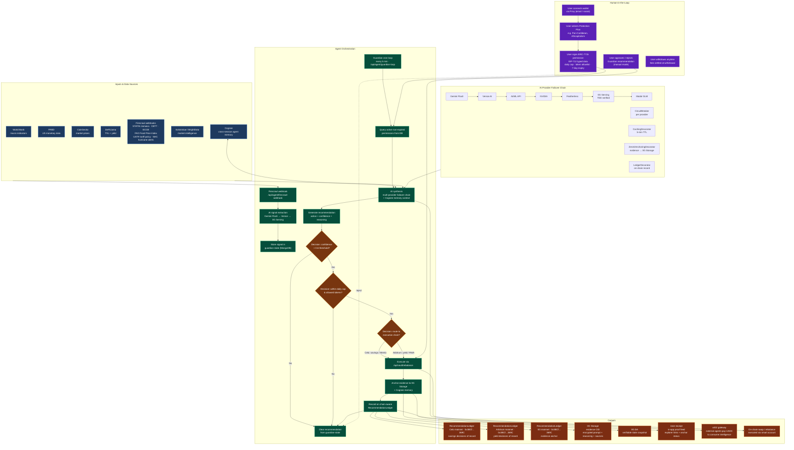

# Agentic Workflow Diagram

Mermaid diagram for the DiversiFi Guardian autonomous loop — covering
inputs, agent orchestration, human-in-the-loop steps, data sources and
APIs, outputs, and key decision points.

Live GitHub link: [`docs/agentic-workflow.md`](./agentic-workflow.md)

## Full Guardian Workflow

## Legend

| Element | Where in diagram |
|---|---|
| **Inputs** | Blue nodes — World Bank, FRED, CoinGecko, DeFiLlama, Firecrawl (Caribbean inflation + hurricane + tariff signals), SoSoValue/BrightData, Cognee memory |
| **Agent orchestration** | Green nodes — Firecrawl webhook → AI signal extraction → guardian-state store → cron loop → permission query → AI synthesis (multi-provider failover) → recommendation generation → threshold/bounds/routing decisions → execute → anchor → ledger → clear |
| **Human-in-the-loop** | Purple nodes — wallet connect → plan selection → ERC-7715 permission signing (EIP-712) → approve/reject recommendation → withdraw anytime |
| **Data sources & APIs** | Blue nodes + AI provider chain — 7 external data sources, 7 AI providers with circuit breakers, Cognee memory, MongoDB state |
| **Outputs** | Orange nodes — chain-aware RecommendationLedger on 3 chains (Celo/Arbitrum/0G), 0G Storage evidence CID, 0G DA snapshot, user receipt, x402 gateway for external agents, on-chain swap execution |
| **Key decision points** | Yellow diamonds — confidence > 0.6 threshold, within daily cap & allowed tokens, route to execution chain (Celo for savings, Arbitrum for yield) |
