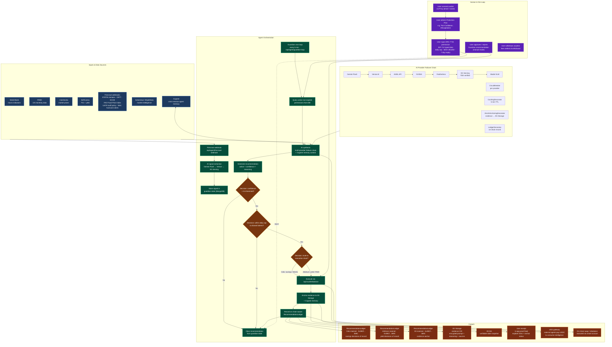

# Architecture

*For the product pitch, see [`product.md`](./product.md). This doc covers the system architecture that makes it work: multi-provider AI inference, a strategy-pattern swap orchestrator, and a cron-driven Guardian execution loop — with chain-aware on-chain settlement (Celo for EM savings, Arbitrum for yield, HashKey for APAC savings, 0G as the tamper-proof evidence layer), all scoped by user-signed ERC-7715-style permissions. For the APAC rail rationale, see [`apac-rail.md`](./apac-rail.md).*

> **Enforcement model (important):** the user-signed permission is cryptographic *consent*, verified server-side. Its spending bounds are currently enforced in **application code**, not on-chain — execution on Celo/Mento runs through a server-custodied smart account. True on-chain enforcement (ERC-7710 redemption) is the residual gap. See [`docs/guardian-enforcement-model.md`](./guardian-enforcement-model.md).

## Recent Hardening (2026-06)

This document reflects the post-hardening state. The headline changes since the initial 8.4/10 review:

- **EIP-712 server-side signature verification** on `POST /api/vault/permission` — every persisted permission is now cryptographically bound to the user's wallet signature (was: trust on first use with server-side inflation defaults).
- **0G anchor observability** — `recordRecommendation` returns a discriminated `AnchorResult` (`anchored | pending | failed`) and the status is surfaced in the chat receipt, the proof feed, and `GuardianState.latestAnchor`. The `pending` case (60s receipt timeout) is honest rather than silent.
- **Server-side alert cooldowns** — per-user, in `GuardianState.alertCooldowns`, surviving device switches. The localStorage map is gone.
- **Unified Guardian tier state machine** — `deriveGuardianTierState` in `@diversifi/shared` is the single source of truth for `idle | authorized | funded | monitoring`, replacing three inline implementations.
- **Celo token registry** — one shared config (`packages/shared/src/config/celo-tokens.ts`) replaces four duplicate `TOKEN_ADDRESSES` maps. The misleading `USDY: cUSD` placeholder is deleted.
- **Proactive loop decoupled from chat** — `ProactiveAgentRunner` mounted in `_app.tsx` owns the single 5-minute monitoring timer.
- **Guardian "Run dry-run now" button** on the tier card, wired to the existing `triggerExecutionLoop(true)` path. The duplicate button in the expanded view was removed.
- **Tab reorder (new user first-run)** — Home → Protect → Exchange → Pilot → Learn. Beginner mode includes Pilot tab. `/`-separated pill labels visible at all breakpoints.
- **GuardianStateScrollytelling** — vertical 4-state pipeline (`idle → authorized → funded → monitoring`) on the Protect tab's unconnected state, with animated step dots and "You are here" badge.
- **TabNavHint + useTabDiscovery** — animated swipe/explore hint above the tab bar on first visit, tracked via `TabDiscoveryProvider` context so TabNavigation and TabContentRouter share dismissal state. Auto-dismisses after 3 tab visits or first swipe.
- **GuidedTour consolidation** — 3-step tour (risk → Shield → connect) for users who skip philosophy onboarding. Region/goal/philosophy live in `useProtectionProfile`; `StrategyContext` delegates to profile storage. `TourTrigger` skips when philosophy is set and migrates old localStorage keys.
- **Beginner IA** — Simple mode: 3 tabs (Shield, Home, Learn), plain-language tips, compact proof card, `GuardianStatusChip` instead of wizard. Header hides mode toggle and chain pill.
- **APAC rail UX** — `needsApacRailMessaging()` surfaces an `apac-rail` contextual banner on Home and Shield for Confucian/Gotong Royong + Asia region; copy swaps honest "coming soon" vs live HashKey explorer link via `isApacRailLive()`.
- **Multi-chain proof feed** — `GET /api/agent/zero-g-ledger` merges recent receipts from Arbitrum, Celo, and HashKey (when configured) for LiveProofCard.
- **Testnet UX gating** — `shouldShowTestnetBanner()` hides the testnet strip unless `NEXT_PUBLIC_SHOW_TESTNET`, dev mode, or explicit opt-in via onboarding developer menu.
- **UnconnectedStateShell prop expansion** — `proofCardSide` (`'above' | 'below'`), `className`, `howItWorksCardClassName`, `demoCtaCardClassName` for flexible slot layout.
- **LiveProofCard as trust surface** — 0G-anchored proof feed rendered on Protect (above hero) and Overview tabs before wallet connection.

Net: 9 phases, +64 tests (300 → 343), 0 lint errors, 4.6 / 5 in per-pillar hardening. Rating moved from 8.4 → 8.7 / 10 (see `docs/roadmap.md` for the per-phase score table).

## High-Level Architecture

```
┌─────────────────────────────────────────────────────────────┐
│  Frontend (Next.js 15 + React 19 + Tailwind)                │
│  pages/index.tsx → AppShell → {Overview,Protect,Exchange,   │
│                                Agent,Info} tabs             │
│  27 hooks, dynamic imports, Framer Motion transitions       │
└──────────────────────────┬──────────────────────────────────┘
                           │
┌──────────────────────────▼──────────────────────────────────┐
│  @diversifi/shared (monorepo package, 33K+ lines)           │
│                                                             │
│  ┌─────────────────────┐  ┌───────────────────────────┐     │
│  │ AI Layer            │  │ Swap Layer                │     │
│  │ • 9 providers       │  │ • SwapOrchestratorService │     │
│  │ • FallbackOrch.     │  │ • 13 strategy impls       │     │
│  │ • CircuitBreaker    │  │ • ChainDetectionService   │     │
│  │ • CachingDecorator  │  │ • LiFi, 1inch, UniswapV3  │     │
│  │ • 0G Anchoring      │  │ • Hyperliquid, Mento, RWA│     │
│  │ • LedgerDecorator   │  └───────────────────────────┘     │
│  └─────────────────────┘                                    │
│                                                             │
│  ┌─────────────────────┐  ┌───────────────────────────┐     │
│  │ Guardian Services   │  │ Data Services             │     │
│  │ • AnalysisData      │  │ • marketPulseService      │     │
│  │ • Recommendation    │  │ • inflationService        │     │
│  │ • Execution         │  │ • unifiedCache            │     │
│  │ • PostAnalysis      │  │ • BrightDataService       │     │
│  └─────────────────────┘  │ • CogneeMemoryService     │     │
│                           └───────────────────────────┘     │
│                                                             │
│  Types, Config, Utils, Wallet adapters, Streak rewards      │
└──────────────────────────┬──────────────────────────────────┘
                           │
┌──────────────────────────▼──────────────────────────────────┐
│  API Layer (pages/api/)                                     │
│                                                             │
│  /api/agent/guardian-loop   → Cron-driven auto-execution    │
│  /api/agent/advisor         → AI-powered recommendations    │
│  /api/agent/x402-gateway    → Payment-gated evidence        │
│  /api/agent/zero-g-ledger   → 0G on-chain proof            │
│  /api/vault/*               → Smart account + fee ops       │
│  /api/agent/firecrawl-*     → Macro signal webhooks         │
└──────────────────────────┬──────────────────────────────────┘
                           │
┌──────────────────────────▼──────────────────────────────────┐
│  External Services                                          │
│  • MongoDB (user state, permissions, guardian-state)        │
│  • Celo/Mento: local stablecoin savings + Mento swaps       │
│    + RecommendationLedger (savings decisions of record)     │
│    + ERC-8004 agent identity                                │
│  • Arbitrum: yield execution (Uniswap V3 / Aave / RWA)      │
│    + RecommendationLedger (yield decisions of record)       │
│    + StrategyVault, AgenticHub                              │
│  • 0G: Storage (evidence CID) + DA + Compute (TEE proofs)   │
│    — the tamper-proof evidence layer both ledgers reference │
│  • Arc: x402 nanopayment settlement                         │
│  • HashKey Chain: APAC savings ledger (Confucian / Gotong Royong) │
│    + RecommendationLedger on chain 177 — see docs/apac-rail.md   │
│  • Cognee: cross-session agent memory                       │
│  • Self Protocol: sybil-resistant agent ID (Celo)           │
│  • Hetzner: always-on cron runtime (no cold starts)         │
└─────────────────────────────────────────────────────────────┘
```

## AI Provider Chain

Requests flow through a 6-deep fallback with circuit breakers at each step:

```
Gemini Flash → Venice AI → AI/ML API → NVIDIA → Featherless → 0G Serving → Modal (GLM)
    │              │            │          │           │             │            │
    └── CircuitBreaker ────────┴──────────┴───────────┴─────────────┴────────────┘
                  │
          CachingDecorator (5-min TTL)
                  │
          ZeroGAnchoringDecorator (evidence → 0G Storage)
                  │
          RecommendationLedgerDecorator (on-chain record)
```

Each provider implements `BaseAIProvider` (abstract class with `initialize()`, `isAvailable()`, `generateChatCompletion()`, `generateSpeech()`, `transcribeAudio()`). The `FallbackOrchestrator` tries providers in order until one succeeds, with per-operation timeouts and circuit breaker trip/reset via `CircuitBreakerDecorator`.

## Swap Orchestrator

The `SwapOrchestratorService` routes swaps through an ordered list of `BaseSwapStrategy` implementations:

| # | Strategy | Use case |
|---|----------|----------|
| 1 | MentoSwapStrategy | Celo same-chain stablecoins |
| 2 | EmergingMarketsStrategy | Celo Sepolia fictional companies |
| 3 | CurveArcStrategy | Curve on Arc Testnet |
| 4 | ArcTestnetStrategy | Arc Testnet guidance |
| 5 | ArbitrumSwapStrategy | Arbitrum-native DEX liquidity (Uniswap V3, Camelot) |
| 6 | HyperliquidPerpStrategy | Commodity perps (GOLD, SILVER, OIL) |
| 7 | OneInchSwapStrategy | Multi-chain best rates |
| 8 | UniswapV3Strategy | Direct Uniswap V3 fallback |
| 9 | LiFiEarnStrategy | Vault deposits |
| 10 | LiFiSwapStrategy | LiFi same-chain |
| 11 | LiFiBridgeStrategy | Cross-chain bridging |
| 12 | DirectRWAStrategy | RWA swaps (final fallback) |

Strategies are tried in order. The orchestrator tracks per-strategy performance (success rate, average time) and can promote/demote. Islamic Finance mode excludes HyperliquidPerpStrategy.

## Guardian Autonomous Loop

The Guardian is a server-side cron (`*/5 * * * *`) on Hetzner that auto-executes within user-signed ERC-7715-style permission bounds (app-layer enforcement; on-chain ERC-7710 redemption is deferred — see [`guardian-enforcement-model.md`](./guardian-enforcement-model.md)):

```
1. Firecrawl detects macro change
   → webhook /api/agent/firecrawl-webhook
   → AI extracts signal
   → stored in guardian-state (MongoDB)

2. Cron ticks → /api/agent/guardian-loop
   → DB query: find active, non-expired permissions
   → Check pending recommendations in guardian-state
   → Validate: confidence > GUARDIAN_CONFIDENCE_THRESHOLD (0.6)
   → Validate: within daily limit, allowed tokens not exceeded
   → Route action to execution chain:
      - Stable-savings / Mento actions → Celo executor
      - Deep-liquidity / RWA yield actions → Arbitrum executor
      - APAC conservative savings (Confucian / Gotong Royong, Asia region) → HashKey ledger via `routingContext`
   → Safety cap: MAX_EXECUTIONS_PER_LOOP (5)
   → Execute via /api/vault/rebalance
   → Anchor evidence bundle to 0G Storage + Cognee memory
   → Record hash/CID on the **chain-aware RecommendationLedger** —
     the decision settles on the chain where the action executed
     (Celo for EM savings, Arbitrum for yield, HashKey for
     regulated-market Asia savings). 0G Storage holds the evidence
     blob; the ledger entry references the 0G CID.
   → Clear recommendation from guardian-state
```

**Security:** Server-to-server auth via `GUARDIAN_LOOP_SECRET` header. DB unavailability returns `200` with status (never `500` — graceful degradation).

**Permission integrity:** The ERC-7715 permission posted to `/api/vault/permission` is verified server-side via `ERC7715Service.verifySignedPermission` (EIP-712 typed-data recovery against the expected `userAddress` and `chainId`). The previous "deferred to Privy policies" posture is gone — every persisted permission is cryptographically bound to the user's wallet signature. Permission objects without a valid 0x-hex signature and 32-byte nonce are rejected with `400`.

## Agent Identity (ERC-8004 + Self Protocol)

The DiversiFi Guardian has two on-chain identity registrations. Both are
ERC-8004 compliant; Self Protocol adds a Proof-of-Human layer on top.

| Registry | Address | Chain | Status |
|---|---|---|---|
| ERC-8004 Identity Registry (8004scan) | `0x8004A169FB4a3325136EB29fA0ceB6D2e539a432` | Celo mainnet | **Registered** — agentId 9654, owner `0x3542…Af48` |
| Self Protocol Agent ID | `0xaC3DF9ABf80d0F5c020C06B04Cced27763355944` (registry) | Celo mainnet (42220) | **Registered** — agent `0xE8cDb7CA…f170`, verified with real passport (proof-of-human, mainnet) |

**ERC-8004 (8004scan):** Portable, censorship-resistant agent identity. The
registration file at `public/.well-known/erc8004.json` describes the agent
(services, x402 support, supported trust signals). `pnpm register-erc8004`
mints the NFT; the `agentURI` points to the hosted registration file.

**Self Protocol Agent ID:** Sybil-resistant identity on Celo backed by ZK
passport verification (one human = one agent). The
`SelfAgentRegistration` component renders a QR code; the agent owner scans
with the Self app → soulbound NFT minted. `self-agent-service.ts` provides
signing (`getSelfSigningAgent`) and verification (`getSelfAgentVerifier`)
for outbound/inbound agent requests.

See [`docs/agent-identity.md`](./agent-identity.md) for registration
instructions, env vars, and the signing/verification API.

## State Management (Frontend)

### Context Providers (nested in `AppProviders`)

| Provider | Scope |
|----------|-------|
| `NavigationProvider` | Active tab, tab history |
| `ThemeProvider` | Dark/light mode |
| `ExperienceProvider` | Simple/Standard/Advanced mode |
| `ProtectionProfileProvider` | Profile goals, region, philosophy (`useStrategy` reads `config.philosophy`) |
| `BacktestProvider` | Shared backtest simulation state |
| `TourProvider` | Guided tour state |
| `DemoModeProvider` | Demo mode toggle + mock data |

### Hooks: Domain-Driven React Hooks

All 40+ hooks live in `/hooks/`. Key patterns:

- **Data hooks** (`use-inflation-data`, `use-multichain-balances`, `use-currency-performance`) — fetch and cache external data
- **Agent hooks** (`use-proactive-agent`, `use-agent-chat`, `use-agent-config`) — Guardian interaction
- **Wallet hooks** (`use-session-key`, `use-arc-balance`) — wallet operations
- **UI hooks** (`use-mobile`, `use-in-view`, `use-animated-counter`) — responsive/UX helpers

The `useProactiveAgent` monitoring loop is mounted once at the app root via `components/agent/ProactiveAgentRunner.tsx` (inside `ProviderTree` in `pages/_app.tsx`), so the 5-minute market + yield + UBI check survives chat-surface open/close transitions.

### Known issue: Prop drilling

`pages/index.tsx` passes 27 props through `AppShell`. This will be resolved via a `useAppShell()` hook (see `roadmap.md`).

## 0G Verifiability Stack

0G is the **evidence layer**, not the ledger of record. The chain-aware
`RecommendationLedger` settles decisions on the chain where the money
moves (Celo for savings, Arbitrum for yield); 0G holds the tamper-proof
reasoning evidence that those ledger entries reference. This separation
serves both the Celo grant (verifiable settlement on Celo) and the 0G
buildathon (deep Storage/Compute/DA integration) without forcing a
single canonical chain.

Every AI recommendation traces through the full 0G pipeline:

| 0G Component | Purpose |
|---|---|
| **0G Serving** | Decentralized inference via 0G Router (part of AI fallback chain) |
| **0G Storage** | Evidence bundles (prompt, reasoning, data sources) hashed → CID. The CID is referenced by the chain-aware ledger entry. |
| **0G DA** | Agent context / preferences serialized for cross-invocation resilience |
| **0G Compute Direct** | Optional TEE-verified inference for high-impact Guardian decisions |

**Chain-aware ledger (the ledger of record follows the money):**

| Chain | Ledger role | Contract | Status |
|---|---|---|---|
| **Arbitrum Sepolia** | Yield decisions of record | [`0xB393Fb70BE3DDE41e3238339E69A27A01Caa2996`](https://sepolia.arbiscan.io/address/0xB393Fb70BE3DDE41e3238339E69A27A01Caa2996) | Live (mainnet promotion in progress) |
| **Celo mainnet** | Savings decisions of record | *(deployment in progress)* | ERC-8004 identity live; ledger deployment next |
| **0G Galileo Testnet** | Evidence mirror | [`0xFADc8a7220Fa152eBE3Dfc5f7828Be289559D4ED`](https://chainscan-galileo.0g.ai/address/0xFADc8a7220Fa152eBE3Dfc5f7828Be289559D4ED) | Live (0G mainnet promotion in Wave 3) |

StrategyVault: [`0xd83797702AE6ef15349e762B22bfe79322B46975`](https://sepolia.arbiscan.io/address/0xd83797702AE6ef15349e762B22bfe79322B46975), AgenticHub: [`0x72c78a27a47d07656bb6b606d7DB5Ae5F114bf92`](https://sepolia.arbiscan.io/address/0x72c78a27a47d07656bb6b606d7DB5Ae5F114bf92) (both Arbitrum Sepolia).

### Anchor observability

`recordRecommendation` returns a discriminated `AnchorResult`:

| Status | Meaning | UI behaviour |
|---|---|---|
| `anchored` | Tx mined, `RecommendationRecorded` event parsed, `id` known | "0G anchored #N" + explorer link |
| `pending`  | Tx broadcast but receipt not confirmed within 60 s | "0G anchor pending" + tx hash, may resolve later |
| `failed`   | Revert, missing signer, RPC throw, or missing contract | "0G anchor failed" with `error` text |

The status is patched into the corresponding `AIMessage.x402Receipt.anchor` in place via `AIConversationContext.patchMessage`, so the user sees the verifier surface in the receipt itself. The Guardian cron persists the same shape to `GuardianState.latestAnchor` and surfaces it on the proof feed. `firecrawl-webhook` includes the anchor in its response, and `zero-g-ledger` POST returns `status`, `txHash`, `explorerUrl`, and (when available) `id`.

## Arc x402 Payment Loop

Paid research flows through an HTTP 402 challenge/response:

```
Client → GET /api/agent/x402-gateway?source=macro_analysis
       ← 402 { nonce, amount, currency: "USDC", recipient, expires }

Client → USDC.transfer on Arc (real on-chain tx)
Client → GET /api/agent/x402-gateway?source=macro_analysis
         + x-payment-proof: 0x{tx_hash}
         + x-payment-nonce: {challenge_nonce}
       ← 200 { data, _billing: { arcSettled: true, txHashes, explorer } }
```

Agent wallet: `0x6D5967e30dF504834DFD0aE38eFaC5DA4ac2DaC8` (Arc Testnet)

## Deployment

| Component | Host | Why |
|-----------|------|------|
| Frontend | Vercel | CDN, edge functions, free tier |
| Heavy API routes | Hetzner VPS | No 15s timeout, no cold starts |
| Agent runtime | Hetzner VPS + PM2 | Always-on cron + process management |
| Database | MongoDB Atlas | Managed, IP-whitelisted |

Heavy routes (`/api/agent/status`, `/api/agent/advisor`, `/api/agent/deep-analyze`, `/api/agent/x402-gateway`, `/api/vault/*`) are proxied from Vercel to Hetzner via `next.config.js` rewrites.

## Monorepo Structure

```
diversifi/
  pages/                    # Next.js pages router
  components/               # React components (agent, app, tabs, onboarding, swap, ui, wallet)
  hooks/                    # Domain-driven React hooks
  context/                  # React context providers
  config/                   # Chain configs, contract addresses
  constants/                # Tab IDs, token addresses, inflation data
  lib/                      # MongoDB client, demo data, OZ contracts (submodule)
  models/                   # Mongoose models (Permission, Vault, etc.)
  packages/
    shared/                 # Core business logic (33K+ lines) — AI, swaps, Guardian, data
    shared-0g/              # 0G Storage + DA integration
    mento-utils/            # Mento Protocol helpers
  scripts/                  # Firecrawl setup, wallet creation, volume generation
  tests/                    # x402 + integration test harnesses
```

## Key Design Patterns

| Pattern | Where | Why |
|---------|-------|------|
| **Strategy** | 13 swap strategies under `SwapOrchestratorService` | New DEX = new class, no existing code changes |
| **Provider** | 9 AI providers under `BaseAIProvider` | Add/remove providers without touching orchestration |
| **Decorator** | AI service wraps providers in caching → circuit breaker → 0G anchoring → ledger | Cross-cutting concerns are independently testable |
| **Orchestrator** | `FallbackOrchestrator` and `SwapOrchestratorService` | Ordered fallback with performance tracking |
| **Observer** | `agentEventBus` for proactive yield/rebalance alerts | Decoupled pub/sub between detection and notification |

## Guardian Workflow Diagram

Mermaid diagram for the DiversiFi Guardian autonomous loop — covering
inputs, agent orchestration, human-in-the-loop steps, data sources and
APIs, outputs, and key decision points.

### Full Guardian Workflow



### Legend

| Element | Where in diagram |
|---|---|
| **Inputs** | Blue nodes — World Bank, FRED, CoinGecko, DeFiLlama, Firecrawl (Caribbean inflation + hurricane + tariff signals), SoSoValue/BrightData, Cognee memory |
| **Agent orchestration** | Green nodes — Firecrawl webhook → AI signal extraction → guardian-state store → cron loop → permission query → AI synthesis (multi-provider failover) → recommendation generation → threshold/bounds/routing decisions → execute → anchor → ledger → clear |
| **Human-in-the-loop** | Purple nodes — wallet connect → plan selection → ERC-7715 permission signing (EIP-712) → approve/reject recommendation → withdraw anytime |
| **Data sources & APIs** | Blue nodes + AI provider chain — 7 external data sources, 7 AI providers with circuit breakers, Cognee memory, MongoDB state |
| **Outputs** | Orange nodes — chain-aware RecommendationLedger on 3 chains (Celo/Arbitrum/0G), 0G Storage evidence CID, 0G DA snapshot, user receipt, x402 gateway for external agents, on-chain swap execution |
| **Key decision points** | Yellow diamonds — confidence > 0.6 threshold, within daily cap & allowed tokens, route to execution chain (Celo for savings, Arbitrum for yield) |

## Dependency Architecture Audit

*Audit date: 2026-07-11. Root-cause pass on dependency leverage after first-load JS was cut 4.24 MB → 0.90 MB gz by deep-importing around the CommonJS `@diversifi/shared` barrel (symptom relief). See `internal/bundle-analysis-2026-07-11.md`.*

**Question:** are we over- or under-leveraging our heaviest dependencies (the AI SDKs, ethers v5+v6, web3.js, LiFi, Circle), do they earn their place in the product, and what architecture change reduces them?

### The one-line finding

The app carries **hackathon/demo breadth** — 9 AI providers, 4 chain libraries, 2 wallet backends, multi-chain bridging — most of which is **not leveraged by the actual product**, and the CommonJS barrel makes all of it a latent client-bundle leak. The highest-value work is *deletion and consolidation*, not optimization.

---

### Findings by cluster

#### A. AI inference SDKs (`openai`, `@google/generative-ai`) — over-leveraged on breadth, dead routing

- **9 registered providers; 5 are the same OpenAI-compatible endpoint** (Venice, AIML, Featherless, 0G, NVIDIA) differing only by `baseURL`/model — sponsor checkboxes, not resilience. `openai` is really just the HTTP transport for all of them; `@google/generative-ai` powers exactly one adapter (Gemini).
- **Dead routing layer (real bug):** `fallback-orchestrator.ts:64,80` computes `getProviderOrderForChat()` then never uses it — `executeWithFallback` iterates raw registration order. `preferredProvider` and JSON-mode "prefer Gemini" are no-ops. Actual order: Venice → Gemini → AIML → … (Venice, a sponsor, is primary).
- **Dead capability:** `ElevenLabsProvider` is a mock; OpenAI Whisper transcription and `generateSpeech`/`transcribe` have zero callers; intent discovery is advertised as AI but is rule-based (`intent-discovery.service.ts:445` AI path commented out).
- **No Claude** in the chain despite the Guardian agent itself running on Claude; no `@anthropic-ai/sdk` dependency. JSON output relies on a prompt-and-clean hack (`base-ai-provider.ts:63`) rather than native JSON mode.
- **Server-only holds by convention** (deep leaf imports), not by the bundler — one accidental barrel import re-leaks both SDKs.

#### B. Chain libraries (ethers v5, ethers6, web3.js, @ethereumjs) — over-leveraged, 4 stacks doing 1 job

- **Four overlapping stacks:** ethers v5 (49 files, the incumbent), `ethers6` (npm alias, **only** for the 0G SDK island in `packages/shared-0g` + the recommendation ledger), **web3.js (~2.5 MB) + @ethereumjs (~590 KB) purely transitive from `@celo/identity`**, and viem/wagmi (the modern stack, already the Privy wallet layer). Each stands up its own RPC + contract-read + signer.
- **web3.js/@ethereumjs exist for ONE feature:** SocialConnect send-to-contact (phone/email → address) via `social-connect-service.ts:13`. It's wired end-to-end but **mostly fails in the default config** (throwaway ODIS key `0x…01` can't pass ODIS quota), hidden on mobile/beginner. It is the sole reason for the `next.config.js` crypto polyfills and the barrel/deep-import contortions. Cost/benefit is heavily negative.
- **ethers v6** is justified but quarantinable — only the 0G SDK genuinely needs it; the recommendation ledger uses it by adjacency and could move to viem.
- **ethers v5 first-load status:** measured `@ethersproject` = 0 in the `_app` chunk, so it is *not* meaningfully in first-load today — but several hooks (`use-multichain-balances`, `use-stablecoin-portfolio`, `use-expected-amount-out`, `use-x402-payment`) still statically `import { ethers }` and genuinely use it (e.g. `use-multichain-balances.ts:186,281`). Worth confirming per-route.

> **Corrections after review (2026-07-11):**
> - **Circle is NOT dead weight — keep it.** It is already server-only + lazily imported (0 bytes in any client chunk — verified), so removing it gives zero mobile benefit, and it is **strategic infrastructure** for the planned Circle Agent Stack / Agent Wallets direction (agents.circle.com/services, developers.circle.com/agent-stack/agent-wallets). It is *underutilized*, not useless. Action changes from "drop" to "keep, wire up per the Agent Stack roadmap, clean up vestigial naming." The audit judged it on current code-reachability, blind to roadmap intent.
> - **Privy is not the only wallet entry.** `use-wallet.ts:247` connects injected wallets (MetaMask/Coinbase) as PRIORITY 1; Privy is the social-login fallback (PRIORITY 2), plus Farcaster/MiniPay auto-connect. So Circle does not "duplicate the only wallet layer" — the user-wallet layer is injected/Privy/Farcaster, and Circle is a separate *agent/smart-account execution* backend.
> - **Voice speech/transcribe DO have callers** (audit was wrong): `VoiceButton.tsx:282` (`transcribeAudio`), `use-agent-chat.ts:294,623` + `use-advisor.ts:102` (`generateSpeech`), all via the `useAgentVoice` hook → an API route (server-side). Voice is a real, if secondary, feature. The AI cleanup must therefore trace the voice API path before deleting anything — `ElevenLabsProvider` being a mock may mean TTS is currently degraded, which is a bug to investigate, not a safe delete.

#### C. LiFi — under-leveraged; Circle — underutilized (not orphaned — see corrections)

- **LiFi:** full cross-chain route/bridge/execute integration (3 strategies + API proxy), but the lowest-scored same-chain option and its unique value (Celo↔ Arbitrum bridging) is gated behind intermediate mode + a same-chain default seed (`ExchangeTab.tsx:72` seeds `42161→42161`). Heavy capability, barely surfaced — a product-surfacing decision, not a delete.
- **Circle (`@circle-fin/developer-controlled-wallets`, ~590 KB):** **orphaned.** Its custodial-wallet role is fully duplicated by Privy (the live vault executor `_executor.ts` is *named* `circleExecutor` but runs on Privy/Safe and never imports the SDK). No API route or UI reaches the Circle SDK — only a test script and `scripts/create-circle-wallet.ts`. The live `circle-service` methods (`getUnifiedUSDCBalance`, mandate verify) don't use the SDK at all.

---

### Prioritized action plan

Ranked by (impact × inverse-risk). Each is independently shippable.

| # | Action | Removes | Effort / Risk | Status |
|---|--------|---------|---------------|--------|
| 1 | ~~Drop the Circle SDK~~ → **KEEP.** Server-only, 0 client bytes, strategic for Circle Agent Stack. Instead: wire it up per the Agent Wallets roadmap and de-"Circle" the *vestigial* naming where it misleads (the `circleExecutor` that actually runs on Privy). | (nothing — revised) | — | Revised: keep |
| 2 | **Decouple SocialConnect from the barrel.** Removed the static `SocialConnectService` import/re-export from `index.ts`; the two real consumers already use dynamic `import()`. Feature preserved; web3.js no longer rides the barrel's synchronous graph. | `@celo/identity` → web3.js/@ethereumjs from the barrel graph (defense against re-leak; already 0 in client first-load) | Low / Low | **✅ Done** |
| 3 | ~~Delete AI dead code~~ → **Voice was dead; now wired.** Trace found voice fully broken: client called `/api/agent/speak` + `/api/agent/transcribe` which **did not exist**, ElevenLabs TTS was a mock returning fake strings, and the fallback orchestrator computed provider order then discarded it (`executeWithFallback` iterated raw registration order). Fixed all three: routing now honors the computed order (also fixes chat `preferredProvider`/JSON-mode preference), ElevenLabs `generateSpeech` makes a real API call, OpenAI `isAvailable()` no longer self-filters pre-init, and both API routes now exist (Whisper transcription via formidable). Voice output/input work when `ELEVENLABS_*` / `OPENAI_API_KEY` are set. | The dead-routing bug (was silently degrading chat too) | Done | **✅ Done** |
| 4 | **★ Durable root fix: make `@diversifi/shared` tree-shakeable.** ESM output (`module: ESNext`), `sideEffects: false` (after auditing module-scope singletons like `circleService`/`feeEngine`), `exports` map. Then the barrel can't leak — no future import reintroduces the whack-a-mole. Add `import 'server-only'` to `ai-service.ts` + circle/social services to enforce the boundary in the bundler. | The *class* of bundle-leak problem | Med / Med |
| 5 | **Collapse the 5 OpenAI-compat AI providers into one** parameterized `OpenAICompatProvider` + config table. Optionally add a Claude adapter as primary (aligns inference with the Guardian's own model, native JSON mode). | ~5 duplicate adapter files; quality upgrade | Med / Low–Med |
| 6 | **Migrate `recommendation-ledger.service.ts` v6 → viem.** Confines `ethers6` to the server-only `packages/shared-0g` 0G island. | `ethers6` from the main package | Med / Low–Med |
| 7 | **Lazy-load LiFi** to the (already dynamic) ExchangeTab via `import('@lifi/sdk')`, keep the capability. Separately, a **product decision:** surface cross-chain as a real default flow or formalize it as a power-user feature. | `@lifi/sdk` from main bundle | Med / Low |
| 8 | **Standardize server services on viem, retire ethers v5** (incremental, per-service: swap strategies, circle/settlement/wallet/rwa, guardian, vault). End state: **viem + wagmi/Privy is the single chain stack**; ethers v5 gone; ethers v6 only inside `shared-0g`. | ethers v5 (49 files) | High / Med |

**Target architecture:** one AI gateway (Gemini + one compat adapter + optional Claude, real failover), one chain library (viem) + wagmi/Privy for wallets, ethers v6 quarantined to the server-only 0G package, ethers v5 / web3.js / @ethereumjs / Circle removed, SocialConnect dropped or lazy, and the browser crypto polyfills deleted.

**Sequencing note:** 1–3 are safe deletions doable now. 4 is the keystone — it makes 5–8 durable rather than another round of manual import surgery. Do 4 before or alongside the consolidations.## Circle Agent Stack & Marketplace

*Date: 2026-07-11 · Status: exploration (decide before building)*
*Question: how should DiversiFi leverage Circle's Agent Stack, and what's the
current code gap?*

### What Circle Agent Stack is (launched 2026-05-11)

Chain-agnostic infra for autonomous agents. Five components:

| Component | What it does | Relevance to DiversiFi |
|---|---|---|
| **Agent Wallets** | Policy-controlled MPC wallets for agents: **wallet-layer** spending limits (time-bound USDC caps), allowlists/blocklists, sanctions screening, **gas-sponsored** tx | ★ Highest — see enforcement fit below |
| **Nanopayments (Circle Gateway)** | Gas-free USDC transfers to $0.000001, x402-compatible, machine-speed | DiversiFi already runs an x402 intelligence toll — this productizes it |
| **Agent Marketplace** | Directory of agentic services agents can discover + pay for | Distribution: list the DiversiFi intelligence gateway |
| **Circle CLI** | Build on Circle platform (wallets/payments/policy) | Tooling for the wire-up |
| **Circle Skills** | Implementation patterns for AI coding tools | Setup at agents.circle.com/skills/setup.md |

Supports USDC/EURC/ERC20 + native tokens. Policies enforced at the wallet
layer *before* on-chain submission.

### Current DiversiFi Circle code (what exists, what's wired)

- `circle-service.ts` — `getOrCreateAgentWallet` (createWalletSet/createWallets),
  `transferUSDCViaGateway`, `bridgeUSDC`, `getUnifiedUSDCBalance`,
  `verifyNanopaymentMandate`. **All on `ARC-TESTNET`.**
- `circle-wallet-provider-real.ts` — `RealCircleWalletProvider` implements the
  agent-wallet interface (getWallet/signTransaction/createTransaction/…).
- **Not wired:** `SMART_ACCOUNT_PROVIDER` defaults to `'privy'`; the factory
  registers privy/safe4337/metamask-delegation but **not circle** — so even
  `SMART_ACCOUNT_PROVIDER=circle` throws "Unknown provider". Config default
  `walletProvider: "CIRCLE_MPC"` (`use-agent-config.ts:12`) is cosmetic.
- The live vault executor is *named* `circleExecutor` but runs on Privy/Safe.
- **Server-only, 0 client bytes** (lazy dynamic import) — no bundle cost.

Net: the developer-controlled-wallets SDK (Agent Wallets' precursor) is
integrated but orphaned, on testnet, and not selectable.

### ★ The standout fit: wallet-layer policy = closes the Guardian enforcement gap

`docs/guardian-enforcement-model.md` states the Guardian's spending bounds are
**"enforced only in application code"** today; the named risk is *"a compromised
server, or a bug that bypasses validateSwap, could exceed bounds."* The deferred
fix was ERC-7710 on-chain enforcement (`metamask-delegation-provider.ts`).

**Circle Agent Wallets close that exact gap a different way** — spending limits +
allowlists enforced at the wallet layer before submission, plus sanctions
screening. For an emerging-markets savings agent, Circle's policy + compliance
may be *more* desirable than raw on-chain ERC-7710 (KYC/AML posture, the Ghana
VASP context). Tradeoff: Circle is a trusted third party enforcing off-chain-ish;
ERC-7710 is trustless on-chain. Not either/or — Circle policy can be the near-term
enforcement while ERC-7710 stays the long-term trustless path.

### Options (ranked, with effort/risk)

| # | Option | What it delivers | Effort / Risk |
|---|--------|------------------|---------------|
| A | **Agent execution wallet w/ wallet-layer policy** | Register a Circle `SmartAccountProvider`, make it selectable, map protection-plan bounds (daily USDC cap, allowed tokens) → Circle spending policies. Guardian executes through a policy-enforced wallet. **Closes the app-layer enforcement gap.** | High / Med — real security win, needs mainnet Circle acct + policy mapping + interface reconciliation (AgentWalletProvider vs SmartAccountProvider) |
| B | **Nanopayments/Gateway rail upgrade** | Route the x402 intelligence tolls through Circle Nanopayments (gas-free, sub-cent). Aligns with the existing x402 gateway. | Med / Low–Med — additive to the settlement rail |
| C | **Agent Marketplace listing** | List the DiversiFi intelligence gateway as a discoverable agentic service — agent-to-agent distribution (consumers #2+). | Low–Med / Low — GTM, not core architecture |
| D | **Mainnet + de-orphan cleanup** | Move Circle off ARC-TESTNET, register the provider, remove the vestigial `circleExecutor` naming, make `walletProvider: "CIRCLE_MPC"` actually do something. Prereq for A. | Low–Med / Low |

### ⚠️ Critical finding: installed SDK does execution, NOT policy

The installed `@circle-fin/developer-controlled-wallets@10.0.1` exposes
execution (`createContractExecutionTransaction`, `createWallet`, `listWallets`,
`getWalletTokenBalance`) but **no policy/spending-limit/allowlist methods**.
Wallet-layer policy enforcement — the strategic win of Option A — is a **Circle
Agent Stack** capability (Circle CLI / newer API), a separate product surface
from this SDK. So:
- **Execution (D) is buildable now** with the installed SDK. ✅ built (below).
- **Policy enforcement (A) requires a Circle Agent Stack account + its API.**
  The app-layer→wallet-layer mapping logic is built and tested; *applying* it
  needs the Agent Stack.

### What's built (2026-07-11)

| Piece | File | Status |
|---|---|---|
| Guardian bounds → Circle policy spec (pure, tested) | `services/vault/circle-agent-policy.ts` (+ 9 tests) | ✅ done, verifiable now |
| Circle execution provider (SmartAccountProvider) | `services/vault/providers/circle-smart-account-provider.ts` | ✅ built, env-gated, **untested vs live Circle** |
| Registered + selectable (`SMART_ACCOUNT_PROVIDER=circle`) | `services/vault/smart-account-provider.ts` | ✅ done (was "Unknown provider") |

**Activation (execution):** `SMART_ACCOUNT_PROVIDER=circle`, `CIRCLE_API_KEY`,
`CIRCLE_ENTITY_SECRET`, `CIRCLE_WALLET_SET_ID`. Until set, `isConfigured()` is
false and the factory default stays Privy — zero risk to the live path.

**Activation (policy enforcement, Option A):** a **Circle Agent Stack account**
+ its policy API. Then feed `sessionPermissionToCirclePolicy(permission)` output
to the Agent Stack to enforce Guardian bounds at the wallet layer.

### ⚠️⚠️ Auth research finding (2026-07-11): the fork that decides fit

Two Circle wallet products, and **you cannot get both "unattended-programmatic"
AND "wallet-layer policy enforcement" at once** today:

| | Agent Wallets (CLI) | Developer-Controlled Wallets (API) |
|---|---|---|
| Auth | Interactive **email-OTP** → 28-day agent session, tied to the login email | **API key + entity secret** (fully programmatic, server-side) |
| Policy engine | ✅ `wallet limit` — real wallet-layer spending limits/allowlists | ❌ enforcement is **app-layer** (your own checks) + console Gas-Station limits |
| Setting a policy | **Human OTP required** every time | n/a (no wallet-layer policy object) |
| Executing (transfer/swap) | Autonomous within the session (no per-tx OTP) | Autonomous (API key) |
| Circle's own words | *"Your agent can only operate the wallet if it has access to the email used during authentication"* — human-in-the-loop by design | *"enforce your own policies (limits, KYC) before any onchain action"* — app-layer |

**Consequence for DiversiFi's per-user model:** wallet-layer policy is human-OTP
per policy. Enforcing a *per-user* wallet-layer policy would make **every user**
complete a Circle email-OTP — a UX non-starter. So Circle Agent Wallet policy
enforcement does **not** scale to per-user savings execution.

**Where it genuinely fits (single-wallet, operator-set policy):**
- The **Guardian's own operational wallet** — paying for intelligence/data via
  `services` (x402 marketplace) + `gateway` (nanopayments), one operator-set
  OTP policy, autonomous execution within it. Strong, achievable-now fit.
- Listing the DiversiFi intelligence gateway *on* the Circle services marketplace.

**Where it does NOT fit:** per-user savings execution with per-user wallet-layer
policy (per-user OTP). Keep Privy/Safe + app-layer there; pursue on-chain
ERC-7710 if wallet-layer per-user enforcement is wanted.

Wallet is live on **Arbitrum** (ARB 42161) at
`0xdd6204dd1b7e0311e184dbe458dcc268715ea061`, default policy
`TRANSFER_LIMIT monthly 100`. Same address across EVM chains.

### Recommendation (revised after auth research)

Refocus Circle from "per-user execution enforcement" (doesn't scale) to the
**agent-operational / x402 layer** where it's purpose-built and achievable now:

1. **Guardian operational wallet on Arbitrum** — operator sets one spending
   policy via OTP (`wallet limit set`), Guardian pays for intelligence/data
   services autonomously within it. Uses `services` + `gateway`.
2. **x402 rail**: DiversiFi already runs an x402 intelligence toll — evaluate
   Circle `gateway` nanopayments as the gas-free settlement path, and list the
   gateway on the Circle services marketplace (distribution).
3. **Keep the shipped foundation** (`circle-agent-policy.ts`,
   `CircleSmartAccountProvider`) for the DCW programmatic path if/when a
   single-wallet execution model is wanted; it stays dormant until keys are set.

Prior "make Circle the per-user execution backend with wallet-layer policy" is
**deprioritized** — the per-user OTP requirement makes it not scale.

### (superseded) earlier recommendation

Lead with **D → A**: first de-orphan and make Circle selectable/mainnet-ready
(small, unblocks everything), then pursue **A** as the flagship — because it's not
"adopt a vendor," it's *closing a documented security gap on the roadmap* (the
Guardian's app-layer enforcement) with infra purpose-built for it. **B** is a
natural follow-on that upgrades the x402 rail DiversiFi already runs. **C** is
cheap distribution to run in parallel whenever.

Open questions to resolve before building A:
1. Mainnet Circle account + which chains (Arbitrum for yield execution?).
2. Custodial posture: are we comfortable Circle-MPC holding agent funds vs the
   current Privy/Safe? (Affects the trust story.)
3. Interface reconciliation: `RealCircleWalletProvider` (AgentWalletProvider)
   vs the vault's `SmartAccountProvider` — adapter or unify.
4. Policy mapping: protection-plan bounds → Circle spending-policy schema.

### Sources

- [Circle blog — Introducing Agent Stack](https://www.circle.com/blog/introducing-circle-agent-stack-financial-infrastructure-for-the-agentic-economy)
- [Circle Docs — Agent Wallets](https://developers.circle.com/agent-stack/agent-wallets)
- [Circle pressroom — AI infrastructure for the agentic economy](https://www.circle.com/pressroom/circle-launches-ai-infrastructure-to-power-the-agentic-economy)

### Circle Marketplace Resale

**Status:** foundation shipped; consumption wiring next.
DiversiFi consumes Circle x402 marketplace services (for the Guardian
*and* to resell to users at a markup), using its existing x402 rail.

#### Why this fits (no rebuild)

DiversiFi already: (1) runs an x402 gateway, (2) consumes external x402 sources
(`arc-research-sources`, `bright-data`), and (3) curates priced data sources in
`ARC_RESEARCH_SOURCE_REGISTRY`. The Circle marketplace is the same pattern at
scale — a directory of x402-paid APIs. So consumption reuses the payment rail;
the marketplace is just discovery.

#### FREE-FIRST PRINCIPLE (non-negotiable)

**Never pay for what we can get free.** DiversiFi already has a deep free/keyed
data stack — CoinGecko + CoinPaprika (crypto prices), Frankfurter + Alpha
Vantage (FX), World Bank (economic), DefiLlama (yield), SoSoValue, plus our own
governance/news feeds and Firecrawl monitors. Marketplace services that
duplicate these are **not** resale candidates — we serve them from the free
source and pass the saving to the user.

Encoded in code: every catalog entry has a `freeAlternative` field.
`shouldPayFor()` returns true **only** when it's `null`.

**Free stack (what we never pay to duplicate):** CoinGecko + CoinPaprika
(crypto prices), Frankfurter + Alpha Vantage (FX), World Bank (economic),
DefiLlama (yield), SoSoValue, our governance/news feeds, Firecrawl monitors,
and now **TinyFish Search API** (`TINYFISH_API_KEY`) — free web search + news +
research-paper search, verified live (returns relevant EM/cedi news).

**Honest marketplace finding (2026-07-11):** searched ~13 categories (prices,
FX, news, web search, sentiment, prediction markets, remittance, country risk,
trade finance, stablecoin yield, wallet risk, credit score, commodities). The
marketplace is **thin on services that are BOTH differentiated AND useful to EM
savers/importers** — most is commodity data we get free, or web search/news now
covered by TinyFish. After the free-first gate, the payable set is a single,
marginally-relevant service:

| Pay + mark up (survives free-first gate) | Wholesale | Relevance |
|---|---|---|
| Surf — prediction-market metrics | $0.0075 | differentiated, but low relevance to savers |

**Implication:** don't build payment/resale plumbing for a near-empty payable
catalog. The real near-term win here was **free** (TinyFish web search/news).
Revisit the marketplace periodically as it grows; wire resale only when a
genuinely useful+differentiated service appears.

#### The resale (markup) business model

```
                 wholesale x402 ($0.008)          resale via credits ($0.0104)
Circle service  ◀─────────────────────  DiversiFi  ─────────────────────▶  User
(BlockRun, etc.)   operator wallet pays              charges marked-up price
                                          keeps margin ($0.0024, +30%)
```

- DiversiFi pays the **wholesale** x402 price from the operator wallet.
- Surfaces the data/service to the user (FX rates, market data, news, research).
- Charges a **resale** price via the existing credits/tier system.
- Pockets the **margin**. Pricing math: `computeResale()` in
  `services/marketplace/circle-marketplace.ts` (tested, never underprices).

Live wholesale prices observed (2026-07-11): BlockRun FX/crypto $0.008,
aisa CoinGecko $0.008, Gloria news $0.05 — all USDC via x402, mostly on Base.

#### What's shipped

| Piece | File | Status |
|---|---|---|
| Curated catalog (4 real services) + resale pricing | `services/marketplace/circle-marketplace.ts` | ✅ + 7 tests |
| Wallet live on Arbitrum (`0xdd62…a061`) | via Circle CLI | ✅ |

#### Consumption flow (to wire next)

1. **Discovery** — periodic sync of the Circle registry into the catalog (or
   keep it curated). The CLI abstracts the registry endpoint; server-side
   discovery needs either the registry API or curated entries (current).
2. **Pay** — route the service's `payTo`/`amount` through DiversiFi's existing
   x402 consumer from the operator wallet. Services price on **Base**; the
   wallet is funded there via Circle `gateway` (gasless cross-chain USDC).
3. **Meter + resell** — debit the user's credits at the `resaleUsd` rate before
   returning data; the difference is margin. Reuse the credits/tier gate that
   already fronts `ARC_RESEARCH_SOURCE_REGISTRY`.
4. **Guardian self-use** — the autonomous Guardian consumes FX/market/news
   services within its operator-wallet spending policy (`wallet limit`).

#### Open items before money moves

- **Wallet funding**: deposit USDC into Circle Gateway on Base for nanopayments.
- **Payment auth on the server**: the operator-wallet x402 payment path (the
  existing `VAULT_PRIVATE_KEY` rail vs the Circle agent session) — decide which
  signs marketplace payments. See the auth finding above.
- **User-facing surface**: where resold data appears (Guardian insights, a
  "market data" panel) and how credits are priced/displayed.
- **Compliance/ToS**: reselling third-party API data — check each provider's
  terms before markup resale.

#### Listing DiversiFi ON the marketplace (distribution, parallel track)

DiversiFi's intelligence gateway is already x402. Registering it in the Circle
services directory makes it discoverable to other agents (consumers #2+) — an
agent-to-agent distribution channel for the intelligence product.
