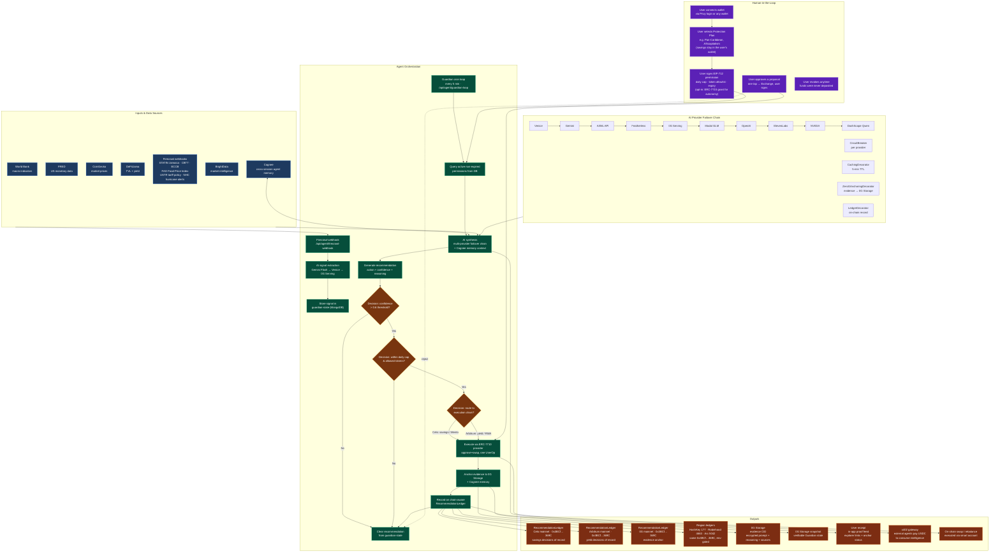

# Architecture

*For the product pitch, see [`product.md`](./product.md). This doc covers the system architecture that makes it work: multi-provider AI inference, a strategy-pattern swap orchestrator, and a cron-driven Guardian execution loop — with chain-aware on-chain settlement (Celo for EM savings, Arbitrum for yield, HashKey for APAC savings, 0G as the tamper-proof evidence layer), all scoped by user-signed ERC-7715-style permissions. For the APAC rail rationale, see [`rails.md`](./rails.md).*

> **Enforcement model (important):** the user-signed EIP-712 permission is cryptographic *consent*, verified server-side, with bounds also enforced in application code. The default execution path is **one-tap user signing** — nothing moves until the user signs on Exchange. Opt-in autonomy is **ERC-7715/7710 only**: the session account redeems a MetaMask Advanced Permission on the user's own smart account, enforced on-chain by the DelegationManager (kit-derived chains: Celo, Celo Sepolia, Arbitrum). There is no Safe, no vault deposit, no server-custodied user account. See [`docs/guardian.md`](./guardian.md).

> **Current state:** this doc describes the post-hardening architecture (rating 8.7/10 after the 2026-06 review pass). The connected wallet is the source of truth for holdings — `apps/web/lib/wallet-portfolio-view.ts` is the shared selector layer consumed by all tabs. Dated change history lives in [`roadmap-log.md`](./roadmap-log.md).

## High-Level Architecture

```
┌─────────────────────────────────────────────────────────────┐
│  Frontend (Next.js 15 + React 19 + Tailwind)                │
│  pages/index.tsx → AppShell → {Overview,Protect,Exchange,   │
│                                Agent,Info} tabs             │
│  70+ hooks, dynamic imports, Framer Motion transitions       │
└──────────────────────────┬──────────────────────────────────┘
                           │
┌──────────────────────────▼──────────────────────────────────┐
│  @diversifi/shared (monorepo package, ~53K lines)            │
│                                                             │
│  ┌─────────────────────┐  ┌───────────────────────────┐     │
│  │ AI Layer            │  │ Swap Layer                │     │
│  │ • 10 providers      │  │ • SwapOrchestratorService │     │
│  │ • FallbackOrch.     │  │ • 13 strategy impls       │     │
│  │ • CircuitBreaker    │  │ • ChainDetectionService   │     │
│  │ • CachingDecorator  │  │ • LiFi, 1inch, UniswapV3  │     │
│  │ • 0G Anchoring      │  │ • Hyperliquid, Mento, RWA│     │
│  │ • LedgerDecorator   │  └───────────────────────────┘     │
│  └─────────────────────┘                                    │
│                                                             │
│  ┌─────────────────────┐  ┌───────────────────────────┐     │
│  │ Guardian Services   │  │ Data Services             │     │
│  │ • AnalysisData      │  │ • marketPulseService      │     │
│  │ • Recommendation    │  │ • inflationService        │     │
│  │ • Execution         │  │ • unifiedCache            │     │
│  │ • PostAnalysis      │  │ • BrightDataService       │     │
│  └─────────────────────┘  │ • CogneeMemoryService     │     │
│                           └───────────────────────────┘     │
│                                                             │
│  Types, Config, Utils, Wallet adapters, Streak rewards      │
└──────────────────────────┬──────────────────────────────────┘
                           │
┌──────────────────────────▼──────────────────────────────────┐
│  API Layer (pages/api/)                                     │
│                                                             │
│  /api/agent/guardian-loop   → Cron-driven auto-execution    │
│  /api/agent/advisor         → AI-powered recommendations    │
│  /api/agent/x402-gateway    → Payment-gated evidence        │
│  /api/agent/zero-g-ledger   → 0G on-chain proof            │
│  /api/vault/*               → Guardian profile/permission ops │
│  /api/agent/firecrawl-*     → Macro signal webhooks         │
└──────────────────────────┬──────────────────────────────────┘
                           │
┌──────────────────────────▼──────────────────────────────────┐
│  External Services                                          │
│  • MongoDB (user state, permissions, guardian-state)        │
│  • Celo/Mento: local stablecoin savings + Mento swaps       │
│    + RecommendationLedger (savings decisions of record)     │
│    + ERC-8004 agent identity                                │
│  • Arbitrum: yield execution (Uniswap V3 / Aave / RWA)      │
│    + RecommendationLedger (yield decisions of record)       │
│    + StrategyVault, AgenticHub                              │
│  • 0G: Storage (evidence CID) + Compute (TEE proofs)         │
│    — the tamper-proof evidence layer the ledgers reference │
│  • Arc: x402 nanopayment settlement                         │
│  • HashKey Chain: APAC savings ledger (Confucian / Gotong Royong) │
│    + RecommendationLedger on chain 177 — see docs/rails.md   │
│  • Cognee: cross-session agent memory                       │
│  • Self Protocol: sybil-resistant agent ID (Celo)           │
│  • Hetzner: always-on cron runtime (no cold starts)         │
└─────────────────────────────────────────────────────────────┘
```

## Data Streams & their Jobs

Every external number is fallible by default. The app's rule across all streams is
**resolve in order**: serve the freshest real data you have, then the last real value
from a cache, then an honest constant — never a fabricated figure. Each row below is
what feeds the surface it powers, where it comes from, and how it stays honest.

### 1. The currency risk moment (Home hero)
| Stream | Source | Powers | Honesty behaviour |
|---|---|---|---|
| Curated depreciation | `constants/currency-risk.ts` — 28 countries, per-benchmark vs USD/EUR/XAU | `useCurrencyMoment` → `CurrencyMomentCard` (one delta + one personal consequence) | Directionally-accurate static data; “not live, not advice” on the card |
| Live 1yr vs-USD | `/api/currency-risk/live` (fawazahmed0 open dataset) | overrides the curated 1yr figure | Falls back to curated on failure; 3yr/5yr stay curated (feed only reaches back to 2024-03-02) |
| Goods anchor | `goodsAnchor` field on an entry (`GHS`/`NGN`/`KES`) | “≈ N fewer bags of rice / maize flour” line | Only shown for a **depreciating** currency and only when a staple is verified — never invents a staple; omitted otherwise |
| Philosophy frame | `lib/narrative/moment-framing.ts` (archetype → accent + reframe) | accent + values-register consequence after onboarding | Pure, no fetch; **non-prescriptive** (re-reads the erosion, never tells the user what to do) |
| Region detection | `useUserRegion` — ipapi.co IP geolocation + browser locale + `user-country-code` override | which country/currency the moment shows | **Location ≠ risk** — a diaspora visitor re-points the moment via the “Whose savings?” override |
| Inflation (fallback) | `/api/inflation` (IMF/World Bank + `FALLBACK_INFLATION_DATA`) | inflation-only moment for uncovered countries | Serves fallback constants before ever fabricating a number |

### 2. Market, yield & FX
| Stream | Source | Powers | Honesty behaviour |
|---|---|---|---|
| Emerging-market prices | `/api/emerging-markets/prices` (per-provider) | EM tracker, currency chart | Per-provider timeouts; serves **expired cache** before a static price; `hasEstimates` → “Includes estimates” |
| Yield | `/api/agent/best-yield` (vaults.fyi, LI.FI Earn, DefiLlama, GMX GM pools) | BestYieldCard, GMX deposits | Free-first: raw APY free, personalized layer gated by `insight-tier` (default-deny) |
| Macro signals | Firecrawl monitors (central banks, yield trackers, depeg) → `MACRO_SIGNAL:*` on the proof-feed cache | TradeIntelligence pill | Items are universal (impact stripped); pill appears only when a fresh signal exists |
| Market regime | `useMarketRegime` | tips + regime pill | Classifies holdings by regime; non-prescriptive |
| Exchange rates / FX netting | `/api/exchange-rates` + `fx-netting/*` (pure matching engine) | CaribbeanFxNetCard, SME FX | Currency-agnostic mid-market matching; net obligations settle on the region-canonical chain |

### 3. On-chain & verifiable
| Stream | Source | Powers | Honesty behaviour |
|---|---|---|---|
| Balances / portfolio | `useMultichainBalances` (Celo/Arbitrum/HashKey/0G) | home holdings, dial, scorecard | Chain-aware; per-chain RPC errors surfaced as inline banners |
| Ledger proof | `recommendationLedgerService` (chain-aware routing) + **0G Storage** CIDs | Verifiable AI tab, Guardian decisions | Every high-impact recommendation is anchored on-chain + mirrored to 0G |

### 4. AI / agent
| Stream | Source | Powers | Honesty behaviour |
|---|---|---|---|
| LLM intelligence | `AIService` — Venice/Gemini/AI·ML API/NVIDIA/Featherless/0G/Modal/OpenAI/ElevenLabs/DashScope (10-deep failover) | advisor, intelligence, web-search, deep-analyze | Circuit breaker + 5-min cache + provider fallback; 0G anchors reasoning |
| Voice | ElevenLabs TTS/STT (`/api/agent/speak`, `/api/agent/transcribe`) | chat voice | Live round-trip; feature-flag gated |
| Guardian | `guardian-heartbeat` + `guardian-loop` cron (Hetzner) | auto-executes within permission bounds | Bounds enforced in app code; every action mirrored to 0G |

## AI Provider Chain

Requests flow through a 10-deep fallback with circuit breakers at each step:

```
Venice → Gemini → AI/ML API → Featherless → 0G Serving → Modal (GLM) → OpenAI → ElevenLabs → NVIDIA → DashScope (Qwen)
    │              │            │          │           │             │            │
    └── CircuitBreaker ────────┴──────────┴───────────┴─────────────┴────────────┘
                  │
          CachingDecorator (5-min TTL)
                  │
          ZeroGAnchoringDecorator (evidence → 0G Storage)
                  │
          RecommendationLedgerDecorator (on-chain record)
```

Each provider implements `BaseAIProvider` (abstract class with `initialize()`, `isAvailable()`, `generateChatCompletion()`, `generateSpeech()`, `transcribeAudio()`). The `FallbackOrchestrator` tries providers in order until one succeeds, with per-operation timeouts and circuit breaker trip/reset via `CircuitBreakerDecorator`.

## Swap Orchestrator

The `SwapOrchestratorService` routes swaps through an ordered list of `BaseSwapStrategy` implementations:

| # | Strategy | Use case |
|---|----------|----------|
| 1 | MentoSwapStrategy | Celo same-chain stablecoins |
| 2 | EmergingMarketsStrategy | Celo Sepolia fictional companies |
| 3 | CurveArcStrategy | Curve on Arc Testnet |
| 4 | ArcTestnetStrategy | Arc Testnet guidance |
| 5 | ArbitrumSwapStrategy | Arbitrum-native DEX liquidity (Uniswap V3, Camelot) |
| 6 | HyperliquidPerpStrategy | Commodity perps (GOLD, SILVER, OIL) |
| 7 | OneInchSwapStrategy | Multi-chain best rates |
| 8 | UniswapV3Strategy | Direct Uniswap V3 fallback |
| 9 | LiFiEarnStrategy | Vault deposits |
| 10 | LiFiSwapStrategy | LiFi same-chain |
| 11 | LiFiBridgeStrategy | Cross-chain bridging |
| 12 | DirectRWAStrategy | RWA swaps (final fallback) |

Strategies are tried in order. The orchestrator tracks per-strategy performance (success rate, average time) and can promote/demote. Islamic Finance mode excludes HyperliquidPerpStrategy.

## Guardian Autonomous Loop

The Guardian is a server-side cron (`*/5 * * * *`) on Hetzner. Savings stay in the user's own wallet; the default is a queued one-tap proposal the user signs on Exchange. Autonomous execution happens only for GUARDIAN-tier permissions on ERC-7710-eligible chains (`ChainDetectionService.isSupported` ∩ installed `@metamask/smart-accounts-kit` environments) with a configured session account — the provider redeems the stored `delegationContext` on the user's smart account, with approve+swap as one atomic UserOp (Mento on Celo, LI.FI quote API elsewhere). Anything else fails closed to a journaled one-tap proposal. See [`guardian.md`](./guardian.md):

```
1. Firecrawl detects macro change
   → webhook /api/agent/firecrawl-webhook
   → AI extracts signal
   → stored in guardian-state (MongoDB)

2. Cron ticks → /api/agent/guardian-loop
   → DB query: find active, non-expired permissions
   → Check pending recommendations in guardian-state
   → Validate: confidence > GUARDIAN_CONFIDENCE_THRESHOLD (0.6)
   → Validate: within daily limit, allowed tokens not exceeded
   → Route action to execution chain:
      - Stable-savings / Mento actions → Celo executor
      - Deep-liquidity / RWA yield actions → Arbitrum executor
      - APAC conservative savings (Confucian / Gotong Royong, Asia region) → HashKey ledger via `routingContext`
   → Safety cap: MAX_EXECUTIONS_PER_LOOP (5)
   → Execute via VaultService.rebalance → ERC-7710 provider (atomic UserOp)
   → Anchor evidence bundle to 0G Storage + Cognee memory
   → Record hash/CID on the **chain-aware RecommendationLedger** —
     the decision settles on the chain where the action executed
     (Celo for EM savings, Arbitrum for yield, HashKey for
     regulated-market Asia savings). 0G Storage holds the evidence
     blob; the ledger entry references the 0G CID.
   → Clear recommendation from guardian-state
```

**Security:** Server-to-server auth via `GUARDIAN_LOOP_SECRET` header. DB unavailability returns `200` with status (never `500` — graceful degradation).

**Permission integrity:** The ERC-7715 permission posted to `/api/vault/permission` is verified server-side via `ERC7715Service.verifySignedPermission` (EIP-712 typed-data recovery against the expected `userAddress` and `chainId`). The previous "deferred to Privy policies" posture is gone — every persisted permission is cryptographically bound to the user's wallet signature. Permission objects without a valid 0x-hex signature and 32-byte nonce are rejected with `400`.

## Agent Identity (ERC-8004 + Self Protocol)

The Guardian has two ERC-8004-compliant on-chain identities on Celo mainnet:
the generic 8004scan registry (agentId 9654, `0x8004A169…a432`) for
ecosystem discoverability, and the Self Protocol Agent ID (registry
`0xaC3DF9AB…5944`) which adds ZK-passport proof-of-human (one human = one
agent). The hosted registration file is `public/.well-known/erc8004.json`.

Registration, env vars, and the signing/verification API:
[`docs/guardian.md`](./guardian.md) § Agent Identity.

## State Management (Frontend)

### Context Providers (nested in `AppProviders`)

| Provider | Scope |
|----------|-------|
| `NavigationProvider` | Active tab, tab history, and the transient cross-tab hand-offs: `navigateWithIntent(tab, TreasuryIntent)` (region / asset / `lens: compare \| netting`, consumed once), `SwapPrefill` (+ `origin` so the receipt can lead back), `lastSettlement` (Home's balance-derived seal), `guardianContext`. None of it is persisted. |
| `ThemeProvider` | Dark/light mode |
| `ExperienceProvider` | Simple/Standard/Advanced mode |
| `ProtectionProfileProvider` | Profile goals, region, philosophy (`useStrategy` reads `config.philosophy`) |
| `BacktestProvider` | Shared backtest simulation state |
| `TourProvider` | Guided tour state |
| `DemoModeProvider` | Demo mode toggle + mock data |

### Hooks: Domain-Driven React Hooks

All 40+ hooks live in `/hooks/`. Key patterns:

- **Data hooks** (`use-inflation-data`, `use-multichain-balances`, `use-currency-performance`) — fetch and cache external data
- **Agent hooks** (`use-proactive-agent`, `use-agent-chat`, `use-agent-config`, `use-guardian-instrument`) — Guardian interaction; `use-guardian-instrument` owns all Guardian-tab state (session key, vault, journal events, loop runs)
- **Wallet hooks** (`use-session-key`, `use-arc-balance`) — wallet operations
- **UI hooks** (`use-mobile`, `use-in-view`, `use-animated-counter`) — responsive/UX helpers

The `useProactiveAgent` monitoring loop is mounted once at the app root via `components/agent/ProactiveAgentRunner.tsx` (inside `ProviderTree` in `pages/_app.tsx`), so the 5-minute market + yield + UBI check survives chat-surface open/close transitions.

### Instrument funnel events

`trackFunnelEvent` (`lib/analytics.ts`, session-scoped, honours Do Not Track) carries the events that say whether the instruments work:

| Event | Props | Fired when |
|---|---|---|
| `marquee_select` | `source`, selection | A selection on a tab's object (coin, slice, benchmark, horizon) |
| `intent_handoff` | `source`, `target`, `outcome` | A cross-tab hand-off is consumed — Exchange `prefilled` / `netting`; Shield `compare` / `focused` / `unfocused` / `preview_kept` |
| `handoff_settled` | `source` | A receipt settles the exact pair a hand-off prefilled |
| `lens_offered` | `tab`, `lens` | A lens prompt actually renders in its slot — once per session per lens, never in demo |
| `lens_open` | `tab`, `lens` | The user opens that lens (same demo gate, so open ÷ offered is an honest rate) |
| `share_open` | `source` | A share line is tapped (`pair_card` / `moment_card` / `plan_card`) |
| `share_landed` | `source` | A `?src=…_card` deep link arrives — once per session, demo-gated |
| `share_settled` | `source` | A receipt settles the shared pair, or the shared plan is committed |

Lenses: `home:concentration`, `protect:floor`, `exchange:decision_window`.

### AppShell state

`AppShell` no longer takes a prop spread — `AppShellContext` (`context/app/AppShellContext.tsx`) aggregates the domain hooks once via `AppShellProvider`, and every consumer reads `useAppShellContext()`.

## 0G Verifiability Stack

0G is the **evidence layer**, not the ledger of record. The chain-aware
`RecommendationLedger` settles decisions on the chain where the money
moves (Celo for savings, Arbitrum for yield); 0G holds the tamper-proof
reasoning evidence that those ledger entries reference. This separation
serves both the Celo grant (verifiable settlement on Celo) and the 0G
buildathon (deep Storage/Compute integration) without forcing a
single canonical chain.

Every AI recommendation traces through the full 0G pipeline:

| 0G Component | Purpose |
|---|---|
| **0G Serving** | Decentralized inference via 0G Router (part of AI fallback chain) |
| **0G Storage** | Evidence bundles (prompt, reasoning, data sources) hashed → CID. The CID is referenced by the chain-aware ledger entry. Also used to persist agent context/preferences for cross-invocation resilience. |
| **0G DA** | Not integrated. Agent context/preference persistence above runs on 0G Storage, not the 0G DA layer — the two are separate products and this doc previously conflated them. Real DA integration is a scoped next-wave item ([roadmap](./roadmap.md)). |
| **0G Compute Direct** | TEE-verified inference for high-impact Guardian decisions (`confidence > 0.8`). Uses the 0G Router `verify_tee: true` extension — fail-closed, 15s timeout — then falls through to the normal Router chain. |

**Chain-aware ledger (the ledger of record follows the money):**

| Chain | Ledger role | Contract | Status |
|---|---|---|---|
| **Arbitrum One mainnet** | Yield decisions of record | [`0x3BCf7dFd68ce98880618c89A351168960724369C`](https://arbiscan.io/address/0x3BCf7dFd68ce98880618c89A351168960724369C) | Live |
| **Celo mainnet** | Savings decisions of record | [`0x3BCf7dFd68ce98880618c89A351168960724369C`](https://celoscan.io/address/0x3BCf7dFd68ce98880618c89A351168960724369C) | Live (ERC-8004 identity also live) |
| **0G mainnet** | Evidence mirror | [`0x3BCf7dFd68ce98880618c89A351168960724369C`](https://chainscan.0g.ai/address/0x3BCf7dFd68ce98880618c89A351168960724369C) | Live (Wave 3) |
| **HashKey mainnet (177)** | APAC savings decisions of record | `0x3BCf7dFd68ce98880618c89A351168960724369C` | Live — see [`rails.md`](./rails.md) § Implementation status |
| **Robinhood Chain mainnet (4663)** | RWA / stock-token decisions of record | `0x3BCf7dFd68ce98880618c89A351168960724369C` (env: `ROBINHOOD_MAINNET_LEDGER_CONTRACT`) | Env-gated |
| **Arc mainnet (5042)** | Settlement-rail decisions of record (x402 gateway on ARC) | `0x3BCf…369C` (env: `ARC_MAINNET_LEDGER_CONTRACT`) | Env-gated |

The canonical fan-out is `PROOF_FEED_CHAIN_IDS` (`apps/web/constants/proof-feed.ts`): Arbitrum, Celo, Robinhood, HashKey, 0G, Arc. Chains without a configured contract drop out automatically.

Sepolia/Galileo testnet predecessors: RecommendationLedger on Arbitrum Sepolia [`0xB393Fb70BE3DDE41e3238339E69A27A01Caa2996`](https://sepolia.arbiscan.io/address/0xB393Fb70BE3DDE41e3238339E69A27A01Caa2996), evidence mirror on 0G Galileo [`0xFADc8a7220Fa152eBE3Dfc5f7828Be289559D4ED`](https://chainscan-galileo.0g.ai/address/0xFADc8a7220Fa152eBE3Dfc5f7828Be289559D4ED).

StrategyVault: [`0xd83797702AE6ef15349e762B22bfe79322B46975`](https://sepolia.arbiscan.io/address/0xd83797702AE6ef15349e762B22bfe79322B46975), AgenticHub: [`0x72c78a27a47d07656bb6b606d7DB5Ae5F114bf92`](https://sepolia.arbiscan.io/address/0x72c78a27a47d07656bb6b606d7DB5Ae5F114bf92) (both Arbitrum Sepolia).

### Readable reasoning (off-chain echo)

The contract stores `reasoningHash` only — the words are never on-chain. The
readable line lives in Mongo (`ledgerreasonings`,
[`models/LedgerReasoning.ts`](../apps/web/models/LedgerReasoning.ts), 90-day
TTL), written and read through
[`lib/ledger-reasoning-store.ts`](../apps/web/lib/ledger-reasoning-store.ts),
keyed two ways:

| Kind | Key | Joined by |
|---|---|---|
| `record` | `(chainId, recordId)` | the identity the proof feed carries |
| `pending` | `keccak256(text)` | the record's own `reasoningHash` — a *verified* join: the words hash to the commitment |

Never join on `settlementTxHash`; that field is the caller-supplied swap tx,
not the anchor tx. Both directions are best-effort — a missing echo renders
hash-only, and text is only ever written when it hashes to the on-chain
commitment (`pnpm backfill-ledger-reasoning` enforces exactly that for
historical records, reporting what it cannot match instead of guessing).

### Anchor observability

`recordRecommendation` returns a discriminated `AnchorResult` (`anchored` / `pending` / `failed`), patched into `AIMessage.x402Receipt.anchor` via `AIConversationContext.patchMessage` so the verifier surface lives in the receipt itself. The Guardian cron persists the same shape to `GuardianState.latestAnchor` for the proof feed. Status contract and caller obligations: [`integrations.md`](./integrations.md) § Anchor observability.

## Arc x402 Payment Loop

Decision-artifact generation (Protection Reviews — `docs/product.md` § The
product object) is billed through an HTTP 402 challenge/response. Sources
are cost-side inputs bundled inside the artifact; the user pays for the
decision, never per feed. Buyer payment is
**mandate-first**: the client signs an EIP-3009 `transferWithAuthorization`
typed-data message — no transaction, no gas, no chain switch — and the
merchant (gateway vault key) submits it on-chain. This is the same primitive
Circle Nanopayments uses; our settlement is self-hosted today, Gateway-batched
settlement is the Phase 3 upgrade.

Consent model: the signature happens at **funding time**, not per call —
the mandate tops up the buyer's credit balance (`suggested_topup_amount`,
not the per-call price), and each request draws the balance down. For the
Guardian's autonomous reviews there is no signer at call time at all: the
authorization *was* the funding event plus the user's protection bounds.
Escalation to an explicit user signature happens only on empty balance or
out-of-bounds action.

Retail consent ladder (`use-agent-chat`): a review-shaped question with an
unfunded balance is **quoted first, never silently downgraded** — the
advisor answers from free context, then a trailing `confirm_research`
offer shows the review cost and the top-up amount up front ("Fund & run ·
$1.00"). Confirm restores the original question and proceeds to the
funding signature; skip keeps the free answer with a `skipped` receipt.
The user-set auto-fund bound (`useResearchPaymentSettings`,
default-off) is checked against the **authoritative gateway quote**, not
the client estimate: at-or-under the cap goes straight to the funding
signature, above it the offer is shown first. The wallet signature remains
the consent moment in every path.

```
Client → GET /api/agent/x402-gateway?source=macro_analysis
       ← 402 { nonce, amount, currency: "USDC", recipient,
               chainId, token, mandate_supported, expires }

Client → signs TransferWithAuthorization(from=user, to=recipient,
         value=amount, validBefore=expires, nonce=challenge_nonce)
Client → GET /api/agent/x402-gateway?source=macro_analysis
         + x-payment-mandate: {sender, recipient, amount, nonce,
                               validAfter, validBefore, chainId,
                               tokenAddress, signature}
       ← gateway verifies the signature AND settles it on-chain via
         transferWithAuthorization (server-side settlement signer pays native gas);
         credit = the on-chain settled amount — a mandate is never credited unsettled
       ← 200 { data, _billing: { settlementTxHash, settlementExplorer } }
       (gateway_batched reports a settlementId, not an immediate tx hash)

Agent fallback → x-payment-proof: 0x{tx_hash}   (raw USDC transfer on the
                 active rail; for external agents / legacy clients)
```

Settlement rail is env-switchable (`SETTLEMENT_NETWORK` + `SETTLEMENT_ENV`):
Arc (mainnet live 2026-09-16, chain ID 5042, USDC native gas) · 0G ·
Arbitrum · HashKey (HSP). Arc's role is commerce only — it never custodies
user savings and stays out of user-facing chain surfaces (`docs/rails.md`
§ Arc Rail).

Test fixture / historical demo wallet: `0x6D5967e30dF504834DFD0aE38eFaC5DA4ac2DaC8` (Arc Testnet only; not evidence of an Arc mainnet operator or buyer wallet).

## Deployment

| Component | Host | Why |
|-----------|------|------|
| Frontend | Vercel | CDN, edge functions, free tier |
| Heavy API routes | Hetzner VPS | No 15s timeout, no cold starts |
| Agent runtime | Hetzner VPS + PM2 | Always-on cron + process management |
| Database | MongoDB Atlas | Managed, IP-whitelisted |

Heavy routes (`/api/agent/status`, `/api/agent/advisor`, `/api/agent/deep-analyze`, `/api/agent/x402-gateway`, `/api/vault/*`) are proxied from Vercel to Hetzner via `next.config.js` rewrites.

## Monorepo Structure

```
diversifi/
  pages/                    # Next.js pages router
  components/               # React components (agent, app, tabs, onboarding, swap, ui, wallet)
  hooks/                    # Domain-driven React hooks
  context/                  # React context providers
  config/                   # Chain configs, contract addresses
  constants/                # Tab IDs, token addresses, inflation data
  lib/                      # MongoDB client, demo data, OZ contracts (submodule)
  models/                   # Mongoose models (Permission, Vault, etc.)
  packages/
    shared/                 # Core business logic (~53K lines) — AI, swaps, Guardian, data
    shared-0g/              # 0G Storage integration (evidence anchoring + persistence)
    mento-utils/            # Mento Protocol helpers
  scripts/                  # Firecrawl setup, wallet creation, volume generation
  scripts/smoke/            # x402 smoke harnesses
  contracts/test/           # Foundry contract tests
```

## Key Design Patterns

| Pattern | Where | Why |
|---------|-------|------|
| **Strategy** | 13 swap strategies under `SwapOrchestratorService` | New DEX = new class, no existing code changes |
| **Provider** | 9 AI providers under `BaseAIProvider` | Add/remove providers without touching orchestration |
| **Decorator** | AI service wraps providers in caching → circuit breaker → 0G anchoring → ledger | Cross-cutting concerns are independently testable |
| **Orchestrator** | `FallbackOrchestrator` and `SwapOrchestratorService` | Ordered fallback with performance tracking |
| **Observer** | `agentEventBus` for proactive yield/rebalance alerts | Decoupled pub/sub between detection and notification |

## Guardian Workflow Diagram

Mermaid diagram for the DiversiFi Guardian autonomous loop — covering
inputs, agent orchestration, human-in-the-loop steps, data sources and
APIs, outputs, and key decision points.

### Full Guardian Workflow


```mermaid
flowchart TD
    %% ===== INPUTS / DATA SOURCES =====
    subgraph Inputs["Inputs & Data Sources"]
        direction TB
        WB["World Bank<br/>macro indicators"]
        FRED["FRED<br/>US monetary data"]
        CG["CoinGecko<br/>market prices"]
        DFL["DeFiLlama<br/>TVL + yield"]
        FC["Firecrawl webhooks<br/>STATIN Jamaica · CBTT · ECCB<br/>FAO Food Price Index<br/>USTR tariff policy · NHC hurricane alerts"]
        SS["BrightData<br/>market intelligence"]
        MEM["Cognee<br/>cross-session agent memory"]
    end

    %% ===== HUMAN-IN-THE-LOOP =====
    subgraph HITL["Human-in-the-Loop"]
        direction TB
        USER["User connects wallet<br/>via Privy login or any wallet"]
        PLAN["User selects Protection Plan<br/>e.g. Pan-Caribbean, Africapitalism<br/>(savings stay in the user's wallet)"]
        SIGN["User signs EIP-712 permission<br/>daily cap · token allowlist · expiry<br/>(opt-in: ERC-7715 grant for autonomy)"]
        APPROVE["User approves a proposal<br/>one tap → Exchange, user signs"]
        WITHDRAW["User revokes anytime<br/>funds were never deposited"]
        USER --> PLAN --> SIGN
    end

    %% ===== AGENT ORCHESTRATION =====
    subgraph Agent["Agent Orchestration"]
        direction TB
        WEBHOOK["Firecrawl webhook<br/>/api/agent/firecrawl-webhook"]
        EXTRACT["AI signal extraction<br/>Gemini Flash → Venice → 0G Serving"]
        STORE["Store signal in<br/>guardian-state (MongoDB)"]
        CRON["Guardian cron loop<br/>every 5 min · /api/agent/guardian-loop"]
        QUERY["Query active non-expired<br/>permissions from DB"]
        SYNTH["AI synthesis<br/>multi-provider failover chain<br/>+ Cognee memory context"]
        RECOG["Generate recommendation<br/>action + confidence + reasoning"]
        THRESH{"Decision: confidence<br/>&gt; 0.6 threshold?"}
        BOUNDS{"Decision: within daily cap<br/>&amp; allowed tokens?"}
        ROUTE{"Decision: route to<br/>execution chain?"}
        EXEC["Execute via ERC-7710 provider<br/>approve+swap, one UserOp"]
        ANCHOR["Anchor evidence to 0G Storage<br/>+ Cognee memory"]
        LEDGER["Record on chain-aware<br/>RecommendationLedger"]
        CLEAR["Clear recommendation<br/>from guardian-state"]

        WEBHOOK --> EXTRACT --> STORE
        CRON --> QUERY --> SYNTH --> RECOG --> THRESH
        THRESH -->|No| CLEAR
        THRESH -->|Yes| BOUNDS
        BOUNDS -->|No| CLEAR
        BOUNDS -->|Yes| ROUTE
        ROUTE -->|Celo: savings / Mento| EXEC
        ROUTE -->|Arbitrum: yield / RWA| EXEC
        EXEC --> ANCHOR --> LEDGER --> CLEAR
    end

    %% ===== AI PROVIDER CHAIN (sub-detail) =====
    subgraph AIChain["AI Provider Failover Chain"]
        direction LR
        P1["Venice"] --> P2["Gemini"] --> P3["AI/ML API"] --> P4["Featherless"] --> P5["0G Serving"] --> P6["Modal GLM"] --> P7["OpenAI"] --> P8["ElevenLabs"] --> P9["NVIDIA"] --> P10["DashScope Qwen"]
        CB["CircuitBreaker<br/>per provider"]
        CACHE["CachingDecorator<br/>5-min TTL"]
        ZG["ZeroGAnchoringDecorator<br/>evidence → 0G Storage"]
        LD["LedgerDecorator<br/>on-chain record"]
    end

    %% ===== OUTPUTS =====
    subgraph Outputs["Outputs"]
        direction TB
        LEDGER_C["RecommendationLedger<br/>Celo mainnet · 0x3BCf…369C<br/>savings decisions of record"]
        LEDGER_A["RecommendationLedger<br/>Arbitrum mainnet · 0x3BCf…369C<br/>yield decisions of record"]
        LEDGER_0G["RecommendationLedger<br/>0G mainnet · 0x3BCf…369C<br/>evidence anchor"]
        LEDGER_R["Region ledgers<br/>HashKey 177 · Robinhood 4663 · Arc 5042<br/>same 0x3BCf…369C, env-gated"]
        ZG_STORAGE["0G Storage<br/>evidence CID<br/>encrypted prompt + reasoning + sources"]
        ZG_SNAP["0G Storage snapshot<br/>verifiable Guardian state"]
        RECEIPT["User receipt<br/>in-app proof feed<br/>explorer links + anchor status"]
        X402["x402 gateway<br/>external agents pay USDC<br/>to consume intelligence"]
        TX["On-chain swap / rebalance<br/>executed via smart account"]
    end

    %% ===== CONNECTIONS =====
    Inputs --> WEBHOOK
    Inputs --> SYNTH
    MEM <--> SYNTH

    SIGN --> QUERY
    APPROVE --> EXEC
    APPROVE -.->|reject| CLEAR

    AIChain --> SYNTH

    LEDGER --> LEDGER_C
    LEDGER --> LEDGER_A
    LEDGER --> LEDGER_0G
    LEDGER --> LEDGER_R
    ANCHOR --> ZG_STORAGE
    ANCHOR --> ZG_SNAP
    LEDGER --> RECEIPT
    EXEC --> TX
    SYNTH --> X402

    %% ===== STYLING =====
    classDef inputStyle fill:#1e3a5f,stroke:#3b82f6,color:#fff
    classDef hitlStyle fill:#5b21b6,stroke:#a78bfa,color:#fff
    classDef agentStyle fill:#064e3b,stroke:#34d399,color:#fff
    classDef outputStyle fill:#7c2d12,stroke:#fb923c,color:#fff
    classDef decisionStyle fill:#78350f,stroke:#fbbf24,color:#fff

    class WB,FRED,CG,DFL,FC,SS,MEM inputStyle
    class USER,PLAN,SIGN,APPROVE,WITHDRAW hitlStyle
    class WEBHOOK,EXTRACT,STORE,CRON,QUERY,SYNTH,RECOG,EXEC,ANCHOR,LEDGER,CLEAR agentStyle
    class THRESH,BOUNDS,ROUTE decisionStyle
    class LEDGER_C,LEDGER_A,LEDGER_0G,LEDGER_R,ZG_STORAGE,ZG_SNAP,RECEIPT,X402,TX outputStyle
```

### Legend

| Element | Where in diagram |
|---|---|
| **Inputs** | Blue nodes — World Bank, FRED, CoinGecko, DeFiLlama, Firecrawl (Caribbean inflation + hurricane + tariff signals), BrightData, Cognee memory |
| **Agent orchestration** | Green nodes — Firecrawl webhook → AI signal extraction → guardian-state store → cron loop → permission query → AI synthesis (multi-provider failover) → recommendation generation → threshold/bounds/routing decisions → execute → anchor → ledger → clear |
| **Human-in-the-loop** | Purple nodes — wallet connect → plan selection → permission signing (EIP-712 consent, optional ERC-7715 on-chain grant) → approve proposal in one tap → revoke anytime |
| **Data sources & APIs** | Blue nodes + AI provider chain — 7 external data sources, 10 AI providers with circuit breakers, Cognee memory, MongoDB state |
| **Outputs** | Orange nodes — chain-aware RecommendationLedger (Celo/Arbitrum/0G + env-gated HashKey/Robinhood/Arc — see `PROOF_FEED_CHAIN_IDS`), 0G Storage evidence CID + Guardian-state snapshot, user receipt, x402 gateway for external agents, on-chain swap execution |
| **Key decision points** | Yellow diamonds — confidence > 0.6 threshold, within daily cap & allowed tokens, route to execution chain (Celo for savings, Arbitrum for yield) |


---
> Dependency audit + Circle agent-stack findings moved to [`internal/architecture-notes.md`](./internal/architecture-notes.md).
