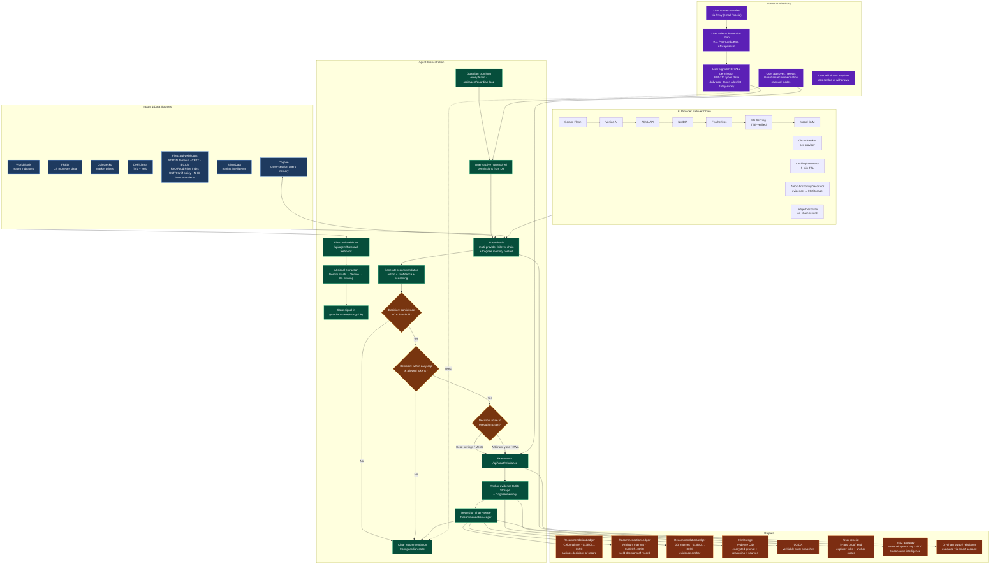

# Architecture

*For the product pitch, see [`product.md`](./product.md). This doc covers the system architecture that makes it work: multi-provider AI inference, a strategy-pattern swap orchestrator, and a cron-driven Guardian execution loop — with chain-aware on-chain settlement (Celo for EM savings, Arbitrum for yield, HashKey for APAC savings, 0G as the tamper-proof evidence layer), all scoped by user-signed ERC-7715-style permissions. For the APAC rail rationale, see [`rails.md`](./rails.md).*

> **Enforcement model (important):** the user-signed permission is cryptographic *consent*, verified server-side. Its spending bounds are currently enforced in **application code**, not on-chain — execution on Celo/Mento runs through a server-custodied smart account. True on-chain enforcement (ERC-7710 redemption) is the residual gap. See [`docs/guardian.md`](./guardian.md).

## Recent Hardening (2026-06)

This document reflects the post-hardening state. The headline changes since the initial 8.4/10 review:

- **EIP-712 server-side signature verification** on `POST /api/vault/permission` — every persisted permission is now cryptographically bound to the user's wallet signature (was: trust on first use with server-side inflation defaults).
- **0G anchor observability** — `recordRecommendation` returns a discriminated `AnchorResult` (`anchored | pending | failed`) and the status is surfaced in the chat receipt, the proof feed, and `GuardianState.latestAnchor`. The `pending` case (60s receipt timeout) is honest rather than silent.
- **Server-side alert cooldowns** — per-user, in `GuardianState.alertCooldowns`, surviving device switches. The localStorage map is gone.
- **Unified Guardian tier state machine** — `deriveGuardianTierState` in `@diversifi/shared` is the single source of truth for `idle | authorized | funded | monitoring`, replacing three inline implementations.
- **Celo token registry** — one shared config (`packages/shared/src/config/celo-tokens.ts`) replaces four duplicate `TOKEN_ADDRESSES` maps. The misleading `USDY: cUSD` placeholder is deleted.
- **Proactive loop decoupled from chat** — `ProactiveAgentRunner` mounted in `_app.tsx` owns the single 5-minute monitoring timer.
- **Guardian "Run dry-run now" button** on the tier card, wired to the existing `triggerExecutionLoop(true)` path. The duplicate button in the expanded view was removed.
- **Tab reorder (new user first-run)** — Home → Protect → Exchange → Pilot → Learn. Beginner mode includes Pilot tab. `/`-separated pill labels visible at all breakpoints.
- **GuardianStateScrollytelling** — vertical 4-state pipeline (`idle → authorized → funded → monitoring`) on the Protect tab's unconnected state, with animated step dots and "You are here" badge.
- **TabNavHint + useTabDiscovery** — animated swipe/explore hint above the tab bar on first visit, tracked via `TabDiscoveryProvider` context so TabNavigation and TabContentRouter share dismissal state. Auto-dismisses after 3 tab visits or first swipe.
- **GuidedTour consolidation** — 3-step tour (risk → Shield → connect) for users who skip philosophy onboarding. Region/goal/philosophy live in `useProtectionProfile`; `StrategyContext` delegates to profile storage. `TourTrigger` skips when philosophy is set and migrates old localStorage keys.
- **Beginner IA** — Simple mode: 3 tabs (Shield, Home, Learn), plain-language tips, compact proof card, `GuardianStatusChip` instead of wizard. Header hides mode toggle and chain pill.
- **APAC rail UX** — `needsApacRailMessaging()` surfaces an `apac-rail` contextual banner on Home and Shield for Confucian/Gotong Royong + Asia region; copy swaps honest "coming soon" vs live HashKey explorer link via `isApacRailLive()`.
- **Caribbean rail UX** — parity with APAC: `needsCaribbeanRailMessaging()` + a `CaribbeanRailHonestyBanner` (Home/Shield) for the Pan-Caribbean + Caribbean profile. Because the Caribbean rail has no separate chain (it settles on the always-on Celo home rail), the banner is always-live explanatory copy + Celo explorer link — no fake "coming soon" branch. Region-canonical routing (`isCaribbeanRailProfile` → Celo) and a Caribbean-cohort Guardian heartbeat leg sit alongside the APAC ones. The `CaribbeanFxNetCard` (two-phase intent → match review) mounts in the FX Corridor section against a hosted Mongo intent pool (`FxIntentRecord` + `lib/fx-intent-pool.ts`); the Guardian's `open_fx_netting_review` recommendation hands off to it.
- **Multi-chain proof feed** — `GET /api/agent/zero-g-ledger` merges recent receipts from Arbitrum, Celo, Robinhood Chain, and HashKey (per configured ledgers) for LiveProofCard; every ticker row surfaces the on-chain reasoning and falls back to the ledger-contract explorer link when a receipt has no settlement tx.
- **Testnet UX gating** — `shouldShowTestnetBanner()` hides the testnet strip unless `NEXT_PUBLIC_SHOW_TESTNET`, dev mode, or explicit opt-in via onboarding developer menu.
- **UnconnectedStateShell prop expansion** — `proofCardSide` (`'above' | 'below'`), `className`, `howItWorksCardClassName`, `demoCtaCardClassName` for flexible slot layout.
- **LiveProofCard as trust surface** — 0G-anchored proof feed rendered on Protect (above hero) and Overview tabs before wallet connection.

Net: 9 phases, +64 tests (300 → 343), 0 lint errors, 4.6 / 5 in per-pillar hardening. Rating moved from 8.4 → 8.7 / 10 (see `docs/roadmap.md` for the per-phase score table).

## High-Level Architecture

```
┌─────────────────────────────────────────────────────────────┐
│  Frontend (Next.js 15 + React 19 + Tailwind)                │
│  pages/index.tsx → AppShell → {Overview,Protect,Exchange,   │
│                                Agent,Info} tabs             │
│  27 hooks, dynamic imports, Framer Motion transitions       │
└──────────────────────────┬──────────────────────────────────┘
                           │
┌──────────────────────────▼──────────────────────────────────┐
│  @diversifi/shared (monorepo package, 33K+ lines)           │
│                                                             │
│  ┌─────────────────────┐  ┌───────────────────────────┐     │
│  │ AI Layer            │  │ Swap Layer                │     │
│  │ • 9 providers       │  │ • SwapOrchestratorService │     │
│  │ • FallbackOrch.     │  │ • 13 strategy impls       │     │
│  │ • CircuitBreaker    │  │ • ChainDetectionService   │     │
│  │ • CachingDecorator  │  │ • LiFi, 1inch, UniswapV3  │     │
│  │ • 0G Anchoring      │  │ • Hyperliquid, Mento, RWA│     │
│  │ • LedgerDecorator   │  └───────────────────────────┘     │
│  └─────────────────────┘                                    │
│                                                             │
│  ┌─────────────────────┐  ┌───────────────────────────┐     │
│  │ Guardian Services   │  │ Data Services             │     │
│  │ • AnalysisData      │  │ • marketPulseService      │     │
│  │ • Recommendation    │  │ • inflationService        │     │
│  │ • Execution         │  │ • unifiedCache            │     │
│  │ • PostAnalysis      │  │ • BrightDataService       │     │
│  └─────────────────────┘  │ • CogneeMemoryService     │     │
│                           └───────────────────────────┘     │
│                                                             │
│  Types, Config, Utils, Wallet adapters, Streak rewards      │
└──────────────────────────┬──────────────────────────────────┘
                           │
┌──────────────────────────▼──────────────────────────────────┐
│  API Layer (pages/api/)                                     │
│                                                             │
│  /api/agent/guardian-loop   → Cron-driven auto-execution    │
│  /api/agent/advisor         → AI-powered recommendations    │
│  /api/agent/x402-gateway    → Payment-gated evidence        │
│  /api/agent/zero-g-ledger   → 0G on-chain proof            │
│  /api/vault/*               → Smart account + fee ops       │
│  /api/agent/firecrawl-*     → Macro signal webhooks         │
└──────────────────────────┬──────────────────────────────────┘
                           │
┌──────────────────────────▼──────────────────────────────────┐
│  External Services                                          │
│  • MongoDB (user state, permissions, guardian-state)        │
│  • Celo/Mento: local stablecoin savings + Mento swaps       │
│    + RecommendationLedger (savings decisions of record)     │
│    + ERC-8004 agent identity                                │
│  • Arbitrum: yield execution (Uniswap V3 / Aave / RWA)      │
│    + RecommendationLedger (yield decisions of record)       │
│    + StrategyVault, AgenticHub                              │
│  • 0G: Storage (evidence CID) + DA + Compute (TEE proofs)   │
│    — the tamper-proof evidence layer both ledgers reference │
│  • Arc: x402 nanopayment settlement                         │
│  • HashKey Chain: APAC savings ledger (Confucian / Gotong Royong) │
│    + RecommendationLedger on chain 177 — see docs/rails.md   │
│  • Cognee: cross-session agent memory                       │
│  • Self Protocol: sybil-resistant agent ID (Celo)           │
│  • Hetzner: always-on cron runtime (no cold starts)         │
└─────────────────────────────────────────────────────────────┘
```

## Data Streams & their Jobs

Every external number is fallible by default. The app's rule across all streams is
**resolve in order**: serve the freshest real data you have, then the last real value
from a cache, then an honest constant — never a fabricated figure. Each row below is
what feeds the surface it powers, where it comes from, and how it stays honest.

### 1. The currency risk moment (Home hero)
| Stream | Source | Powers | Honesty behaviour |
|---|---|---|---|
| Curated depreciation | `constants/currency-risk.ts` — 28 countries, per-benchmark vs USD/EUR/XAU | `useCurrencyMoment` → `CurrencyMomentCard` (one delta + one personal consequence) | Directionally-accurate static data; “not live, not advice” on the card |
| Live 1yr vs-USD | `/api/currency-risk/live` (fawazahmed0 open dataset) | overrides the curated 1yr figure | Falls back to curated on failure; 3yr/5yr stay curated (feed only reaches back to 2024-03-02) |
| Goods anchor | `goodsAnchor` field on an entry (`GHS`/`NGN`/`KES`) | “≈ N fewer bags of rice / maize flour” line | Only shown for a **depreciating** currency and only when a staple is verified — never invents a staple; omitted otherwise |
| Philosophy frame | `lib/narrative/moment-framing.ts` (archetype → accent + reframe) | accent + values-register consequence after onboarding | Pure, no fetch; **non-prescriptive** (re-reads the erosion, never tells the user what to do) |
| Region detection | `useUserRegion` — ipapi.co IP geolocation + browser locale + `user-country-code` override | which country/currency the moment shows | **Location ≠ risk** — a diaspora visitor re-points the moment via the “Whose savings?” override |
| Inflation (fallback) | `/api/inflation` (IMF/World Bank + `FALLBACK_INFLATION_DATA`) | inflation-only moment for uncovered countries | Serves fallback constants before ever fabricating a number |

### 2. Market, yield & FX
| Stream | Source | Powers | Honesty behaviour |
|---|---|---|---|
| Emerging-market prices | `/api/emerging-markets/prices` (per-provider) | EM tracker, currency chart | Per-provider timeouts; serves **expired cache** before a static price; `hasEstimates` → “Includes estimates” |
| Yield | `/api/agent/best-yield` (vaults.fyi, LI.FI Earn, DefiLlama, GMX GM pools) | BestYieldCard, GMX deposits | Free-first: raw APY free, personalized layer gated by `insight-tier` (default-deny) |
| Macro signals | Firecrawl monitors (central banks, yield trackers, depeg) → `MACRO_SIGNAL:*` on the proof-feed cache | TradeIntelligence pill | Items are universal (impact stripped); pill appears only when a fresh signal exists |
| Market regime | `useMarketRegime` | tips + regime pill | Classifies holdings by regime; non-prescriptive |
| Exchange rates / FX netting | `/api/exchange-rates` + `fx-netting/*` (pure matching engine) | CaribbeanFxNetCard, SME FX | Currency-agnostic mid-market matching; net obligations settle on the region-canonical chain |

### 3. On-chain & verifiable
| Stream | Source | Powers | Honesty behaviour |
|---|---|---|---|
| Balances / portfolio | `useMultichainBalances` (Celo/Arbitrum/HashKey/0G) | home holdings, dial, scorecard | Chain-aware; per-chain RPC errors surfaced as inline banners |
| Ledger proof | `recommendationLedgerService` (chain-aware routing) + **0G Storage** CIDs | Verifiable AI tab, Guardian decisions | Every high-impact recommendation is anchored on-chain + mirrored to 0G |

### 4. AI / agent
| Stream | Source | Powers | Honesty behaviour |
|---|---|---|---|
| LLM intelligence | `AIService` — Venice/Gemini/AI·ML/NVIDIA/Featherless/0G/Modal (6-deep failover) | advisor, intelligence, web-search, deep-analyze | Circuit breaker + 5-min cache + provider fallback; 0G anchors reasoning |
| Voice | ElevenLabs TTS/STT (`/api/agent/speak`, `/api/agent/transcribe`) | chat voice | Live round-trip; feature-flag gated |
| Guardian | `guardian-heartbeat` + `guardian-loop` cron (Hetzner) | auto-executes within permission bounds | Bounds enforced in app code; every action mirrored to 0G |

## AI Provider Chain

Requests flow through a 6-deep fallback with circuit breakers at each step:

```
Gemini Flash → Venice AI → AI/ML API → NVIDIA → Featherless → 0G Serving → Modal (GLM)
    │              │            │          │           │             │            │
    └── CircuitBreaker ────────┴──────────┴───────────┴─────────────┴────────────┘
                  │
          CachingDecorator (5-min TTL)
                  │
          ZeroGAnchoringDecorator (evidence → 0G Storage)
                  │
          RecommendationLedgerDecorator (on-chain record)
```

Each provider implements `BaseAIProvider` (abstract class with `initialize()`, `isAvailable()`, `generateChatCompletion()`, `generateSpeech()`, `transcribeAudio()`). The `FallbackOrchestrator` tries providers in order until one succeeds, with per-operation timeouts and circuit breaker trip/reset via `CircuitBreakerDecorator`.

## Swap Orchestrator

The `SwapOrchestratorService` routes swaps through an ordered list of `BaseSwapStrategy` implementations:

| # | Strategy | Use case |
|---|----------|----------|
| 1 | MentoSwapStrategy | Celo same-chain stablecoins |
| 2 | EmergingMarketsStrategy | Celo Sepolia fictional companies |
| 3 | CurveArcStrategy | Curve on Arc Testnet |
| 4 | ArcTestnetStrategy | Arc Testnet guidance |
| 5 | ArbitrumSwapStrategy | Arbitrum-native DEX liquidity (Uniswap V3, Camelot) |
| 6 | HyperliquidPerpStrategy | Commodity perps (GOLD, SILVER, OIL) |
| 7 | OneInchSwapStrategy | Multi-chain best rates |
| 8 | UniswapV3Strategy | Direct Uniswap V3 fallback |
| 9 | LiFiEarnStrategy | Vault deposits |
| 10 | LiFiSwapStrategy | LiFi same-chain |
| 11 | LiFiBridgeStrategy | Cross-chain bridging |
| 12 | DirectRWAStrategy | RWA swaps (final fallback) |

Strategies are tried in order. The orchestrator tracks per-strategy performance (success rate, average time) and can promote/demote. Islamic Finance mode excludes HyperliquidPerpStrategy.

## Guardian Autonomous Loop

The Guardian is a server-side cron (`*/5 * * * *`) on Hetzner that auto-executes within user-signed ERC-7715-style permission bounds (app-layer enforcement; on-chain ERC-7710 redemption is deferred — see [`guardian.md`](./guardian.md)):

```
1. Firecrawl detects macro change
   → webhook /api/agent/firecrawl-webhook
   → AI extracts signal
   → stored in guardian-state (MongoDB)

2. Cron ticks → /api/agent/guardian-loop
   → DB query: find active, non-expired permissions
   → Check pending recommendations in guardian-state
   → Validate: confidence > GUARDIAN_CONFIDENCE_THRESHOLD (0.6)
   → Validate: within daily limit, allowed tokens not exceeded
   → Route action to execution chain:
      - Stable-savings / Mento actions → Celo executor
      - Deep-liquidity / RWA yield actions → Arbitrum executor
      - APAC conservative savings (Confucian / Gotong Royong, Asia region) → HashKey ledger via `routingContext`
   → Safety cap: MAX_EXECUTIONS_PER_LOOP (5)
   → Execute via /api/vault/rebalance
   → Anchor evidence bundle to 0G Storage + Cognee memory
   → Record hash/CID on the **chain-aware RecommendationLedger** —
     the decision settles on the chain where the action executed
     (Celo for EM savings, Arbitrum for yield, HashKey for
     regulated-market Asia savings). 0G Storage holds the evidence
     blob; the ledger entry references the 0G CID.
   → Clear recommendation from guardian-state
```

**Security:** Server-to-server auth via `GUARDIAN_LOOP_SECRET` header. DB unavailability returns `200` with status (never `500` — graceful degradation).

**Permission integrity:** The ERC-7715 permission posted to `/api/vault/permission` is verified server-side via `ERC7715Service.verifySignedPermission` (EIP-712 typed-data recovery against the expected `userAddress` and `chainId`). The previous "deferred to Privy policies" posture is gone — every persisted permission is cryptographically bound to the user's wallet signature. Permission objects without a valid 0x-hex signature and 32-byte nonce are rejected with `400`.

## Agent Identity (ERC-8004 + Self Protocol)

The DiversiFi Guardian has two on-chain identity registrations. Both are
ERC-8004 compliant; Self Protocol adds a Proof-of-Human layer on top.

| Registry | Address | Chain | Status |
|---|---|---|---|
| ERC-8004 Identity Registry (8004scan) | `0x8004A169FB4a3325136EB29fA0ceB6D2e539a432` | Celo mainnet | **Registered** — agentId 9654, owner `0x3542…Af48` |
| Self Protocol Agent ID | `0xaC3DF9ABf80d0F5c020C06B04Cced27763355944` (registry) | Celo mainnet (42220) | **Registered** — agent `0xE8cDb7CA…f170`, verified with real passport (proof-of-human, mainnet) |

**ERC-8004 (8004scan):** Portable, censorship-resistant agent identity. The
registration file at `public/.well-known/erc8004.json` describes the agent
(services, x402 support, supported trust signals). `pnpm register-erc8004`
mints the NFT; the `agentURI` points to the hosted registration file.

**Self Protocol Agent ID:** Sybil-resistant identity on Celo backed by ZK
passport verification (one human = one agent). The
`SelfAgentRegistration` component renders a QR code; the agent owner scans
with the Self app → soulbound NFT minted. `self-agent-service.ts` provides
signing (`getSelfSigningAgent`) and verification (`getSelfAgentVerifier`)
for outbound/inbound agent requests.

See [`docs/guardian.md`](./guardian.md) for registration
instructions, env vars, and the signing/verification API.

## State Management (Frontend)

### Context Providers (nested in `AppProviders`)

| Provider | Scope |
|----------|-------|
| `NavigationProvider` | Active tab, tab history |
| `ThemeProvider` | Dark/light mode |
| `ExperienceProvider` | Simple/Standard/Advanced mode |
| `ProtectionProfileProvider` | Profile goals, region, philosophy (`useStrategy` reads `config.philosophy`) |
| `BacktestProvider` | Shared backtest simulation state |
| `TourProvider` | Guided tour state |
| `DemoModeProvider` | Demo mode toggle + mock data |

### Hooks: Domain-Driven React Hooks

All 40+ hooks live in `/hooks/`. Key patterns:

- **Data hooks** (`use-inflation-data`, `use-multichain-balances`, `use-currency-performance`) — fetch and cache external data
- **Agent hooks** (`use-proactive-agent`, `use-agent-chat`, `use-agent-config`) — Guardian interaction
- **Wallet hooks** (`use-session-key`, `use-arc-balance`) — wallet operations
- **UI hooks** (`use-mobile`, `use-in-view`, `use-animated-counter`) — responsive/UX helpers

The `useProactiveAgent` monitoring loop is mounted once at the app root via `components/agent/ProactiveAgentRunner.tsx` (inside `ProviderTree` in `pages/_app.tsx`), so the 5-minute market + yield + UBI check survives chat-surface open/close transitions.

### Known issue: Prop drilling

`pages/index.tsx` passes 27 props through `AppShell`. This will be resolved via a `useAppShell()` hook (see `roadmap.md`).

## 0G Verifiability Stack

0G is the **evidence layer**, not the ledger of record. The chain-aware
`RecommendationLedger` settles decisions on the chain where the money
moves (Celo for savings, Arbitrum for yield); 0G holds the tamper-proof
reasoning evidence that those ledger entries reference. This separation
serves both the Celo grant (verifiable settlement on Celo) and the 0G
buildathon (deep Storage/Compute/DA integration) without forcing a
single canonical chain.

Every AI recommendation traces through the full 0G pipeline:

| 0G Component | Purpose |
|---|---|
| **0G Serving** | Decentralized inference via 0G Router (part of AI fallback chain) |
| **0G Storage** | Evidence bundles (prompt, reasoning, data sources) hashed → CID. The CID is referenced by the chain-aware ledger entry. |
| **0G DA** | Agent context / preferences serialized for cross-invocation resilience |
| **0G Compute Direct** | Optional TEE-verified inference for high-impact Guardian decisions |

**Chain-aware ledger (the ledger of record follows the money):**

| Chain | Ledger role | Contract | Status |
|---|---|---|---|
| **Arbitrum Sepolia** | Yield decisions of record | [`0xB393Fb70BE3DDE41e3238339E69A27A01Caa2996`](https://sepolia.arbiscan.io/address/0xB393Fb70BE3DDE41e3238339E69A27A01Caa2996) | Live (mainnet promotion in progress) |
| **Celo mainnet** | Savings decisions of record | *(deployment in progress)* | ERC-8004 identity live; ledger deployment next |
| **0G Galileo Testnet** | Evidence mirror | [`0xFADc8a7220Fa152eBE3Dfc5f7828Be289559D4ED`](https://chainscan-galileo.0g.ai/address/0xFADc8a7220Fa152eBE3Dfc5f7828Be289559D4ED) | Live (0G mainnet promotion in Wave 3) |

StrategyVault: [`0xd83797702AE6ef15349e762B22bfe79322B46975`](https://sepolia.arbiscan.io/address/0xd83797702AE6ef15349e762B22bfe79322B46975), AgenticHub: [`0x72c78a27a47d07656bb6b606d7DB5Ae5F114bf92`](https://sepolia.arbiscan.io/address/0x72c78a27a47d07656bb6b606d7DB5Ae5F114bf92) (both Arbitrum Sepolia).

### Anchor observability

`recordRecommendation` returns a discriminated `AnchorResult`:

| Status | Meaning | UI behaviour |
|---|---|---|
| `anchored` | Tx mined, `RecommendationRecorded` event parsed, `id` known | "0G anchored #N" + explorer link |
| `pending`  | Tx broadcast but receipt not confirmed within 60 s | "0G anchor pending" + tx hash, may resolve later |
| `failed`   | Revert, missing signer, RPC throw, or missing contract | "0G anchor failed" with `error` text |

The status is patched into the corresponding `AIMessage.x402Receipt.anchor` in place via `AIConversationContext.patchMessage`, so the user sees the verifier surface in the receipt itself. The Guardian cron persists the same shape to `GuardianState.latestAnchor` and surfaces it on the proof feed. `firecrawl-webhook` includes the anchor in its response, and `zero-g-ledger` POST returns `status`, `txHash`, `explorerUrl`, and (when available) `id`.

## Arc x402 Payment Loop

Paid research flows through an HTTP 402 challenge/response:

```
Client → GET /api/agent/x402-gateway?source=macro_analysis
       ← 402 { nonce, amount, currency: "USDC", recipient, expires }

Client → USDC.transfer on Arc (real on-chain tx)
Client → GET /api/agent/x402-gateway?source=macro_analysis
         + x-payment-proof: 0x{tx_hash}
         + x-payment-nonce: {challenge_nonce}
       ← 200 { data, _billing: { arcSettled: true, txHashes, explorer } }
```

Agent wallet: `0x6D5967e30dF504834DFD0aE38eFaC5DA4ac2DaC8` (Arc Testnet)

## Deployment

| Component | Host | Why |
|-----------|------|------|
| Frontend | Vercel | CDN, edge functions, free tier |
| Heavy API routes | Hetzner VPS | No 15s timeout, no cold starts |
| Agent runtime | Hetzner VPS + PM2 | Always-on cron + process management |
| Database | MongoDB Atlas | Managed, IP-whitelisted |

Heavy routes (`/api/agent/status`, `/api/agent/advisor`, `/api/agent/deep-analyze`, `/api/agent/x402-gateway`, `/api/vault/*`) are proxied from Vercel to Hetzner via `next.config.js` rewrites.

## Monorepo Structure

```
diversifi/
  pages/                    # Next.js pages router
  components/               # React components (agent, app, tabs, onboarding, swap, ui, wallet)
  hooks/                    # Domain-driven React hooks
  context/                  # React context providers
  config/                   # Chain configs, contract addresses
  constants/                # Tab IDs, token addresses, inflation data
  lib/                      # MongoDB client, demo data, OZ contracts (submodule)
  models/                   # Mongoose models (Permission, Vault, etc.)
  packages/
    shared/                 # Core business logic (33K+ lines) — AI, swaps, Guardian, data
    shared-0g/              # 0G Storage + DA integration
    mento-utils/            # Mento Protocol helpers
  scripts/                  # Firecrawl setup, wallet creation, volume generation
  scripts/smoke/            # x402 smoke harnesses
  contracts/test/           # Foundry contract tests
```

## Key Design Patterns

| Pattern | Where | Why |
|---------|-------|------|
| **Strategy** | 13 swap strategies under `SwapOrchestratorService` | New DEX = new class, no existing code changes |
| **Provider** | 9 AI providers under `BaseAIProvider` | Add/remove providers without touching orchestration |
| **Decorator** | AI service wraps providers in caching → circuit breaker → 0G anchoring → ledger | Cross-cutting concerns are independently testable |
| **Orchestrator** | `FallbackOrchestrator` and `SwapOrchestratorService` | Ordered fallback with performance tracking |
| **Observer** | `agentEventBus` for proactive yield/rebalance alerts | Decoupled pub/sub between detection and notification |

## Guardian Workflow Diagram

Mermaid diagram for the DiversiFi Guardian autonomous loop — covering
inputs, agent orchestration, human-in-the-loop steps, data sources and
APIs, outputs, and key decision points.

### Full Guardian Workflow


```mermaid
flowchart TD
    %% ===== INPUTS / DATA SOURCES =====
    subgraph Inputs["Inputs & Data Sources"]
        direction TB
        WB["World Bank<br/>macro indicators"]
        FRED["FRED<br/>US monetary data"]
        CG["CoinGecko<br/>market prices"]
        DFL["DeFiLlama<br/>TVL + yield"]
        FC["Firecrawl webhooks<br/>STATIN Jamaica · CBTT · ECCB<br/>FAO Food Price Index<br/>USTR tariff policy · NHC hurricane alerts"]
        SS["BrightData<br/>market intelligence"]
        MEM["Cognee<br/>cross-session agent memory"]
    end

    %% ===== HUMAN-IN-THE-LOOP =====
    subgraph HITL["Human-in-the-Loop"]
        direction TB
        USER["User connects wallet<br/>via Privy (email / social)"]
        PLAN["User selects Protection Plan<br/>e.g. Pan-Caribbean, Africapitalism"]
        SIGN["User signs ERC-7715 permission<br/>EIP-712 typed data<br/>daily cap · token allowlist · 7-day expiry"]
        APPROVE["User approves / rejects<br/>Guardian recommendation<br/>(manual mode)"]
        WITHDRAW["User withdraws anytime<br/>fees settled at withdrawal"]
        USER --> PLAN --> SIGN
    end

    %% ===== AGENT ORCHESTRATION =====
    subgraph Agent["Agent Orchestration"]
        direction TB
        WEBHOOK["Firecrawl webhook<br/>/api/agent/firecrawl-webhook"]
        EXTRACT["AI signal extraction<br/>Gemini Flash → Venice → 0G Serving"]
        STORE["Store signal in<br/>guardian-state (MongoDB)"]
        CRON["Guardian cron loop<br/>every 5 min · /api/agent/guardian-loop"]
        QUERY["Query active non-expired<br/>permissions from DB"]
        SYNTH["AI synthesis<br/>multi-provider failover chain<br/>+ Cognee memory context"]
        RECOG["Generate recommendation<br/>action + confidence + reasoning"]
        THRESH{"Decision: confidence<br/>&gt; 0.6 threshold?"}
        BOUNDS{"Decision: within daily cap<br/>&amp; allowed tokens?"}
        ROUTE{"Decision: route to<br/>execution chain?"}
        EXEC["Execute via /api/vault/rebalance"]
        ANCHOR["Anchor evidence to 0G Storage<br/>+ Cognee memory"]
        LEDGER["Record on chain-aware<br/>RecommendationLedger"]
        CLEAR["Clear recommendation<br/>from guardian-state"]

        WEBHOOK --> EXTRACT --> STORE
        CRON --> QUERY --> SYNTH --> RECOG --> THRESH
        THRESH -->|No| CLEAR
        THRESH -->|Yes| BOUNDS
        BOUNDS -->|No| CLEAR
        BOUNDS -->|Yes| ROUTE
        ROUTE -->|Celo: savings / Mento| EXEC
        ROUTE -->|Arbitrum: yield / RWA| EXEC
        EXEC --> ANCHOR --> LEDGER --> CLEAR
    end

    %% ===== AI PROVIDER CHAIN (sub-detail) =====
    subgraph AIChain["AI Provider Failover Chain"]
        direction LR
        P1["Gemini Flash"] --> P2["Venice AI"] --> P3["AI/ML API"] --> P4["NVIDIA"] --> P5["Featherless"] --> P6["0G Serving<br/>TEE-verified"] --> P7["Modal GLM"]
        CB["CircuitBreaker<br/>per provider"]
        CACHE["CachingDecorator<br/>5-min TTL"]
        ZG["ZeroGAnchoringDecorator<br/>evidence → 0G Storage"]
        LD["LedgerDecorator<br/>on-chain record"]
    end

    %% ===== OUTPUTS =====
    subgraph Outputs["Outputs"]
        direction TB
        LEDGER_C["RecommendationLedger<br/>Celo mainnet · 0x3BCf…369C<br/>savings decisions of record"]
        LEDGER_A["RecommendationLedger<br/>Arbitrum mainnet · 0x3BCf…369C<br/>yield decisions of record"]
        LEDGER_0G["RecommendationLedger<br/>0G mainnet · 0x3BCf…369C<br/>evidence anchor"]
        ZG_STORAGE["0G Storage<br/>evidence CID<br/>encrypted prompt + reasoning + sources"]
        ZG_DA["0G DA<br/>verifiable state snapshot"]
        RECEIPT["User receipt<br/>in-app proof feed<br/>explorer links + anchor status"]
        X402["x402 gateway<br/>external agents pay USDC<br/>to consume intelligence"]
        TX["On-chain swap / rebalance<br/>executed via smart account"]
    end

    %% ===== CONNECTIONS =====
    Inputs --> WEBHOOK
    Inputs --> SYNTH
    MEM <--> SYNTH

    SIGN --> QUERY
    APPROVE --> EXEC
    APPROVE -.->|reject| CLEAR

    AIChain --> SYNTH

    LEDGER --> LEDGER_C
    LEDGER --> LEDGER_A
    LEDGER --> LEDGER_0G
    ANCHOR --> ZG_STORAGE
    ANCHOR --> ZG_DA
    LEDGER --> RECEIPT
    EXEC --> TX
    SYNTH --> X402

    %% ===== STYLING =====
    classDef inputStyle fill:#1e3a5f,stroke:#3b82f6,color:#fff
    classDef hitlStyle fill:#5b21b6,stroke:#a78bfa,color:#fff
    classDef agentStyle fill:#064e3b,stroke:#34d399,color:#fff
    classDef outputStyle fill:#7c2d12,stroke:#fb923c,color:#fff
    classDef decisionStyle fill:#78350f,stroke:#fbbf24,color:#fff

    class WB,FRED,CG,DFL,FC,SS,MEM inputStyle
    class USER,PLAN,SIGN,APPROVE,WITHDRAW hitlStyle
    class WEBHOOK,EXTRACT,STORE,CRON,QUERY,SYNTH,RECOG,EXEC,ANCHOR,LEDGER,CLEAR agentStyle
    class THRESH,BOUNDS,ROUTE decisionStyle
    class LEDGER_C,LEDGER_A,LEDGER_0G,ZG_STORAGE,ZG_DA,RECEIPT,X402,TX outputStyle
```

### Legend

| Element | Where in diagram |
|---|---|
| **Inputs** | Blue nodes — World Bank, FRED, CoinGecko, DeFiLlama, Firecrawl (Caribbean inflation + hurricane + tariff signals), BrightData, Cognee memory |
| **Agent orchestration** | Green nodes — Firecrawl webhook → AI signal extraction → guardian-state store → cron loop → permission query → AI synthesis (multi-provider failover) → recommendation generation → threshold/bounds/routing decisions → execute → anchor → ledger → clear |
| **Human-in-the-loop** | Purple nodes — wallet connect → plan selection → ERC-7715 permission signing (EIP-712) → approve/reject recommendation → withdraw anytime |
| **Data sources & APIs** | Blue nodes + AI provider chain — 7 external data sources, 7 AI providers with circuit breakers, Cognee memory, MongoDB state |
| **Outputs** | Orange nodes — chain-aware RecommendationLedger on 3 chains (Celo/Arbitrum/0G), 0G Storage evidence CID, 0G DA snapshot, user receipt, x402 gateway for external agents, on-chain swap execution |
| **Key decision points** | Yellow diamonds — confidence > 0.6 threshold, within daily cap & allowed tokens, route to execution chain (Celo for savings, Arbitrum for yield) |


---
> Dependency audit + Circle agent-stack findings moved to [`architecture-notes.md`](./architecture-notes.md).
