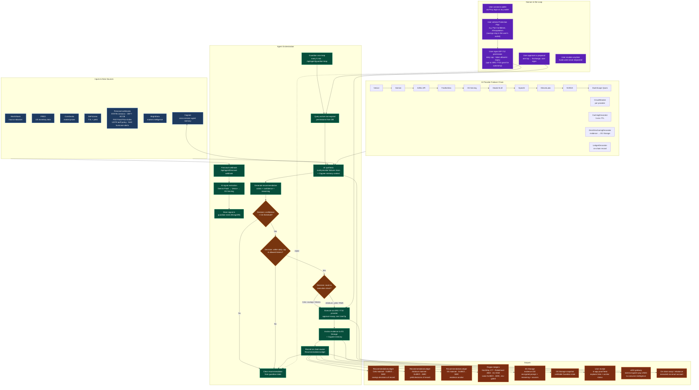

# Architecture

*For the product pitch, see [`product.md`](./product.md). This doc covers the system architecture that makes it work — and the chain/rail architecture that it settles on. Chains, rails, and settlement lanes are one subject and live here: the multi-provider AI layer, the strategy-pattern swap orchestrator, and the cron-driven Guardian execution loop, plus every savings and settlement lane (Celo for EM savings, Arbitrum for yield and a settlement rail, Arc for commerce, HashKey for APAC savings, the Caribbean netting rail, 0G as the tamper-proof evidence layer), all scoped by user-signed ERC-7715-style permissions.*

> **Positioning — the Guardian within your rules:** the target pipeline is
> **data → deterministic risk calculation → constrained strategy → AI
> explanation → user approval → on-chain execution**. Four live paths still
> let model output choose recommendations or user-facing numbers without
> the required deterministic check; see [the implementation gaps](./guardian.md#where-the-model-still-decides).
> The model never authorizes a move. Default execution requires the user's
> signature; opt-in autonomous execution uses a bounded ERC-7715 grant.
> Broader on-chain policy remains deferred, as the enforcement tiers in
> [Guardian](./guardian.md#what-bounds-execution) explain.

> **Enforcement model (important):** the user-signed EIP-712 permission is cryptographic *consent*, verified server-side, with bounds also enforced in application code. The default execution path is **one-tap user signing** — nothing moves until the user signs on Exchange. Opt-in autonomy is **ERC-7715/7710 only**: the session account redeems a MetaMask Advanced Permission on the user's own smart account, enforced on-chain by the DelegationManager (kit-derived chains: Celo, Celo Sepolia, Arbitrum). There is no Safe, no vault deposit, no server-custodied user account. See [`docs/guardian.md`](./guardian.md).

> **Current state:** this doc describes the post-hardening architecture (rating 8.7/10 after the 2026-06 review pass). The connected wallet is the source of truth for holdings — `apps/web/lib/wallet-portfolio-view.ts` is the shared selector layer consumed by all tabs. Dated change history lives in [`docs/history/roadmap-log.md`](./history/roadmap-log.md).

## Table of Contents

1. [High-Level Architecture](#high-level-architecture)
2. [Chain and rail architecture (the end state)](#chain-and-rail-architecture-the-end-state)
   · [Payment-rail migration phases](#payment-rail-migration-phases)
3. Rails in detail: [Celo & Mento](#celo--mento--the-regional-savings-rail) · [Arbitrum](#arbitrum--execution-yield-and-x402-settlement) · [Arc](#arc--commerce-and-settlement-mainnet-live-2026-09-16) · [HashKey / APAC](#hashkey--the-apac-rail) · [Caribbean](#caribbean-rail--future-caribbean-2026)
4. [Data Streams & their Jobs](#data-streams--their-jobs)
5. [AI Provider Chain](#ai-provider-chain)
6. [Swap Orchestrator](#swap-orchestrator)
7. [Guardian Autonomous Loop](#guardian-autonomous-loop)
8. [Agent Identity (ERC-8004 + Self Protocol)](#agent-identity-erc-8004--self-protocol)
9. [State Management (Frontend)](#state-management-frontend)
10. [0G Verifiability Stack](#0g-verifiability-stack)
11. [Arc x402 Payment Loop](#arc-x402-payment-loop)
12. [Deployment](#deployment) · [Monorepo Structure](#monorepo-structure) · [Key Design Patterns](#key-design-patterns)
13. [Guardian Workflow Diagram](#guardian-workflow-diagram)
14. [Rail implementation status](#rail-implementation-status)
15. [Related docs](#related-docs)

## High-Level Architecture

```
┌─────────────────────────────────────────────────────────────┐
│  Frontend (Next.js 15 + React 19 + Tailwind)                │
│  pages/index.tsx → AppShell → {Overview,Protect,Exchange,   │
│                                Agent,Info} tabs             │
│  70+ hooks, dynamic imports, Framer Motion transitions       │
└──────────────────────────┬──────────────────────────────────┘
                           │
┌──────────────────────────▼──────────────────────────────────┐
│  @diversifi/shared (monorepo package, ~53K lines)            │
│                                                             │
│  ┌─────────────────────┐  ┌───────────────────────────┐     │
│  │ AI Layer            │  │ Swap Layer                │     │
│  │ • 10 providers      │  │ • SwapOrchestratorService │     │
│  │ • FallbackOrch.     │  │ • 13 strategy impls       │     │
│  │ • CircuitBreaker    │  │ • ChainDetectionService   │     │
│  │ • CachingDecorator  │  │ • LiFi, 1inch, UniswapV3  │     │
│  │ • 0G Anchoring      │  │ • Hyperliquid, Mento, RWA│     │
│  │ • LedgerDecorator   │  └───────────────────────────┘     │
│  └─────────────────────┘                                    │
│                                                             │
│  ┌─────────────────────┐  ┌───────────────────────────┐     │
│  │ Guardian Services   │  │ Data Services             │     │
│  │ • AnalysisData      │  │ • marketPulseService      │     │
│  │ • Recommendation    │  │ • inflationService        │     │
│  │ • Execution         │  │ • unifiedCache            │     │
│  │ • PostAnalysis      │  │ • BrightDataService       │     │
│  └─────────────────────┘  │ • CogneeMemoryService     │
│                           └───────────────────────────┘     │
│                                                             │
│  Types, Config, Utils, Wallet adapters, Streak rewards      │
└──────────────────────────┬──────────────────────────────────┘
                           │
┌──────────────────────────▼──────────────────────────────────┐
│  API Layer (pages/api/)                                     │
│                                                             │
│  /api/agent/guardian-loop   → Cron-driven auto-execution    │
│  /api/agent/advisor         → AI-powered recommendations    │
│  /api/agent/x402-gateway    → Payment-gated evidence        │
│  /api/agent/zero-g-ledger   → 0G on-chain proof            │
│  /api/vault/*               → Guardian profile/permission ops │
│  /api/agent/firecrawl-*     → Macro signal webhooks         │
└──────────────────────────┬──────────────────────────────────┘
                           │
┌──────────────────────────▼──────────────────────────────────┐
│  External Services                                          │
│  • MongoDB (user state, permissions, guardian-state)        │
│  • Celo/Mento: local stablecoin savings + Mento swaps       │
│    + RecommendationLedger (savings decisions of record)     │
│    + ERC-8004 agent identity                                │
│  • Arbitrum: yield execution (Uniswap V3 / Aave / RWA)      │
│    + RecommendationLedger (yield decisions of record)       │
│    + StrategyVault, AgenticHub                              │
│  • 0G: Storage (evidence CID) + Compute (TEE proofs)         │
│    — the tamper-proof evidence layer the ledgers reference │
│  • Arc: x402 nanopayment settlement                         │
│  • HashKey Chain: APAC savings ledger (Confucian / Gotong Royong) │
│    + RecommendationLedger on chain 177 — see § HashKey — the APAC rail │
│  • Cognee: cross-session agent memory                       │
│  • Self Protocol: sybil-resistant agent ID (Celo)           │
│  • Hetzner: always-on cron runtime (no cold starts)         │
└─────────────────────────────────────────────────────────────┘
```

## Chain and rail architecture (the end state)

Each layer owned by exactly one chain. The ledger of record follows the
money — decisions settle where the action executes; 0G holds the evidence
CIDs those entries reference (current-state detail:
[§ 0G Verifiability Stack](#0g-verifiability-stack)).

| Layer | Chain | Why this chain | What it does NOT do |
|---|---|---|---|
| **Savings + Identity** | **Celo** | Regional Mento stablecoins (cUSD, cREAL, KESm, GHSm), SocialConnect ODIS, GoodDollar UBI | Agent execution (no EIP-7702), nanopayments |
| **Execution + Yield** | **Arbitrum** | Deepest USDC + RWA liquidity (Uniswap V3, 1inch, Camelot, PAXG, USDY, SYRUPUSDC); EIP-7702-capable for true on-chain ERC-7710 enforcement | Regional stablecoins, nanopayments |
| **Trust + Verifiability** | **0G** | Content-addressed Storage, TEE-verified Compute, DA | Payment settlement (gas-token friction), ledger of record |
| **Commerce / settlement** | **Arc** | x402 mandate-first settlement, Circle Gateway funding, CCTP domain 26 — invisible to retail; not a savings or execution chain. Its one user-facing job: a deposit rail — Arc USDC → CCTP → the user's wallet on **Arbitrum** (never Celo: not a CCTP domain) | Verifiable AI, regional stablecoins, deep DEX liquidity |

Alongside the four-layer end state, two regional lanes extend the map:
**HashKey Chain** gives APAC savings a geographic + trust home the
four-chain stack did not cover ([§ HashKey — the APAC rail](#hashkey--the-apac-rail)),
and the **Caribbean rail** adds FX netting and USD-pegged savings for
CARICOM/CSME ([§ Caribbean rail](#caribbean-rail--future-caribbean-2026)).
Neither changes the layer ownership above.

### Payment-rail migration phases

The codebase default remains 0G Pay on testnet; Arc public mainnet landed
2026-09-16 (chain ID 5042, USDC native gas, CCTP domain 26). Arc EIP-3009
settlement, CCTP V2 and Circle Gateway Nanopayments are integrated. Production
activation is not established by repository state: the deployed environment
must select `SETTLEMENT_NETWORK=ARC SETTLEMENT_ENV=mainnet`, configure the
merchant recipient and the legacy-named `VAULT_PRIVATE_KEY` settlement signer,
and pass an explicitly authorized end-to-end mainnet payment check. That signer
submits buyer authorizations and pays gas; it is not a user-funds vault.

| Phase | Trigger | Payment rail | Notes |
|---|---|---|---|
| **1 — Current code defaults** | Current | ZERO_G/testnet | `SETTLEMENT_NETWORK=ZERO_G`, `SETTLEMENT_ENV=testnet` |
| **2 — Arc mainnet integration** | Implemented; production activation unconfirmed | Arc | EIP-3009 settlement, CCTP V2 and Gateway Nanopayments are integrated; validate deployment config and a real settlement before describing production as live |
| **3 — Protection Balance product** | Planned; deployment not established here | — | A cross-chain prepaid balance is distinct from Gateway Nanopayments; do not infer production availability from the settlement integration |
| **2b — Arc arrival (deposit rail)** | Built 2026-09-28; production off until a mainnet rehearsal | Arc → Arbitrum | Exchange offers "USDC on Arc — bring it here" only when the wallet holds it; one Standard, Circle-forwarded CCTP burn; arrival prefills USDC → PAXG on Arbitrum. Enable with `NEXT_PUBLIC_ARC_ARRIVAL=mainnet` after one real small transfer. Next: gasless first swap on arrival (USDC permit / intent route) so no Arbitrum ETH is needed. Celo leg (LiFi) only on demand. [§ Arc — commerce and settlement](#arc--commerce-and-settlement-mainnet-live-2026-09-16) |
| **4 — StableFX business venue (under evaluation)** | Circle answers on platform model + delegate funding | Arc | Live on Arc mainnet since 2026-09-22. Fit: execution for KYB'd business users behind the payment-cycle report, plus a 24/7 route on Mento-overlapping pairs. Not a retail or EM-corridor venue. Plan + open questions: [`reference.md`](./reference.md) § StableFX (Circle) |

Intended billing unit: a user funds a Protection Balance once and pays for
**decision artifacts** (Protection Reviews), not per-source feeds — source
prices are COGS inside the artifact. This is product direction; do not infer
that a cross-chain Gateway balance or production payment rail is active from
the settlement integrations alone. Doctrine: `docs/product.md` § The product
object.

**Codebase rule:** do not delete Arc infrastructure (`ArcAgent`, Curve/AeonDEX
strategies, `use-arc-balance`) — it has long-term value at Arc mainnet.

---

## Celo & Mento — the regional savings rail

**Job:** regional stablecoin savings and the savings ledger of record for
Africa, LatAm, emerging markets, and (by routing) the Caribbean. Mento
provides the local-stable pairs; `RecommendationLedger` (Celo mainnet,
`0x3BCf7dFd68ce98880618c89A351168960724369C`) is where savings decisions
settle; ERC-8004 agent identity lives here too
([§ Agent Identity](#agent-identity-erc-8004--self-protocol)).

**The full Mento roster** (as of the Caribbean research, July 2026):
USDm, EURm, BRLm, KESm, PHPm, COPm, GHSm, NGNm, GBPm, CADm, AUDm, CHFm,
JPYm, XOFm, ZARm, cUSD, cEUR, cREAL. Celo still owns cUSD / KESm / COPm /
PHPm as the local-stable savings venue; **JPYm on Celo/Mento is the
executable yen exposure today** (see the Japan note under the APAC rail).
There are **no Caribbean Mento currencies** — no JMDm, TTDm, BBDm, XCDm,
or GYDm — which is why the Caribbean rail settles in USD-pegged cUSD on
Celo rather than a local stabletoken.

| What Celo does NOT do | Detail |
|---|---|
| Agent execution autonomy | No EIP-7702 — ERC-7710 session paths exist on kit-derived chains where the environment supports them; see [§ Guardian Autonomous Loop](#guardian-autonomous-loop) and `docs/guardian.md` |
| Nanopayments | Arc's job — Celo's gas economics aren't built for sub-cent intelligence tolls |
| Receiving Arc money | Celo is neither a CCTP domain nor a Circle Gateway domain (both lists checked 2026-09-28); USDC isn't in the app's Celo token lists; Mento routes Mento stables only. The Celo leg from Arc (via LiFi) is deliberately not built and would only be added on real demand for regional stables |
| Yield optimization | Arbitrum holds that role — "the yield optimizer, not the savings account" |

**Mento swap mechanics** (implementation detail in
[§ Swap Orchestrator](#swap-orchestrator)): `MentoSwapStrategy` goes
through the Mento SDK v3 (broker + FPMM pools, multi-hop in one Router
tx); Mento v3 pools stop quoting when FX markets close (`market_closed`)
— the motivation for evaluating StableFX as a 24/7 weekend route on
overlapping currencies ([§ Arc — StableFX](#stablefx--business-execution-venue-under-evaluation-2026-09-28)).
Remittance and off-ramp: Celo + MiniPay delivers <1% diaspora remittance
cost (network fee under $0.001, off-ramp via Noah/partners to 40+ local
currencies; MiniPay already operates in 66+ countries). GoodDollar UBI and
SocialConnect ODIS are the identity/entitlement rails on the same chain.

**FX-anchor routing:** `pages/api/agent/x402-gateway.ts` maps
`FX_ANCHOR_CHAIN_BY_REGION.caribbean = 42220` — there is no native
Caribbean chain, so USD-pegged stables on Celo are the Caribbean savings
rail and its canonical ledger.

---

## Arbitrum — execution, yield, and x402 settlement

**Job:** deepest USDC + RWA liquidity (Uniswap V3, 1inch, Camelot, PAXG,
USDY, SYRUPUSDC); EIP-7702-capable for true on-chain ERC-7710 enforcement;
yield decisions of record on the chain-aware `RecommendationLedger`
(Arbitrum One mainnet, `0x3BCf7dFd68ce98880618c89A351168960724369C`). It
also became a fourth x402 settlement rail. It is the **yield optimizer,
not the savings account** — APAC and EM savings stay on their regional
rails; Arbitrum executes the yield slice (e.g. the Singapore Gotong
Royong example: 70% park on the APAC ledger, 30% rotate to USDY on
Arbitrum).

The following records the (now-shipped) implementation plan that added
Arbitrum to the x402 settlement system. It is kept as the reference for
how the env-gated rail works, not as an open plan.

### Implementation Plan (shipped): Arbitrum as an x402 Settlement Rail

## Goal

Enable the DiversiFi x402 Data Hub to accept USDC payments on **Arbitrum** (mainnet and Sepolia), so the Arbitrum track could truthfully say:

> *"The DiversiFi Guardian keeps its treasury in USDC on Arbitrum and pays for premium intelligence directly on the same chain where it executes yield."*

This was a code-only extension of the existing env-gated settlement system. No new services, no new packages, no new gateway endpoints.

---

## Current State

The settlement layer is already env-gated via `SETTLEMENT_NETWORK` + `SETTLEMENT_ENV`:

- The current `settlement-service.ts` builds per-rail configs, including `ARC`, `ZERO_G`, `ARBITRUM`, and `HASHKEY`.
- `x402-gateway.ts` reads the active config and returns its chain and environment in payment challenges; `x402-metrics.ts` derives explorer and settlement stats from the active config.
- Arc mainnet support has since been integrated. The configured default remains `ZERO_G`/testnet; production activation on any rail must be verified in deployment configuration.

The Arbitrum rail and USDC addresses described in this plan have shipped.

---

## Core Principles Mapping

| Principle | How this plan honours it |
|---|---|
| **ENHANCEMENT FIRST** | Extend `settlement-service.ts` and `config/index.ts`; do not create a new settlement service or gateway. |
| **CONSOLIDATION** | Delete the `settleOnArc`/`getArcSettlementStats` convenience re-exports if they are no longer used; collapse the duplicate Arbitrum USDC constant in `HYPERLIQUID_CONFIG` into `ARBITRUM_TOKENS`. |
| **PREVENT BLOAT** | Only one new rail entry in the existing `NETWORK_CONFIGS`. No new middleware, no new API route, no new analytics module. |
| **DRY** | Arbitrum USDC mainnet/testnet addresses come from the existing `ARBITRUM_TOKENS` / `ARBITRUM_SEPOLIA_TOKENS` constants. RPCs come from the existing `NETWORKS.ARBITRUM_ONE` / `NETWORKS.ARBITRUM_SEPOLIA` entries. |
| **CLEAN** | Settlement remains the sole responsibility of `settlement-service.ts`; the gateway remains payment-agnostic. |
| **MODULAR** | The rail is selectable at runtime, so tests can run against `ARBITRUM_SEPOLIA` without touching mainnet. |
| **PERFORMANT** | Reuses the existing provider/signer/USDC caches per `SettlementNetwork`. No extra RPC calls. |
| **ORGANIZED** | All network-specific constants stay in `packages/shared/src/config/index.ts`; all settlement logic stays in `packages/shared/src/services/settlement-service.ts`. |

---

## Step-by-Step Implementation

### Step 1 — Consolidate the Arbitrum USDC constant in config

**File:** `packages/shared/src/config/index.ts`

- `ARBITRUM_TOKENS.USDC` already holds the correct mainnet USDC address: `0xaf88d065e77c8cC2239327C5EDb3A432268e5831`.
- `HYPERLIQUID_CONFIG.USDC_TOKEN_ID` duplicates this value. Replace it with `ARBITRUM_TOKENS.USDC` so the Hyperliquid config points to the single source of truth.
- Ensure `ARBITRUM_SEPOLIA_TOKENS.USDC` is correct: `0x75faf114eafb1BDbe2F0316DF893fd58CE46AA4d`.

### Step 2 — Add the `ARBITRUM` rail to settlement service

**File:** `packages/shared/src/services/settlement-service.ts`

1. Expand the type:
   ```ts
   export type SettlementNetwork = 'ARC' | 'ZERO_G' | 'ARBITRUM';
   ```

2. Add an `ARBITRUM` branch to `buildNetworkConfigs(env)`:
   - **testnet** (`SETTLEMENT_ENV=testnet`)
     - `rpcUrl`: `process.env.ARBITRUM_SEPOLIA_RPC_URL || NETWORKS.ARBITRUM_SEPOLIA.rpcUrl`
     - `usdcAddress`: `process.env.ARBITRUM_TESTNET_USDC || ARBITRUM_SEPOLIA_TOKENS.USDC`
     - `explorerBase`: `NETWORKS.ARBITRUM_SEPOLIA.explorerUrl`
     - `chainId`: `NETWORKS.ARBITRUM_SEPOLIA.chainId`
     - `name`: `'Arbitrum Sepolia'`
   - **mainnet** (`SETTLEMENT_ENV=mainnet`)
     - `rpcUrl`: `process.env.ARBITRUM_ONE_RPC_URL || NETWORKS.ARBITRUM_ONE.rpcUrl`
     - `usdcAddress`: `process.env.ARBITRUM_MAINNET_USDC || ARBITRUM_TOKENS.USDC`
     - `explorerBase`: `NETWORKS.ARBITRUM_ONE.explorerUrl`
     - `chainId`: `NETWORKS.ARBITRUM_ONE.chainId`
     - `name`: `'Arbitrum'`

3. Use the same `recipientAddress` pattern as the other rails (`DATA_HUB_RECIPIENT_ADDRESS` || `ARC_DATA_HUB_CONFIG.RECIPIENT_ADDRESS`).

### Step 3 — Clean up unused convenience exports

**File:** `packages/shared/src/services/settlement-service.ts` and `packages/shared/src/index.ts`

- `settleOnArc` and `getArcSettlementStats` were created for the old Arc-only era. If nothing imports them, delete them. If they are still imported anywhere, evaluate whether those callers should use the generic `settleOnChain` / `getSettlementStats` with `DEFAULT_SETTLEMENT_NETWORK` instead.
- The goal is one generic settlement API, not per-rail shims.

### Step 4 — Update the package exports

**File:** `packages/shared/src/index.ts`

- No new exports are needed if `SettlementNetwork` and `SettlementConfig` types are already exported.
- Verify that `getSettlementConfig`, `SETTLEMENT_ENV`, and `DEFAULT_SETTLEMENT_NETWORK` remain exported (already done in previous commit).

### Step 5 — Verify the gateway is rail-agnostic

**File:** `pages/api/agent/x402-gateway.ts`

- Confirm it uses `getSettlementConfig()` for `chainId`, RPC, and USDC in `verifyOnChainPayment`.
- Confirm the 402/quote response uses `settlementConfig.chainId` and adds `settlement_network` / `settlement_env`.
- Remove any remaining Arc-specific language in comments.
- No new logic is needed; the gateway already works for any rail returned by `getSettlementConfig()`.

### Step 6 — Verify metrics are rail-agnostic

**File:** `pages/api/agent/x402-metrics.ts`

- Already uses `getSettlementConfig()` for `explorerBase` and `getSettlementStats(DEFAULT_SETTLEMENT_NETWORK, ...)`.
- No changes needed.

### Step 7 — Document the new env vars

**File:** `.env.example`

In the "MAINNET FLIP" section, add an Arbitrum block:

```bash
## Arbitrum settlement (USDC-native, deep liquidity, already-live mainnet)
ARBITRUM_ONE_RPC_URL=
ARBITRUM_SEPOLIA_RPC_URL=
ARBITRUM_MAINNET_USDC=          # defaults to 0xaf88d065e77c8cC2239327C5EDb3A432268e5831
ARBITRUM_TESTNET_USDC=          # defaults to 0x75faf114eafb1BDbe2F0316DF893fd58CE46AA4d
```

Also update the comment to note that **Arbitrum is the only rail with a verified, live mainnet USDC contract today**, so it is the natural choice for a mainnet settlement demo.

### Step 8 — Update tests

**File:** `packages/shared/src/services/__tests__/settlement-service.test.ts`

Add a new describe block:

- `SETTLEMENT_NETWORK=ARBITRUM SETTLEMENT_ENV=mainnet` returns `chainId` 42161, `explorerBase` `https://arbiscan.io`, `usdcAddress` `ARBITRUM_TOKENS.USDC`.
- `SETTLEMENT_NETWORK=ARBITRUM SETTLEMENT_ENV=testnet` returns `chainId` 421614, `explorerBase` `https://sepolia.arbiscan.io`, `usdcAddress` `ARBITRUM_SEPOLIA_TOKENS.USDC`.
- Override via env var works (e.g. `ARBITRUM_MAINNET_USDC=0x...`).

### Step 9 — Update docs

- [`docs/reference.md`](./reference.md): add `ARBITRUM` to the settlement-rail table and note that it is the only rail with a live, verified mainnet USDC contract today.
- `docs/README.md` § Getting Started: mention Arbitrum as a settlement option, especially for the buildathon.
- [`docs/plan.md`](./plan.md): update the mainnet settlement blocker to state that Arbitrum is now a supported rail and is the preferred path for the buildathon.
- `README.md`: update the Money Movement / x402 Settlement Stack section to include Arbitrum.

### Step 10 — Verification & deploy

1. `pnpm build`
2. `pnpm test`
3. `pnpm lint`
4. Fund the server-side settlement signer (`VAULT_PRIVATE_KEY` — legacy env name, not a user-funds vault) with Arbitrum Sepolia USDC for testnet validation, or Arbitrum mainnet USDC for the live demo.
5. Set `SETTLEMENT_NETWORK=ARBITRUM` and `SETTLEMENT_ENV=mainnet` (or `testnet`) in `.env.local`.
6. Deploy with `DEPLOY_SYNC_ENV=true ./scripts/deploy-to-hetzner.sh`.

---

## Expected Demo Behaviour

With `SETTLEMENT_NETWORK=ARBITRUM SETTLEMENT_ENV=mainnet`:

```bash
curl https://api.diversifi.famile.xyz/api/agent/x402-gateway?source=macro_analysis
```

returns:

```json
{
  "error": "Premium Source Required",
  "amount": "0.004",
  "currency": "USDC",
  "chainId": 42161,
  "settlement_network": "ARBITRUM",
  "settlement_env": "mainnet",
  "recipient": "0x...",
  ...
}
```

The buyer sends a USDC transfer on Arbitrum mainnet to the recipient. The gateway verifies it on `arb1.arbitrum.io/rpc`, settles the intelligence, and returns `_billing.explorer` links to Arbiscan.

`GET /api/agent/x402-metrics` will report:

```json
{
  "settlement": {
    "network": "ARBITRUM",
    "env": "mainnet",
    "name": "Arbitrum",
    "explorerBase": "https://arbiscan.io"
  }
}
```

---

## Funding & Operational Notes

- **Mainnet demo:** the server-side settlement signer (`VAULT_PRIVATE_KEY` — legacy env name, not a user-funds vault) holds the Arbitrum USDC that funds settlement submission + a small amount of ETH for gas. The recipient address (`DATA_HUB_RECIPIENT_ADDRESS`) must also be funded or at least able to receive USDC.
- **Testnet validation:** Arbitrum Sepolia USDC is available from the Circle testnet faucet. This is the recommended way to verify the integration before risking mainnet funds.
- **Gas:** each `USDC.transfer` on Arbitrum costs ~$0.01–$0.05 in gas. The intelligence payment itself is $0.001–$0.01, so gas is the dominant cost at tiny payment sizes. For the demo, this is acceptable; for production, batching/credits already amortize this.

---

## What This Delivered

1. A **true Arbitrum mainnet payment story** for the x402 intelligence gateway.
2. A **single-config mainnet flip** (`SETTLEMENT_NETWORK=ARBITRUM SETTLEMENT_ENV=mainnet`) backed by verified Circle USDC.
3. No new architecture, no new services, no new endpoints — just a new rail in the existing, tested settlement system.
4. Full backwards compatibility with the current `ZERO_G` testnet default; the old Arc/0G paths remain untouched.

---

## Arc — commerce and settlement (mainnet live 2026-09-16)

**Arc's job is to be invisible to retail.** It is the money-movement and billing layer under the intelligence product — not a place users hold savings. Users visit it in exactly one case: to sign the burn that brings USDC they already hold on Arc into the app (the Arc arrival path below).

What Arc does for us:

- **x402 settlement for decision artifacts.** Buyer signs an EIP-3009 `transferWithAuthorization` mandate (no transaction, no gas, no chain switch); the merchant settles it on-chain. Raw-transfer proofs remain the fallback for external agents. The protocol-level flow is in [§ Arc x402 Payment Loop](#arc-x402-payment-loop); the billing unit is the Protection Review artifact — per-source data prices are COGS bundled inside it (`docs/product.md` § The product object).
- **Circle Gateway Nanopayments (integrated, activation unconfirmed).** The x402 gateway has an additive Circle Gateway batched-payment path on Arc. A Gateway settlement is reported as a settlement ID rather than an immediate on-chain transaction; buyer credit is added only after Circle reports settlement. Do not conflate this with a generally available, user-facing Protection Balance funded on any chain: that product flow remains a separate roadmap direction, and repository integration alone does not prove a deployed production balance.
- **Treasury mobility.** Arc is CCTP domain 26. CCTP V2 configuration and transfer code are present for Arc↔Arbitrum mainnet and the Arc/Arbitrum testnet pair; this code-level integration is not proof of a production transfer. Arc can only source **Standard** transfers (Circle lists Fast as N/A for Arc — it is already final in ~0.5 s), and Standard carries no protocol fee; `cctp-service` enforces this per chain (`fastTransferSource`).
- **Deposit rail into the app (Arc arrival, 2026-09-28).** USDC held on Arc can be brought to the user's own wallet on **Arbitrum** from Exchange: a quiet transition-slot line appears only when the wallet holds ≥ 1 USDC on Arc, the inspector quotes Circle's live forwarding fee, the user signs one burn on Arc (USDC gas), and Circle's Forwarding Service mints on Arbitrum — no ETH needed to receive. The burn hash is persisted, so a reload resumes the delivery watch; if Circle attests but doesn't forward, the user can finish the mint themselves. On arrival the ticket is prefilled USDC → PAXG on Arbitrum (flagging missing Arbitrum ETH for that swap). Gated by `NEXT_PUBLIC_ARC_ARRIVAL` = `mainnet` | `testnet` | `off` — default `testnet` in development, **off in production** until a real mainnet rehearsal transfer has been made. Files: `lib/arc-arrival.ts`, `hooks/use-arc-arrival.ts`, `components/swap/ArcArrival.tsx`.

**Why Arbitrum, not Celo, is where Arc money lands.** Celo is neither a CCTP domain nor a Circle Gateway domain (both lists checked 2026-09-28), so there is no native USDC path Arc → Celo, and USDC isn't in the app's Celo token lists (Mento routes Mento stables only). Reaching Celo would mean CCTP to Arbitrum plus a LiFi hop — two bridges, gas on two chains. Arbitrum is a CCTP domain, an executable chain, and already holds the protective assets (PAXG, USDY, syrupUSDC via 1inch / Uniswap V3 / LiFi). So "Arc → protected portfolio" means **Arc → Arbitrum**; the Celo leg is deliberately not built and would only be added (via LiFi) on real demand for regional stables. Celo stays the home of the retail savings product (MiniPay, GoodDollar, Mento).

Why Arc (not Celo/Arb/0G):

- USDC is the native gas token — ~$0.004 fees make sub-cent intelligence tolls economically real (Nanopayments batch settlement goes down to $0.000001).
- Sub-second deterministic finality — payments confirm inside the request latency budget.
- Arc is Circle's canonical agentic-commerce chain; being payable there is positioning, not just plumbing.
- Validator set = institutions a B2B buyer's compliance team recognizes (Visa, DTCC, BlackRock, ICE).

What Arc does NOT do:

- **No user savings.** Permissioned PoA validator set at launch — right-sized for billing tolls, not for custodying saver balances.
- **No EM consumer stables.** Arc's fiat roster (EURC plus Circle Partner Stablecoins — AUD, BRL, CAD, CHF, EUR, GBP, JPY, KRW, MXN, SEK, TRY, ZAR per Circle's supported-currencies page, checked 2026-09-28) is institutional corridor coverage. It has no NGN, GHS, KES, XOF, COP or PHP — complementary to Mento, not a replacement.
- **No swap surface.** Arc is excluded from the swap-executable set (`ChainDetectionService.isSupported`) by design. The wallet may switch to Arc for one purpose only — signing the Arc-arrival burn — and is parked back on Arbitrum right after. (The StableFX business pilot below would be the first trading exception, and only for KYB'd business users.)

### StableFX — business execution venue (under evaluation, 2026-09-28)

StableFX went live on Arc mainnet on 2026-09-22 (Arc blog). What it is, from Circle's docs and public OpenAPI spec:

- **RFQ + atomic PvP.** A taker requests a quote; competing makers answer in under 500 ms (priced via Talos); on acceptance both legs are escrowed in `FxEscrow` on Arc and settle together or not at all. Settlement windows (`tenor`): `instant` (30 min), `hourly` (1 h), `daily` (24 h). 24/7. Minimum trade 10 USDC. The documented console flow requires one side of every pair to be USDC.
- **Permissioned.** Takers and makers must pass Circle KYB/AML; read-write users are individually screened. Trading wallets must be individually owned — not omnibus.
- **Non-custodial mechanics.** Traders sign EIP-712 / Permit2 from their own wallet; Circle states it does not accept or transmit digital assets. A taker risk buffer (`collateral`) may be escrowed per maker/pair.
- **API surfaces that matter to us:** `quoteType: reference` (indicative) vs `tradable` quotes; `delegate` funding mode (trader signs a zero-amount authorization, a separate funder wallet delivers and a `recipientAddress` receives — maker and taker); webhooks for trade lifecycle; settlement advances (a maker credit line).
- **Escrow addresses** (already in `packages/shared/src/config/index.ts` → `STABLEFX_ESCROW`): Arc `0xe2E5…DFe6`, Arc testnet `0x8676…a9f8`.

Where it fits DiversiFi:

- **Business tier execution (the fit).** The payment-cycle report decides *when* to convert; StableFX would execute for KYB'd business users with multi-maker pricing, PvP settlement and an on-chain tx for the ledger. A `daily` tenor lets a business commit to a rate today and settle within 24 hours.
- **Weekend continuity.** Mento v3 pools stop quoting when FX markets close (`market_closed`); StableFX runs 24/7 on the overlapping currencies (EUR, GBP, BRL, ZAR, CAD, AUD, JPY, CHF).
- **Executable pricing in the cycle report** for supported pairs via reference quotes — subject to display terms.
- **New corridors** Mento lacks: MXN, KRW, SEK, TRY.

Where it does not fit:

- **Retail savers** cannot be KYB'd takers, and DiversiFi trading for them from a shared wallet is both excluded by the omnibus rule and would make DiversiFi the regulated party. Mento stays the savings venue.
- **Core EM corridors** (NGN, GHS, KES, XOF, COP, PHP) are not supported. PHPC appeared in Circle's launch post but is not in the current supported-currencies table.
- **No forward protection.** The longest settlement window is 24 hours; a payment weeks away is still protected by converting early, never by a locked forward rate.
- **Arc-only settlement.** Users' funds live mostly on Celo; CCTP covers Arc↔Arbitrum, and Celo is not a CCTP domain at all.

Open questions for Circle (must be answered before any build): see [`reference.md`](./reference.md) § StableFX (Circle) — business pilot plan.

---

## HashKey — the APAC rail

*Grant-track status: the HashKey Horizon track is **closed**; nothing about HashKey is on the forward plan. The rail itself is real and stays in the architecture: the `RecommendationLedger` is **deployed and seeded on HashKey mainnet** (chain 177) since 2026-07-10 — see § Implementation status for the txs. What is missing is **activation, not deployment**: savings decisions do not route to HashKey until `NEXT_PUBLIC_HASHKEY_LEDGER_CONTRACT` is set (the UI shows an honest "APAC rail — coming soon" banner until then), and ongoing ledger writes need the deployer (`LEDGER_PRIVATE_KEY`) funded with HSK. Do not present HashKey as an active savings destination in user-facing copy.*

### Summary

The **APAC rail** is DiversiFi's **regulated-market savings and settlement home** for East and Southeast Asia. The `RecommendationLedger` contract is live on **HashKey Chain mainnet** (chain 177, `0x3BCf…369C` — see § Implementation status); the remaining go-live step is deployer HSK gas + env wiring for the banner/heartbeat. It is where **Confucian** and **Gotong Royong** protection plans are designed to execute when the user's goal is prudence, compliance-adjacent trust, and local market access — not maximum RWA depth.

It is **not** a replacement for Arbitrum (yield), Celo (EM local stables), Arc (x402 intelligence tolls), or 0G (evidence). It fills a **geographic + trust gap** the current four-chain stack does not cover.

**One-line positioning:** *APAC rail is where APAC-facing savings actions settle; Arbitrum still handles global yield; Arc still pays for intelligence; 0G still anchors reasoning.*

### The gap the rail was built for

DiversiFi's chain stack is built around **where money is deepest or most local** — the layer-by-layer end state and each chain's "does NOT do" column are in [§ Chain and rail architecture](#chain-and-rail-architecture-the-end-state). The APAC row that stack did not have:

| Rail | Job today |
|------|-----------|
| **Celo** | Regional Mento stables + savings ledger (Africa, LatAm, emerging markets) |
| **Arbitrum** | Deep liquidity + RWA yield execution |
| **Arc** | Micropayments to buy intelligence (x402) |
| **0G** | Evidence + verifiable compute |
| **HashKey (APAC rail)** | APAC savings ledger (Confucian / Gotong Royong + Asia region) |

The product already **detects** APAC users (`JP`, `HK`, `SG`, `PH`, etc. → `Asia` region) and ships **East/SE Asian protection philosophies** (**Confucian**, **Gotong Royong**). The roadmap names SE Asia onramps (**StraitsX**, **Coins.ph**).

What was missing was an **execution + trust home** for those users. A Confucian-plan saver in Tokyo previously routed through "Celo for some stables / Arbitrum for yield" — chains chosen for emerging markets and global DeFi, not for **APAC-regulated finance**.

The APAC rail closes that gap — ledger deployed and seeded on chain 177 since 2026-07-10, with routing, heartbeat and proof-feed wired. User-facing activation waits on `NEXT_PUBLIC_HASHKEY_LEDGER_CONTRACT` plus HSK funding for ongoing writes.

### What the APAC rail is

| It is | It is not |
|-------|-----------|
| The chain where **APAC-facing savings actions settle** | Another yield chain |
| A **trust + compliance-adjacent** savings home | A replacement for Arc or 0G |
| The **Asia leg** of onramp → protect → offramp | A duplicate ledger for actions that already execute on Celo or Arbitrum |

**Leading candidate infrastructure:** [HashKey Chain](https://docs.hashkeychain.net/) — compliance-forward L1, APAC ecosystem ramps, and HSP (HashKey Settlement Protocol) for structured payment/settlement sync. Final chain selection is a product decision; the **rail role** is fixed regardless of vendor.

### What it offers users

#### 1. A credible home for Confucian / Gotong Royong plans

Protection philosophies are culturally specific; execution chains mostly are not, for Asia.

With an APAC rail:

- **Confucian** → conservative stablecoin parking + low-volatility protection on infrastructure aligned with APAC regulated crypto markets
- **Gotong Royong** → community-first savings with SE Asia on-ramp partners that land on the same rail, not only abstract Celo/Arbitrum paths

Without it, "Confucian prudence" is branding. With it, **region → plan → chain** lines up.

#### 2. A different trust model

| User type | Primary concern |
|-----------|-----------------|
| Celo saver | Local currency (KES, COP, PHP) |
| Arbitrum path | Yield depth |
| APAC saver | **Institutional credibility** — savings on rails their market recognizes |

Relevant for Japan / HK / Singapore retail, diaspora seeking stability without generic offshore DeFi framing, and future B2B treasury-lite where audit trails matter.

**Japan DeFi Gateway watch (2026-10-03):** SMBC Nikko + Nethermind signed an MoU with Uniswap Labs, Base, and Nyx Foundation for a Japan-compliant venue targeting mid-2027 — Uniswap **v4 hooks** embedding AML/CFT and investor-protection checks at the pool, plus agentic-vault exploration; progress shared with Japan's FSA, **not a live product**. DiversiFi's APAC rail remains **HashKey** (savings ledger + HSP settlement); JPYm on Celo/Mento stays the executable yen exposure today. Treat the Japan gateway as a pattern reference (compliance-in-pool vs our app-layer geo/sanctions gates) and a possible future partner venue — **not** a reason to add Base as an execution chain or to relocate APAC savings off HashKey.

#### 3. Completing the regional lifecycle

The roadmap already maps onramps by region. The APAC rail answers **where stablecoins live and get protected** after on-ramp:

```
Fiat (PHP / SGD / HKD / JPY path) → stablecoin on APAC rail → Guardian protects →
optional yield leg on Arbitrum → off-ramp to local fiat
```

- **Celo** owns Africa / LatAm legs
- **APAC rail** owns the Asia leg
- **Arbitrum** stays the **yield optimizer**, not the savings account

#### 4. Settlement semantics beyond micropayments

| Layer | Role |
|-------|------|
| **Arc / x402** | Toll booth for intelligence API (sub-cent agent tolls) |
| **APAC settlement (HSP-style)** | Structured payment messages: request → confirm → receipt — for agent fees above micropayment size, user-visible rebalance receipts, partner integrations |
| **RecommendationLedger on APAC** | Immutable record that a savings decision happened **on that rail** |

Arc and APAC settlement are **different layers**, not duplicates.

### Guardian routing (ledger follows the money)

```
User region + protection plan + action type
        │
        ├─ EM local stable rebalance     → Celo ledger
        ├─ RWA / deep yield rotation     → Arbitrum ledger
        ├─ APAC conservative hold/save   → APAC rail ledger
        │
        ├─ Paid intel fetch              → Arc (always)
        └─ Reasoning evidence            → 0G (always)
```

#### Example — Singapore user, Gotong Royong plan

1. On-ramp via StraitsX → USDC on APAC rail
2. Guardian: "HOLD 70% USDC, rotate 30% to yield"
3. **70%** recorded on **APAC ledger** (savings home)
4. **30%** executed on **Arbitrum** (e.g. USDY), recorded on **Arbitrum ledger**
5. Intelligence paid via **Arc**; reasoning anchored on **0G**

Arbitrum is not replaced — it is **specialized** for the yield slice. The APAC rail holds the trust-sensitive core.

### What it does not offer

| Misconception | Reality |
|---------------|---------|
| Better RWA yields than Arbitrum | No — keep Arbitrum for execution |
| Replacement for Mento local stables | No — Celo still owns cUSD / KESm / COPm / PHPm |
| Cheaper agent API payments | No — Arc stays for x402 |
| More verifiable AI | No — 0G stays for evidence |

If the APAC rail is added expecting any of the above, it is bloat.

### When the rail earns its keep

The rail exists in code; this records the decision logic it was built on.

Build the APAC rail when committing to **Asia as a first-class market**:

1. **Confucian / Gotong Royong** get real default allocation paths on APAC, not generic Global Diversification
2. Pursuing **StraitsX / Coins.ph / HashKey-ecosystem** onramps within the product horizon
3. Shipping a **two-tier Guardian**: "park safely on APAC rail" vs "chase yield on Arbitrum" with user-visible clarity
4. Requiring **payment-grade audit trails** for agent actions in regulated markets

Skip when:

- Asia users are a negligible traffic share
- Maintaining another ledger + RPC + compliance story is not justified
- The rail would only duplicate receipts already on Celo or Arbitrum

### Implementation status

**Deployed on HashKey mainnet (2026-07-10).** Chain **177**, contract `0x3BCf7dFd68ce98880618c89A351168960724369C`. First APAC seed: [explorer tx](https://hashkey.blockscout.com/tx/0xc220dc0f991242ecef75086e625c24c889f93a9103daa996667f1d542011f1f8). Hetzner API runtime synced; Vercel frontend needs `NEXT_PUBLIC_HASHKEY_LEDGER_CONTRACT` for live banner. **FX Protection Insight #25** (2026-07-12, real per-cycle FX drag for a PHP importer, computed from live rates): [explorer tx](https://hashkey.blockscout.com/tx/0xb9c924ae5f7ace287d8a3222addd1831dad55cac6407f6134c8b40481142329b) — see [`archive/strategy-2026-07.md`](./archive/strategy-2026-07.md) § HSP Settlement & FX Protection Insight.

| Piece | Status |
|-------|--------|
| Chain config | ✅ `HASHKEY_LEDGER_CONTRACT` / `HASHKEY_RPC_URL` in the ledger registry (`recommendation-ledger.service.ts`), `hashkey` RPC endpoint in `foundry.toml`, explorer `https://hashkey.blockscout.com` |
| `RecommendationLedger` | ✅ `0x3BCf7dFd68ce98880618c89A351168960724369C` on chain 177 — seeded rec #1 (Confucian HOLD → USDC) |
| Guardian routing | ✅ `getLedgerChainForAction(action, token, routingContext)` — APAC-profile (`isApacRailProfile` in `types/strategy.ts`, single source of truth) savings/hold actions → HashKey 177; yield rotations → Arbitrum unchanged; Celo local stables → Celo unchanged |
| Guardian loop | ✅ `guardian-loop.ts` passes `deriveLedgerRoutingContextFromVault(vault.strategy)` on ledger writes (Asia region assumed for APAC philosophies until vault persists region) |
| Heartbeat | ✅ `guardian-heartbeat.ts` records an APAC-cohort savings advisory on HashKey in parallel with the primary beat when `HASHKEY_LEDGER_CONTRACT` is set |
| Proof feed | ✅ `GET /api/agent/zero-g-ledger` fans out across Arbitrum + Celo + HashKey when no user/chainId filter; `LiveProofCard` shows multi-chain headlines and per-receipt chain labels |
| UX | ✅ `constants/apac-rail.ts` + `apac-rail` contextual banner on Home/Shield — honest "coming soon" until `NEXT_PUBLIC_HASHKEY_LEDGER_CONTRACT` is set, then live copy + HashKey explorer link |
| Plan preview | ✅ Confucian / Gotong Royong allocations show APAC savings home (HashKey) + Arbitrum yield split in onboarding and Guardian wizard |
| Settlement (HSP) | ✅ Code complete, tests green (675/675) — see [`archive/strategy-2026-07.md`](./archive/strategy-2026-07.md) § HSP Settlement & FX Protection Insight. `HASHKEY` added as a fourth x402 settlement rail; a paid `fx_protection` insight settles zero-custody via HSP (EIP-712 mandate, REST-only client — no SDK dependency). Its ledger anchor is **region-canonical** (follows the money): an **APAC**-currency importer's record lands here on HashKey (payment + proof on one chain); an African importer's on Celo; else Arbitrum. **The anchor is proven live** — [rec #25](https://hashkey.blockscout.com/tx/0xb9c924ae5f7ace287d8a3222addd1831dad55cac6407f6134c8b40481142329b), HSK gas only, no Coordinator needed. HSP mandate/receipt settlement itself is blocked on Coordinator KYC (submitted, pending), not on more code; a plain-transfer settlement path (USDT on HashKey) is ready and needs only a funded payer wallet. |

Yield execution stays on Arbitrum. Intelligence stays on Arc. Evidence stays on 0G.

### Go-live runbook

The Horizon grant track is closed; this runbook remains the deploy path
when the rail goes live for users.

1. Fund the deployer (`LEDGER_PRIVATE_KEY` address) with HSK on chain 177 (bridge: https://bridge.hsk.xyz)
2. `./scripts/deploy-all.sh hashkey`
3. Set `HASHKEY_LEDGER_CONTRACT` + `NEXT_PUBLIC_HASHKEY_LEDGER_CONTRACT` in `.env.local`
4. `npx tsx scripts/seed-mainnet-recommendation.ts hashkey` — first APAC savings record via real routing
5. `DEPLOY_SYNC_ENV=true ./scripts/deploy-to-hetzner.sh` — banner flips to live, heartbeat starts attesting, proof feed picks up HashKey receipts

---

## Caribbean rail — Future Caribbean 2026

**Status:** Drafted 2026-07-03. Updated 2026-08-04 — Caribbean rail shipped (FX netting engine + currency-risk data + API routes).
**Purpose:** DiversiFi's Caribbean positioning for the Future Caribbean 2026 competition (Finance, Payments & MSME Capital track). The Caribbean is the third regional rail alongside Africa (Celo) and APAC (HashKey) — global reach preserved, Caribbean added.

### 0. Current state (shipped 2026-08-04)

The strategic design in §1–8 below is now implemented. What shipped:

| Component | File | What it does |
|---|---|---|
| **Pan-Caribbean archetype** | `hooks/useFinancialStrategies.ts`, `strategy.service.ts`, `plan-preview.ts` | Full `pan_caribbean` strategy: AI prompt (imported inflation, BBD/XCD pegs, hurricane disaster-mode, diaspora corridors), plan preview allocation (cUSD 50% / PAXG 30% / cEUR 20%), selectable in onboarding under "Local prosperity" values lens |
| **Caribbean currency-risk data** | `constants/currency-risk.ts` | 5 Caribbean entries (HTG, JMD, TTD, BBD, XCD) — Jamaica is the evidence country (7.1% food inflation, Hurricane Beryl). Visitors from JM/BB/TT/HT now get the first-run "aha" risk moment. Dataset: 23 → 28 currencies |
| **Caribbean FX-drag region** | `packages/shared/src/services/fx-drag/regions.ts` | `'caribbean'` added to `FxRegion` + 7 currency codes (JMD, BBD, TTD, XCD, HTG, DOP, GYD). FX-protection records now anchor to the Caribbean rail's canonical ledger |
| **Caribbean ledger routing** | `pages/api/agent/x402-gateway.ts` | `FX_ANCHOR_CHAIN_BY_REGION.caribbean = 42220` (Celo — no native Caribbean chain; USD-pegged stables on Celo are the savings rail) |
| **FX matching engine** | `packages/shared/src/services/fx-netting/matching-engine.ts` | Pure functions: `matchIntents()` (pairwise currency matching at mid-market, no USD bridge — BBD↔JMD, GHS↔NGN, XOF↔XAF, any pair), `computeNetObligations()` (nets all pairwise flows to single cUSD obligations), `runNetting()` (full pipeline + savings reporting) |
| **Settlement plan generator** | `packages/shared/src/services/fx-netting/settlement.ts` | `buildSettlementPlan()` — region-aware ledger anchor params (action `FX_MATCH`, detects region from currency pair → routes to canonical chain: Africa/Caribbean/LatAm → Celo, APAC → HashKey) + cUSD transfer instructions + residual routing for unmatched intents |
| **Live rate adapter** | `packages/shared/src/services/fx-netting/rate-adapter.ts` | Bridges the fawazahmed0 currency dataset (200+ currencies) into the matching engine's `MidRateFn` |
| **Match API** | `pages/api/fx-netting/match.ts` | `POST /api/fx-netting/match` — accepts intents, runs matching at live mid-market rates, returns settlement plan, anchors each match to the RecommendationLedger (fire-and-forget) |
| **Intent API** | `pages/api/fx-netting/intent.ts` | `POST /api/fx-netting/intent` — wallet-authenticated intent creation + validation |
| **Tests** | `fx-netting/__tests__/` | 26 tests (matching + settlement, Caribbean + African currency pairs); 912 total tests pass |

#### The track's build goal — delivered

| Track asks for | Delivered |
|---|---|
| Multi-currency matching (2–3 currencies min) | ✅ BBD↔JMD + GHS↔NGN + XOF↔XAF direct matching at mid-market (no USD bridge) — engine is currency-agnostic, any pair with a mid-market rate can be matched |
| Reduced FX cost vs traditional bank routes | ✅ $700 saved on $10,000 matched (7% corridor cost avoided) |
| Net settlement across multiple participants | ✅ `computeNetObligations` nets all pairwise flows to single cUSD transfers |
| Clear path to institutional integration | ✅ On-chain RecommendationLedger anchor per match (Celo) + 0G evidence trail; wallet-authenticated API with rate limiting |

#### What remains

- **Priority 5a (done, first release)**: `CaribbeanFxNetCard` UI component — two-phase card (intent form → match review) in the Overview FX Corridor / business section. Reuses the pre-existing `useFxNetting` hook (read-only matching via `POST /api/fx-netting/match`); wallet-signed intent creation is available via `POST /api/fx-netting/intent` for the hosted-pool path. The chat drawer's `open_fx_netting_review` hand-off now lands on this card. Honest fallback when no counterparty pool is hosted yet ("your intent stays open for the next cycle").
- **Priority 5b (done)**: Guardian `FX_MATCH` recommendation type — `open_fx_netting_review` action on `GuardianRecommendationAction` + `buildFxNettingContract()` producer (`recommendation-contract.ts`); handled in the chat drawer's exhaustive switch; on-chain settlement already uses the `FX_MATCH` action.
- **Priority 6 (done)**: `isCaribbeanRailProfile` routing helper in `types/strategy.ts` (mirrors `isApacRailProfile`)
- **Next work to make it live**: ~~a hosted intent pool~~ **Done** — `models/FxIntentRecord.ts` (Mongo pool: remainingSell decrements, status advances `open → partially_matched → matched`, matchId audit trail) + `lib/fx-intent-pool.ts` (loadOpenPool / upsertPoolIntent / persistMatchOutcomes, DI-seamed for Mongo-free tests). `POST /api/fx-netting/match` now upserts body intents, loads the full open pool, matches, and persists outcomes (`poolSize` in the response); `POST /api/fx-netting/intent` persists (and `GET` lists the caller's intents). Remaining: settlement execution from the net obligations.

### 1. The token supply problem — and the honest answer

**Mento does not offer any Caribbean stablecoin.** The full Mento roster
(USDm, EURm, BRLm, KESm, PHPm, COPm, GHSm, NGNm, GBPm, CADm, AUDm, CHFm,
JPYm, XOFm, ZARm, cUSD, cEUR, cREAL) contains zero Caribbean currencies.
There is no JMDm, TTDm, BBDm, XCDm, or GYDm.

**The Caribbean digital currency landscape is real but not onchain:**

| Project | Status (July 2026) | On a public chain? | Bridgeable to Celo? |
|---|---|---|---|
| **Carib$ (CaribDollar)** | Pan-Caribbean complementary currency. Backed by BBD/XCD/TTD. Field-tested in Barbados, St Vincent, T&T (May 2025). CTU/CARICOM-backed. | Private/permissioned DLT — own wallet app | **No** — no public token contract, no bridge |
| **SandDollar (Bahamas)** | Live CBDC since 2020. Legal tender. | Central Bank of Bahamas permissioned ledger | **No** |
| **JAM-DEX (Jamaica)** | Live CBDC since June 2022. ~J$260M issued. Legal tender. | eCurrency DSC3 — centralized ledger at BOJ, not blockchain | **No** |
| **DCash (Eastern Caribbean)** | Pilot ended Jan 2024. Transitioning to DCash 2.0. | Was Hyperledger Fabric (private) | **No** |

**Conclusion:** There is no native Caribbean stabletoken on any public
chain today. Every Caribbean digital currency is a CBDC or permissioned
complementary currency on a private ledger. None are bridgeable to Celo,
Arbitrum, or 0G.

**This is not fatal — it changes the angle.** The Caribbean protection
thesis is not "hold a Jamaican stablecoin to escape JMD inflation." It is
"hold USD-pegged stablecoins to escape imported inflation, FX scarcity,
and remittance friction — with a Guardian that watches the specific
Caribbean inflation drivers."

### 2. The real Caribbean pain points (researched July 2026)

#### 2.1 Imported inflation, not hyperinflation

Caribbean inflation is moderate but **food inflation is the real story**:

| Country | Headline inflation (2025) | Food inflation (2025) | Driver |
|---|---|---|---|
| Jamaica | 4.2% | 7.1% | Import dependence (43% from US), US tariff pass-through |
| Guyana | 3.6% | 8.2% | Oil boom + import dependence, terms of trade worsening |
| Barbados | 2.3% | n/a | 80%+ imports from US — highest US dependency in region |
| Trinidad & Tobago | 1.5% | 3.0% | Energy exporter, but food imported |
| Caribbean avg | 3.9% (est) | 5-8% | US tariffs, energy prices, hurricane disruption |

The region imports ~43% of goods from the US. US tariff pass-through
hits Caribbean import prices directly. This is **imported inflation
protection** — the Guardian monitors US tariff policy, food commodity
prices, and FX trends, then rebalances before the next import cycle
erodes purchasing power.

#### 2.2 FX liquidity + USD scarcity

Caribbean businesses constantly struggle for USD liquidity to pay
importers. Carib$'s entire thesis is reducing USD dependency. A
USD-pegged stablecoin savings vehicle directly addresses this — the
saver holds USD-pegged value that can be deployed for import payments,
remittances, or yield, without depending on local bank USD queues.

#### 2.3 Diaspora remittance corridor

The Caribbean diaspora in the US, UK, and Canada is enormous relative
to home-country populations. Traditional remittance costs 6-10%.
Celo + MiniPay delivers <1% (network fee under $0.001, off-ramp via
Noah/partners to 40+ local currencies). This is the strongest
immediate PMF — and MiniPay already operates in 66+ countries.

#### 2.4 Hurricane / disaster financial resilience

Hurricane Melissa disrupted Jamaica's western economy in Dec 2025.
Physical cash and banking infrastructure fail during disasters. Onchain
stablecoins on a mobile-first chain (Celo) are disaster-resilient —
value persists independent of local physical infrastructure, accessible
from any phone. This maps to the "Climate Risk & Disaster Coordination"
and "Energy, Climate & Resilience" tracks as a secondary angle.

#### 2.5 CSME cross-border trade friction

CARICOM's "25 by 2025" initiative wants seamless cross-border payments.
Carib$ is the institutional answer; DiversiFi can be the consumer/savings
answer on the same thesis. A future DiversiFi ↔ Carib$ integration
(DiversiFi as the savings/yield layer, Carib$ as the cross-border
settlement layer) is a compelling long-term partnership narrative.

#### 2.6 The cultural primitive: the sou-sou (partner circle)

The netting pool + settlement-native credit file are not new concepts to
the region — they are the formalization of its oldest financial
coordination primitive. The **rotating savings club** — *partner* in
Jamaica, *sou-sou* in Trinidad & Tobago and the wider English Caribbean,
*san* in the Dominican Republic — pools contributions in a circle and
settles with itself, no bank in the middle. Its underwriting has always
been behavioural: your standing in the circle is your credit.

This is the same family of institution as West Africa's *tontine*,
Kenya's *chama*, Mexico's *tanda*, the Philippines' *paluwagan*, and
Egypt's *gameya* — which is why the framing travels with the engine as it
generalizes across rails. The design implication, encoded in the product:
the netting card introduces itself as "the sou-sou, digitized", and the
credit readout treats a thin file the way a circle treats a new member —
the first settled trade starts your file, and the circle remembers who
honours their hand.

### 3. The token strategy that actually works

Since there is no onchain Caribbean currency, the Caribbean protection
plan is **USD-pegged savings + diaspora on/off-ramp + inflation-aware
rebalancing**, not local-currency stablecoins.

| Layer | Token(s) | Chain | Why |
|---|---|---|---|
| **Savings vehicle** | USDC, cUSD | Celo | Caribbean currencies are largely USD-pegged or stable vs USD (BBD 2:1 fixed, XCD 2.7:1 fixed, TTD floats but stable). USD-pegged stablecoins ARE the inflation protection. Celo = mobile-first, sub-cent fees, MiniPay distribution. |
| **Yield vehicle** | USDY, PAXG, SYRUPUSDC | Arbitrum | Same as current Arbitrum thesis — deep RWA yield liquidity. PAXG (gold) hedges against the imported inflation that drives Caribbean food prices. |
| **Local-currency off-ramp** | MiniPay / Noah partners | Celo → local rails | MiniPay supports 40+ local currencies via partner rails. Cash-out to Caribbean bank accounts / mobile money. Diaspora corridor: US/UK/CA → Caribbean. |
| **Inflation hedge** | PAXG (gold) | Arbitrum | Gold tracks the commodity inflation that drives Caribbean food/import prices. The Guardian increases PAXG weight when food commodity indices spike. |
| **Future: Carib$** | Carib$ (when onchain or API-open) | TBD | Long-term partnership. CaribCoin is Barbados-based, CTU-backed. If Carib$ opens an API or deploys on a public chain, DiversiFi integrates it as the regional settlement layer. |

#### Why this is honest, not hand-wavy

We are NOT claiming "Caribbean users hold cJMD." We ARE claiming:
1. Caribbean savers face real purchasing-power erosion from imported
   inflation (7-8% food inflation in Jamaica/Guyana).
2. USD-pegged stablecoins are a proven hedge — most Caribbean currencies
   are USD-pegged or stable vs USD, so USD-pegged stablecoins preserve
   local-currency purchasing power better than holding local cash.
3. The Guardian's inflation monitoring (World Bank, FRED, Firecrawl)
   already tracks Caribbean countries and US tariff/commodity pass-through.
4. The diaspora remittance corridor is the strongest immediate adoption
   path — Celo + MiniPay already serve this use case at <1% cost.

### 4. The Pan-Caribbean protection plan

#### Plan name: Pan-Caribbean (CSME)

| Field | Value |
|---|---|
| **Philosophy** | Caribbean resilience. Protect purchasing power against imported inflation, FX scarcity, and disaster disruption. Keep wealth in the region where possible; hold hard USD value when local currencies weaken. |
| **Cultural alignment** | CSME / "25 by 2025" regional integration. Pan-Caribbean identity — not single-country. Diaspora-aware (US/UK/CA → home). |
| **Target regions** | Caribbean (T&T, Jamaica, Barbados, Guyana, ECCU, Bahamas) + Commodities (gold hedge) |
| **Target allocation** | 40-50% USD-pegged stablecoins (USDC/cUSD on Celo), 20-30% RWA yield (USDY/PAXG on Arbitrum), 10-20% Commodities (PAXG gold — inflation hedge), 10-20% Global diversification |
| **Prioritize assets** | USDC, cUSD, PAXG, USDY |
| **Exclude assets** | None (no Sharia constraint) — but de-emphasize speculative perps |
| **Inflation trigger** | Guardian watches Caribbean food inflation (STATIN Jamaica, Central Bank of T&T, ECCB), US tariff policy, food commodity indices. Rebalances toward PAXG/USDY when food inflation > 6%. |
| **Disaster mode** | Guardian detects hurricane alerts (Firecrawl webhook) → shifts to USDC/cUSD (max liquidity, max portability) → user can withdraw from any phone post-disaster. |
| **Diaspora mode** | User sets "home country" → Guardian optimizes off-ramp path (US/UK/CA → home country via MiniPay/Noah) → minimizes remittance cost. |

#### Why "Pan-Caribbean" not "Jamaica-first"

The Future Caribbean rubric rewards "scalability across multiple
markets" and "global deployment." A single-country plan is narrower.
Pan-Caribbean covers CARICOM/CSME — the same regional integration thesis
that Carib$ and the "25 by 2025" initiative serve. Jamaica is the
primary evidence country (largest diaspora, clearest food inflation
data, JAM-DEX context) but the plan scales across the region.

#### Jamaica as the evidence country

Jamaica is the concrete market for PMF evidence:
- **Largest Caribbean diaspora** in US/UK/Canada — strongest remittance corridor
- **Clear food inflation** (7.1% Dec 2025) — Guardian's inflation thesis is provable
- **JAM-DEX live** — even though it's not onchain, it proves Jamaica has digital-currency appetite and BOJ is pushing adoption
- **STATIN publishes monthly inflation** — Guardian can consume this via Firecrawl
- **Hurricane Melissa (Dec 2025)** — disaster-resilience thesis is provable

### 5. The Guardian's Caribbean intelligence diet

The Guardian already consumes 12+ data sources. For the Caribbean plan,
it adds Caribbean-specific signals:

| Signal | Source | What it triggers |
|---|---|---|
| Jamaica food inflation | STATIN monthly bulletins (Firecrawl) | Rebalance toward PAXG/USDY when > 6% |
| T&T inflation | Central Bank of T&T Economic DataPack (Firecrawl) | Rebalance toward USDC when > 2% |
| Guyana food inflation | Bureau of Statistics (Firecrawl) | Rebalance toward PAXG when > 6% |
| US tariff policy | USTR / news webhooks (Firecrawl) | Pre-emptive rebalance — tariffs pass through to Caribbean import prices within 1-2 quarters |
| Food commodity indices | FAO Food Price Index, World Bank Pink Sheet | Increase PAXG weight when food commodity index spikes |
| Hurricane alerts | NHC / regional meteorological webhooks | Disaster mode → shift to USDC/cUSD (max liquidity) |
| USD/XCD, USD/BBD, USD/TTD FX | Central bank rates / open FX APIs | Detect local-currency stress → increase USD-pegged allocation |

This is the "thoughtful use of Agentic AI" the rubric asks for — the
Guardian is not just calling an LLM; it is synthesizing Caribbean-specific
macro signals into **deterministically bounded** rebalancing decisions
(thresholds and allowlists gate every action; the AI explains the move)
with on-chain proof.

### 6. Code changes required (design → shipped)

To ship the Pan-Caribbean plan, the following changes follow the
existing protection-plan pattern:

| File | Change | Lines |
|---|---|---|
| `packages/shared/src/types/strategy.ts` | Add `'pan_caribbean'` to `FinancialStrategy` union | +1 |
| `packages/shared/src/config/index.ts` | Add `CARIBBEAN: 'Caribbean'` to `GEOGRAPHIC_REGIONS` | +1 |
| `packages/shared/src/services/strategy/strategy.service.ts` | Add `case 'pan_caribbean':` config block (preferredRegions: Caribbean + Commodities, targetAllocations, prioritizeAssets: USDC/cUSD/PAXG/USDY) | +25 |
| `packages/shared/src/services/strategy/strategy.service.ts` | Add `case 'pan_caribbean':` AI prompt block (Caribbean inflation thesis) | +12 |
| `components/protection-cards/tokens.ts` | Add `pan_caribbean` archetype (surface gradient: Caribbean sea — deep teal → turquoise → sand) | +12 |
| `components/protection-cards/tokens.ts` | Add `'pan_caribbean'` to `ArchetypeId` union + `ARCHETYPE_ORDER` | +2 |
| `components/protection-cards/cards.tsx` | Add Pan-Caribbean card | +20 |
| `components/protection-cards/heroes.tsx` | Add Pan-Caribbean hero | +30 |
| `hooks/useFinancialStrategies.ts` | Add Pan-Caribbean to strategy options list | +8 |
| `components/tabs/protect/ProtectionAmbient.tsx` | Add Pan-Caribbean ambient | +5 |
| `components/portfolio/StrategyMetrics.tsx` | Add `getPanCaribbeanMetrics()` (Caribbean exposure %, food inflation hedge ratio, diaspora corridor cost) | +40 |
| `packages/shared/src/services/swap/swap-orchestrator.service.ts` | Add Pan-Caribbean to strategy routing | +5 |
| Guardian loop / Firecrawl monitors | Add Caribbean inflation source monitors (STATIN, CBTT, ECCB) | +30 |
| Tests | Pan-Caribbean strategy config test + AI prompt test | +30 |

**Net: ~220 lines across ~12 files, 0 new modules.** Follows the
ENHANCEMENT FIRST principle — extends existing strategy/archetype
pattern, no new packages or parallel surfaces.

> **2026-08-04 update:** All §6 items shipped. The Pan-Caribbean archetype,
> strategy config, archetype token, AI prompt, ambient, and tests are live.
> Additionally shipped beyond §6's scope: 5 Caribbean currency-risk entries
> (Gap B fix), the `caribbean` FX-drag region (Gap A fix), the Caribbean
> ledger routing in `x402-gateway.ts`, and the full CARICOM FX matching +
> net-settlement engine (`packages/shared/src/services/fx-netting/`) with
> API routes (`pages/api/fx-netting/match.ts`, `intent.ts`). See §0 above.

### 7. What we are NOT claiming (honesty guardrails)

- We are NOT claiming Caribbean users hold a local-currency stablecoin.
  There is none onchain. We are claiming USD-pegged stablecoins are the
  right hedge, and that is provable.
- We are NOT claiming integration with JAM-DEX, SandDollar, or DCash.
  They are not onchain and have no public API we can settle against.
- We ARE claiming a future Carib$ integration is the long-term play —
  but only if/when Carib$ opens an API or deploys on a public chain.
- We ARE claiming the Guardian can monitor Caribbean inflation drivers
  today (STATIN, CBTT, ECCB, FAO, NHC) via Firecrawl — this is real and
  buildable.
- We ARE claiming the diaspora remittance corridor is the strongest
  immediate adoption path — Celo + MiniPay already serve this at <1%
  cost vs 6-10% traditional.

### 8. Competitive positioning for Future Caribbean 2026

#### Where this strategy scores well

**Agentic AI Excellence (50%):** Unchanged — strong. The Caribbean
strategy adds a new Guardian intelligence diet (Caribbean inflation
signals, hurricane alerts, diaspora corridor optimization) which is
exactly the "thoughtful, distinctive, efficient" use of Agentic AI the
rubric rewards. The verifiable AI stack (0G evidence, chain-aware
ledger, multi-provider failover) is already best-in-class.

**Product Innovation (Business Strength):** Stronger with the Caribbean
plan. "Verifiable AI agent that protects Caribbean savings from imported
inflation and disaster disruption" is more category-defining than
"multi-chain agent protocol." The disaster-mode + diaspora-mode
features are novel and regionally specific.

**Product-Market Fit (Business Strength):** This is where the Caribbean
plan moves the needle — from "aspirational global" to "Caribbean-evidenced."
Jamaica food inflation (7.1%), diaspora corridor (US/UK/CA → Jamaica),
and hurricane Melissa (Dec 2025) are concrete, citable PMF evidence.
The plan scales across CARICOM/CSME — "scalability across multiple
markets" from a Caribbean base.

#### Where this strategy still leaves gaps

**Team Quality:** Unknown — depends on founder/team narrative. No code
change fixes this; it is a grant-application narrative task.

**Caribbean native token:** We cannot show a Caribbean stablecoin
integration because none exists onchain. This is an honest limitation.
The mitigation is the USD-pegged thesis + Carib$ future partnership —
but a judge who expected "cJMD on Celo" will not find it.

**Caribbean user / partner evidence:** The strategy is designed but
not yet deployed with a Caribbean user. One LOI from a Caribbean MSME,
credit union, or diaspora remittance corridor would shift PMF from
"designed for" to "evidenced by."

#### Net assessment

The Caribbean strategy moves DiversiFi from "partial fit" to "credible
applicant" for Future Caribbean 2026. The Agentic AI excellence is
already strong; the Caribbean plan fixes the PMF and product-innovation
gaps that a Caribbean-focused judge would penalize. The remaining gap
is team narrative + one piece of Caribbean user/partner evidence —
neither is a code problem.

> **2026-08-05 update:** The FX matching engine has been generalized from
> Caribbean-only to multi-region. It now handles African currency pairs
> (GHS↔NGN, XOF↔XAF) and any other pair with a mid-market rate. The
> settlement layer is region-aware: it detects the region from the matched
> currency pair and routes the ledger anchor to the canonical chain
> (Africa/Caribbean/LatAm → Celo, APAC → HashKey). 26 tests cover Caribbean
> + African pairs; 912 total tests pass.
>
> **2026-08-04 update:** The CARICOM FX matching engine + net-settlement
> layer is now shipped (the track's flagship build goal). The "Caribbean
> native token" gap remains honest — no onchain Caribbean stabletoken
> exists, so settlement happens in USD-pegged cUSD on Celo. The FX
> matching engine delivers the track's "BBD ↔ JMD — Direct" scenario:
> $10,000 matched, $700 saved (7% corridor cost avoided), zero net
> settlement capital needed (perfect mid-market match = capital efficiency).
> Remaining: UI component (`CaribbeanFxNetCard`) + Caribbean user/partner
> evidence (LOI from a Caribbean MSME or credit union).

---

## Data Streams & their Jobs

Every external number is fallible by default. The app's rule across all streams is
**resolve in order**: serve the freshest real data you have, then the last real value
from a cache, then an honest constant — never a fabricated figure. Each row below is
what feeds the surface it powers, where it comes from, and how it stays honest.

### 1. The currency risk moment (Home hero)
| Stream | Source | Powers | Honesty behaviour |
|---|---|---|---|
| Curated depreciation | `constants/currency-risk.ts` — 28 countries, per-benchmark vs USD/EUR/XAU | `useCurrencyMoment` → `CurrencyMomentCard` (one delta + one personal consequence) | Directionally-accurate static data; “not live, not advice” on the card |
| Live 1yr vs-USD | `/api/currency-risk/live` (fawazahmed0 open dataset) | overrides the curated 1yr figure | Falls back to curated on failure; 3yr/5yr stay curated (feed only reaches back to 2024-03-02) |
| Goods anchor | `goodsAnchor` field on an entry (`GHS`/`NGN`/`KES`) | “≈ N fewer bags of rice / maize flour” line | Only shown for a **depreciating** currency and only when a staple is verified — never invents a staple; omitted otherwise |
| Philosophy frame | `lib/narrative/moment-framing.ts` (archetype → accent + reframe) | accent + values-register consequence after onboarding | Pure, no fetch; **non-prescriptive** (re-reads the erosion, never tells the user what to do) |
| Region detection | `useUserRegion` — ipapi.co IP geolocation + browser locale + `user-country-code` override | which country/currency the moment shows | **Location ≠ risk** — a diaspora visitor re-points the moment via the “Whose savings?” override |
| Inflation (fallback) | `/api/inflation` (IMF/World Bank + `FALLBACK_INFLATION_DATA`) | inflation-only moment for uncovered countries | Serves fallback constants before ever fabricating a number |

### 2. Market, yield & FX
| Stream | Source | Powers | Honesty behaviour |
|---|---|---|---|
| Emerging-market prices | `/api/emerging-markets/prices` (per-provider) | EM tracker, currency chart | Per-provider timeouts; serves **expired cache** before a static price; `hasEstimates` → “Includes estimates” |
| Yield | `/api/agent/best-yield` (vaults.fyi, LI.FI Earn, DefiLlama, GMX GM pools) | BestYieldCard, GMX deposits | Free-first: raw APY free, personalized layer gated by `insight-tier` (default-deny) |
| Macro signals | Firecrawl monitors (central banks, yield trackers, depeg) → `MACRO_SIGNAL:*` on the proof-feed cache | TradeIntelligence pill | Items are universal (impact stripped); pill appears only when a fresh signal exists |
| Market regime | `useMarketRegime` | tips + regime pill | Classifies holdings by regime; non-prescriptive |
| Exchange rates / FX netting | `/api/exchange-rates` + `fx-netting/*` (pure matching engine) | CaribbeanFxNetCard, SME FX | Currency-agnostic mid-market matching; net obligations settle on the region-canonical chain |

### 3. On-chain & verifiable
| Stream | Source | Powers | Honesty behaviour |
|---|---|---|---|
| Balances / portfolio | `useMultichainBalances` (Celo/Arbitrum/HashKey/0G) | home holdings, dial, scorecard | Chain-aware; per-chain RPC errors surfaced as inline banners |
| Ledger proof | `recommendationLedgerService` (chain-aware routing) + **0G Storage** CIDs | Verifiable AI tab, Guardian decisions | Every high-impact recommendation is anchored on-chain + mirrored to 0G |

### 4. AI / agent
| Stream | Source | Powers | Honesty behaviour |
|---|---|---|---|
| LLM intelligence | `AIService` — Venice/Gemini/AI·ML API/NVIDIA/Featherless/0G/Modal/OpenAI/ElevenLabs/DashScope (10-deep failover) | advisor, intelligence, web-search, deep-analyze | Circuit breaker + 5-min cache + provider fallback; 0G anchors reasoning |
| Voice | ElevenLabs TTS/STT (`/api/agent/speak`, `/api/agent/transcribe`) | chat voice | Live round-trip; feature-flag gated |
| Guardian | `guardian-heartbeat` + `guardian-loop` cron (Hetzner) | auto-executes within permission bounds | Bounds enforced in app code; every action mirrored to 0G |

## AI Provider Chain

Requests flow through a 10-deep fallback with circuit breakers at each step.
Providers generate explanations and narrow options; the risk calculation,
thresholds, and permission bounds that gate a recommendation are
deterministic and live in the Guardian services, not in the model:

```
Venice → Gemini → AI/ML API → Featherless → 0G Serving → Modal (GLM) → OpenAI → ElevenLabs → NVIDIA → DashScope (Qwen)
    │              │            │          │           │             │            │
    └── CircuitBreaker ────────┴──────────┴───────────┴─────────────┴────────────┘
                  │
          CachingDecorator (5-min TTL)
                  │
          ZeroGAnchoringDecorator (evidence → 0G Storage)
                  │
          RecommendationLedgerDecorator (on-chain record)
```

Each provider implements `BaseAIProvider` (abstract class with `initialize()`, `isAvailable()`, `generateChatCompletion()`, `generateSpeech()`, `transcribeAudio()`). The `FallbackOrchestrator` tries providers in order until one succeeds, with per-operation timeouts and circuit breaker trip/reset via `CircuitBreakerDecorator`.

## Swap Orchestrator

The `SwapOrchestratorService` routes swaps through a ranked set of `BaseSwapStrategy` implementations:

| Strategy | Use case |
|----------|----------|
| MentoSwapStrategy | Celo stablecoins via Mento SDK v3 (broker + FPMM pools, multi-hop in one Router tx) |
| EmergingMarketsStrategy | Celo Sepolia fictional companies |
| CurveArcStrategy | Curve on Arc Testnet |
| ArcTestnetStrategy | Arc Testnet guidance |
| HyperliquidPerpStrategy | Commodity perps (GOLD, SILVER, OIL) |
| OneInchSwapStrategy | Arbitrum best-rate aggregator via `/api/swap/oneinch-proxy` (needs `ONEINCH_API_KEY` server-side; not on Celo) |
| UniswapV3Strategy | CELO pairs on Celo (SwapRouter02 + QuoterV2) and Arbitrum (SwapRouter + QuoterV2); rejects >3% price impact as no-route |
| GmxGmDepositStrategy | GMX GM-pool deposits (feature-gated) |
| LiFiEarnStrategy | Vault deposits |
| LiFiSwapStrategy | Same-chain aggregator fallback (on Celo it cannot route CELO) |
| LiFiBridgeStrategy | Cross-chain bridging |

Strategies are ranked by `SWAP_CONFIG.STRATEGY_SCORES` + `TOKEN_PREFERENCES` + tracked performance — not tried in a fixed order. Quotes for the ticket come from `getEstimate`, which surfaces the most specific no-route reason with an `errorClass`; a failed quote renders nothing (no static-rate fallback). `pnpm check-swap-routes` is the live read-only route check. Islamic Finance mode excludes HyperliquidPerpStrategy.

## Guardian Autonomous Loop

The Guardian is a server-side cron (`*/5 * * * *`) on Hetzner. Savings stay in the user's own wallet; the default is a queued one-tap proposal the user signs on Exchange. Autonomous execution happens only for GUARDIAN-tier permissions on ERC-7710-eligible chains (`ChainDetectionService.isSupported` ∩ installed `@metamask/smart-accounts-kit` environments) with a configured session account — the provider redeems the stored `delegationContext` on the user's smart account, with approve+swap as one atomic UserOp (Mento on Celo, LI.FI quote API elsewhere). Anything else fails closed to a journaled one-tap proposal. The LLM synthesizes and explains the recommendation; whether it passes at all is decided by the deterministic checks below (threshold, daily limit, allowlist, routing). See [`guardian.md`](./guardian.md):

```
1. Firecrawl detects macro change
   → webhook /api/agent/firecrawl-webhook
   → AI extracts signal
   → stored in guardian-state (MongoDB)

2. Cron ticks → /api/agent/guardian-loop
   → DB query: find active, non-expired permissions
   → Check pending recommendations in guardian-state
   → Validate: confidence > GUARDIAN_CONFIDENCE_THRESHOLD (0.6)
   → Validate: within daily limit, allowed tokens not exceeded
   → Route action to execution chain:
      - Stable-savings / Mento actions → Celo executor
      - Deep-liquidity / RWA yield actions → Arbitrum executor
      - APAC conservative savings (Confucian / Gotong Royong, Asia region) → HashKey ledger via `routingContext`
   → Safety cap: MAX_EXECUTIONS_PER_LOOP (5)
   → Execute via VaultService.rebalance → ERC-7710 provider (atomic UserOp)
   → Anchor evidence bundle to 0G Storage + Cognee memory
   → Record hash/CID on the **chain-aware RecommendationLedger** —
     the decision settles on the chain where the action executed
     (Celo for EM savings, Arbitrum for yield, HashKey for
     regulated-market Asia savings). 0G Storage holds the evidence
     blob; the ledger entry references the 0G CID.
   → Clear recommendation from guardian-state
```

**Security:** Server-to-server auth via `GUARDIAN_LOOP_SECRET` header. DB unavailability returns `200` with status (never `500` — graceful degradation).

**Permission integrity:** The ERC-7715 permission posted to `/api/vault/permission` is verified server-side via `ERC7715Service.verifySignedPermission` (EIP-712 typed-data recovery against the expected `userAddress` and `chainId`). The previous "deferred to Privy policies" posture is gone — every persisted permission is cryptographically bound to the user's wallet signature. Permission objects without a valid 0x-hex signature and 32-byte nonce are rejected with `400`.

## Agent Identity (ERC-8004 + Self Protocol)

The Guardian has two ERC-8004-compliant on-chain identities on Celo mainnet:
the generic 8004scan registry (agentId 9654, `0x8004A169…a432`) for
ecosystem discoverability, and the Self Protocol Agent ID (registry
`0xaC3DF9AB…5944`) which adds ZK-passport proof-of-human (one human = one
agent). The hosted registration file is `public/.well-known/erc8004.json`.

Registration, env vars, and the signing/verification API:
[`docs/guardian.md`](./guardian.md) § Agent Identity.

## State Management (Frontend)

### Context Providers (nested in `AppProviders`)

| Provider | Scope |
|----------|-------|
| `NavigationProvider` | Active tab, tab history, and the transient cross-tab hand-offs: `navigateWithIntent(tab, TreasuryIntent)` (region / asset / `lens: compare \| netting`, consumed once), `SwapPrefill` (+ `origin` so the receipt can lead back), `lastSettlement` (Home's balance-derived seal), `guardianContext`. None of it is persisted. |
| `ThemeProvider` | Dark/light mode |
| `ExperienceProvider` | Simple/Standard/Advanced mode |
| `ProtectionProfileProvider` | Profile goals, region, philosophy (`useStrategy` reads `config.philosophy`) |
| `BacktestProvider` | Shared backtest simulation state |
| `TourProvider` | Guided tour state |
| `DemoModeProvider` | Demo mode toggle + mock data |

### Hooks: Domain-Driven React Hooks

All 40+ hooks live in `/hooks/`. Key patterns:

- **Data hooks** (`use-inflation-data`, `use-multichain-balances`, `use-currency-performance`) — fetch and cache external data
- **Agent hooks** (`use-proactive-agent`, `use-agent-chat`, `use-agent-config`, `use-guardian-instrument`) — Guardian interaction; `use-guardian-instrument` owns all Guardian-tab state (session key, vault, journal events, loop runs)
- **Wallet hooks** (`use-session-key`, `use-arc-balance`) — wallet operations
- **UI hooks** (`use-mobile`, `use-in-view`, `use-animated-counter`) — responsive/UX helpers

The `useProactiveAgent` monitoring loop is mounted once at the app root via `components/agent/ProactiveAgentRunner.tsx` (inside `ProviderTree` in `pages/_app.tsx`), so the 5-minute market + yield + UBI check survives chat-surface open/close transitions.

### Instrument funnel events

`trackFunnelEvent` (`lib/analytics.ts`, session-scoped, honours Do Not Track) carries the events that say whether the instruments work:

| Event | Props | Fired when |
|---|---|---|
| `marquee_select` | `source`, selection | A selection on a tab's object (coin, slice, benchmark, horizon) |
| `intent_handoff` | `source`, `target`, `outcome` | A cross-tab hand-off is consumed — Exchange `prefilled` / `netting`; Shield `compare` / `focused` / `unfocused` / `preview_kept` |
| `handoff_settled` | `source` | A receipt settles the exact pair a hand-off prefilled |
| `lens_offered` | `tab`, `lens` | A lens prompt actually renders in its slot — once per session per lens, never in demo |
| `lens_open` | `tab`, `lens` | The user opens that lens (same demo gate, so open ÷ offered is an honest rate) |
| `share_open` | `source` | A share line is tapped (`pair_card` / `moment_card` / `plan_card`) |
| `share_landed` | `source` | A `?src=…_card` deep link arrives — once per session, demo-gated |
| `share_settled` | `source` | A receipt settles the shared pair, or the shared plan is committed |

Lenses: `home:concentration`, `protect:floor`, `exchange:decision_window`.

### AppShell state

`AppShell` no longer takes a prop spread — `AppShellContext` (`context/app/AppShellContext.tsx`) aggregates the domain hooks once via `AppShellProvider`, and every consumer reads `useAppShellContext()`.

## 0G Verifiability Stack

0G is the **evidence layer**, not the ledger of record. The chain-aware
`RecommendationLedger` settles decisions on the chain where the money
moves (Celo for savings, Arbitrum for yield); 0G holds the tamper-proof
reasoning evidence that those ledger entries reference. This separation
keeps the Celo grant's thesis (verifiable settlement on Celo) and the
deep 0G Storage/Compute integration delivered during the 0G buildathon
(now closed as a submission track — the integration itself stays and is
the evidence substrate) without forcing a single canonical chain.

Every AI recommendation traces through the full 0G pipeline:

| 0G Component | Purpose |
|---|---|
| **0G Serving** | Decentralized inference via 0G Router (part of AI fallback chain) |
| **0G Storage** | Evidence bundles (prompt, reasoning, data sources) hashed → CID. The CID is referenced by the chain-aware ledger entry. Also used to persist agent context/preferences for cross-invocation resilience. |
| **0G DA** | Not integrated. Agent context/preference persistence above runs on 0G Storage, not the 0G DA layer — the two are separate products and this doc previously conflated them. Real DA integration is a scoped next-wave item ([roadmap](./plan.md)). |
| **0G Compute Direct** | TEE-verified inference for high-impact Guardian decisions (`confidence > 0.8`). Uses the 0G Router `verify_tee: true` extension — fail-closed, 15s timeout — then falls through to the normal Router chain. |

**Chain-aware ledger (the ledger of record follows the money):**

| Chain | Ledger role | Contract | Status |
|---|---|---|---|
| **Arbitrum One mainnet** | Yield decisions of record | [`0x3BCf7dFd68ce98880618c89A351168960724369C`](https://arbiscan.io/address/0x3BCf7dFd68ce98880618c89A351168960724369C) | Live |
| **Celo mainnet** | Savings decisions of record | [`0x3BCf7dFd68ce98880618c89A351168960724369C`](https://celoscan.io/address/0x3BCf7dFd68ce98880618c89A351168960724369C) | Live (ERC-8004 identity also live) |
| **0G mainnet** | Evidence mirror | [`0x3BCf7dFd68ce98880618c89A351168960724369C`](https://chainscan.0g.ai/address/0x3BCf7dFd68ce98880618c89A351168960724369C) | Live (Wave 3) |
| **HashKey mainnet (177)** | APAC savings decisions of record | `0x3BCf7dFd68ce98880618c89A351168960724369C` | Live — see [§ HashKey — the APAC rail](#hashkey--the-apac-rail) § Implementation status |
| **Robinhood Chain mainnet (4663)** | RWA / stock-token decisions of record | `0x3BCf7dFd68ce98880618c89A351168960724369C` (env: `ROBINHOOD_MAINNET_LEDGER_CONTRACT`) | Env-gated |
| **Arc mainnet (5042)** | Settlement-rail decisions of record (x402 gateway on ARC) | `0x3BCf…369C` (env: `ARC_MAINNET_LEDGER_CONTRACT`) | Env-gated |

The canonical fan-out is `PROOF_FEED_CHAIN_IDS` (`apps/web/constants/proof-feed.ts`): Arbitrum, Celo, Robinhood, HashKey, 0G, Arc. Chains without a configured contract drop out automatically.

Sepolia/Galileo testnet predecessors: RecommendationLedger on Arbitrum Sepolia [`0xB393Fb70BE3DDE41e3238339E69A27A01Caa2996`](https://sepolia.arbiscan.io/address/0xB393Fb70BE3DDE41e3238339E69A27A01Caa2996), evidence mirror on 0G Galileo [`0xFADc8a7220Fa152eBE3Dfc5f7828Be289559D4ED`](https://chainscan-galileo.0g.ai/address/0xFADc8a7220Fa152eBE3Dfc5f7828Be289559D4ED).

StrategyVault: [`0xd83797702AE6ef15349e762B22bfe79322B46975`](https://sepolia.arbiscan.io/address/0xd83797702AE6ef15349e762B22bfe79322B46975), AgenticHub: [`0x72c78a27a47d07656bb6b606d7DB5Ae5F114bf92`](https://sepolia.arbiscan.io/address/0x72c78a27a47d07656bb6b606d7DB5Ae5F114bf92) (both Arbitrum Sepolia).

### Readable reasoning (off-chain echo)

The contract stores `reasoningHash` only — the words are never on-chain. The
readable line lives in Mongo (`ledgerreasonings`,
[`models/LedgerReasoning.ts`](../apps/web/models/LedgerReasoning.ts), 90-day
TTL), written and read through
[`lib/ledger-reasoning-store.ts`](../apps/web/lib/ledger-reasoning-store.ts),
keyed two ways:

| Kind | Key | Joined by |
|---|---|---|
| `record` | `(chainId, recordId)` | the identity the proof feed carries |
| `pending` | `keccak256(text)` | the record's own `reasoningHash` — a *verified* join: the words hash to the commitment |

Never join on `settlementTxHash`; that field is the caller-supplied swap tx,
not the anchor tx. Both directions are best-effort — a missing echo renders
hash-only, and text is only ever written when it hashes to the on-chain
commitment (`pnpm backfill-ledger-reasoning` enforces exactly that for
historical records, reporting what it cannot match instead of guessing).

### Anchor observability

`recordRecommendation` returns a discriminated `AnchorResult` (`anchored` / `pending` / `failed`), patched into `AIMessage.x402Receipt.anchor` via `AIConversationContext.patchMessage` so the verifier surface lives in the receipt itself. The Guardian cron persists the same shape to `GuardianState.latestAnchor` for the proof feed. Status contract and caller obligations: [`reference.md`](./reference.md) § Anchor observability.

## Arc x402 Payment Loop

Decision-artifact generation (Protection Reviews — `docs/product.md` § The
product object) is billed through an HTTP 402 challenge/response. Sources
are cost-side inputs bundled inside the artifact; the user pays for the
decision, never per feed. Buyer payment is
**mandate-first**: the client signs an EIP-3009 `transferWithAuthorization`
typed-data message — no transaction, no gas, no chain switch — and the
merchant (gateway vault key) submits it on-chain. This is the same primitive
Circle Nanopayments uses; our settlement is self-hosted today, Gateway-batched
settlement is the Phase 3 upgrade.

Consent model: the signature happens at **funding time**, not per call —
the mandate tops up the buyer's credit balance (`suggested_topup_amount`,
not the per-call price), and each request draws the balance down. For the
Guardian's autonomous reviews there is no signer at call time at all: the
authorization *was* the funding event plus the user's protection bounds.
Escalation to an explicit user signature happens only on empty balance or
out-of-bounds action.

Retail consent ladder (`use-agent-chat`): a review-shaped question with an
unfunded balance is **quoted first, never silently downgraded** — the
advisor answers from free context, then a trailing `confirm_research`
offer shows the review cost and the top-up amount up front ("Fund & run ·
$1.00"). Confirm restores the original question and proceeds to the
funding signature; skip keeps the free answer with a `skipped` receipt.
The user-set auto-fund bound (`useResearchPaymentSettings`,
default-off) is checked against the **authoritative gateway quote**, not
the client estimate: at-or-under the cap goes straight to the funding
signature, above it the offer is shown first. The wallet signature remains
the consent moment in every path.

```
Client → GET /api/agent/x402-gateway?source=macro_analysis
       ← 402 { nonce, amount, currency: "USDC", recipient,
               chainId, token, mandate_supported, expires }

Client → signs TransferWithAuthorization(from=user, to=recipient,
         value=amount, validBefore=expires, nonce=challenge_nonce)
Client → GET /api/agent/x402-gateway?source=macro_analysis
         + x-payment-mandate: {sender, recipient, amount, nonce,
                               validAfter, validBefore, chainId,
                               tokenAddress, signature}
       ← gateway verifies the signature AND settles it on-chain via
         transferWithAuthorization (server-side settlement signer pays native gas);
         credit = the on-chain settled amount — a mandate is never credited unsettled
       ← 200 { data, _billing: { settlementTxHash, settlementExplorer } }
       (gateway_batched reports a settlementId, not an immediate tx hash)

Agent fallback → x-payment-proof: 0x{tx_hash}   (raw USDC transfer on the
                 active rail; for external agents / legacy clients)
```

Settlement rail is env-switchable (`SETTLEMENT_NETWORK` + `SETTLEMENT_ENV`):
Arc (mainnet live 2026-09-16, chain ID 5042, USDC native gas) · 0G ·
Arbitrum · HashKey (HSP). Arc's role is commerce only — it never custodies
user savings and stays out of user-facing chain surfaces ([§ Arc — commerce
and settlement](#arc--commerce-and-settlement-mainnet-live-2026-09-16)).

Test fixture / historical demo wallet: `0x6D5967e30dF504834DFD0aE38eFaC5DA4ac2DaC8` (Arc Testnet only; not evidence of an Arc mainnet operator or buyer wallet).

## Deployment

| Component | Host | Why |
|-----------|------|------|
| Frontend | Vercel | CDN, edge functions, free tier |
| Heavy API routes | Hetzner VPS | No 15s timeout, no cold starts |
| Agent runtime | Hetzner VPS + PM2 | Always-on cron + process management |
| Database | MongoDB Atlas | Managed, IP-whitelisted |

Heavy routes (`/api/agent/status`, `/api/agent/advisor`, `/api/agent/deep-analyze`, `/api/agent/x402-gateway`, `/api/vault/*`) are proxied from Vercel to Hetzner via `next.config.js` rewrites.

## Monorepo Structure

```
diversifi/
  pages/                    # Next.js pages router
  components/               # React components (agent, app, tabs, onboarding, swap, ui, wallet)
  hooks/                    # Domain-driven React hooks
  context/                  # React context providers
  config/                   # Chain configs, contract addresses
  constants/                # Tab IDs, token addresses, inflation data
  lib/                      # MongoDB client, demo data, OZ contracts (submodule)
  models/                   # Mongoose models (Permission, Vault, etc.)
  packages/
    shared/                 # Core business logic (~53K lines) — AI, swaps, Guardian, data
    shared-0g/              # 0G Storage integration (evidence anchoring + persistence)
    mento-utils/            # Mento Protocol helpers
  scripts/                  # Firecrawl setup, wallet creation, volume generation
  scripts/smoke/            # x402 smoke harnesses
  contracts/test/           # Foundry contract tests
```

## Key Design Patterns

| Pattern | Where | Why |
|---------|-------|------|
| **Strategy** | 11 swap strategies under `SwapOrchestratorService` | New DEX = new class, no existing code changes |
| **Provider** | 9 AI providers under `BaseAIProvider` | Add/remove providers without touching orchestration |
| **Decorator** | AI service wraps providers in caching → circuit breaker → 0G anchoring → ledger | Cross-cutting concerns are independently testable |
| **Orchestrator** | `FallbackOrchestrator` and `SwapOrchestratorService` | Ranked fallback (scores + token prefs) with performance tracking |
| **Observer** | `agentEventBus` for proactive yield/rebalance alerts | Decoupled pub/sub between detection and notification |

## Guardian Workflow Diagram

Mermaid diagram for the DiversiFi Guardian autonomous loop — covering
inputs, agent orchestration, human-in-the-loop steps, data sources and
APIs, outputs, and key decision points.

### Full Guardian Workflow


```mermaid
flowchart TD
    %% ===== INPUTS / DATA SOURCES =====
    subgraph Inputs["Inputs & Data Sources"]
        direction TB
        WB["World Bank<br/>macro indicators"]
        FRED["FRED<br/>US monetary data"]
        CG["CoinGecko<br/>market prices"]
        DFL["DeFiLlama<br/>TVL + yield"]
        FC["Firecrawl webhooks<br/>STATIN Jamaica · CBTT · ECCB<br/>FAO Food Price Index<br/>USTR tariff policy · NHC hurricane alerts"]
        SS["BrightData<br/>market intelligence"]
        MEM["Cognee<br/>cross-session agent memory"]
    end

    %% ===== HUMAN-IN-THE-LOOP =====
    subgraph HITL["Human-in-the-Loop"]
        direction TB
        USER["User connects wallet<br/>via Privy login or any wallet"]
        PLAN["User selects Protection Plan<br/>e.g. Pan-Caribbean, Africapitalism<br/>(savings stay in the user's wallet)"]
        SIGN["User signs EIP-712 permission<br/>daily cap · token allowlist · expiry<br/>(opt-in: ERC-7715 grant for autonomy)"]
        APPROVE["User approves a proposal<br/>one tap → Exchange, user signs"]
        WITHDRAW["User revokes anytime<br/>funds were never deposited"]
        USER --> PLAN --> SIGN
    end

    %% ===== AGENT ORCHESTRATION =====
    subgraph Agent["Agent Orchestration"]
        direction TB
        WEBHOOK["Firecrawl webhook<br/>/api/agent/firecrawl-webhook"]
        EXTRACT["AI signal extraction<br/>Gemini Flash → Venice → 0G Serving"]
        STORE["Store signal in<br/>guardian-state (MongoDB)"]
        CRON["Guardian cron loop<br/>every 5 min · /api/agent/guardian-loop"]
        QUERY["Query active non-expired<br/>permissions from DB"]
        SYNTH["AI synthesis<br/>multi-provider failover chain<br/>+ Cognee memory context"]
        RECOG["Generate recommendation<br/>action + confidence + reasoning"]
        THRESH{"Decision: confidence<br/>&gt; 0.6 threshold?"}
        BOUNDS{"Decision: within daily cap<br/>&amp; allowed tokens?"}
        ROUTE{"Decision: route to<br/>execution chain?"}
        EXEC["Execute via ERC-7710 provider<br/>approve+swap, one UserOp"]
        ANCHOR["Anchor evidence to 0G Storage<br/>+ Cognee memory"]
        LEDGER["Record on chain-aware<br/>RecommendationLedger"]
        CLEAR["Clear recommendation<br/>from guardian-state"]

        WEBHOOK --> EXTRACT --> STORE
        CRON --> QUERY --> SYNTH --> RECOG --> THRESH
        THRESH -->|No| CLEAR
        THRESH -->|Yes| BOUNDS
        BOUNDS -->|No| CLEAR
        BOUNDS -->|Yes| ROUTE
        ROUTE -->|Celo: savings / Mento| EXEC
        ROUTE -->|Arbitrum: yield / RWA| EXEC
        EXEC --> ANCHOR --> LEDGER --> CLEAR
    end

    %% ===== AI PROVIDER CHAIN (sub-detail) =====
    subgraph AIChain["AI Provider Failover Chain"]
        direction LR
        P1["Venice"] --> P2["Gemini"] --> P3["AI/ML API"] --> P4["Featherless"] --> P5["0G Serving"] --> P6["Modal GLM"] --> P7["OpenAI"] --> P8["ElevenLabs"] --> P9["NVIDIA"] --> P10["DashScope Qwen"]
        CB["CircuitBreaker<br/>per provider"]
        CACHE["CachingDecorator<br/>5-min TTL"]
        ZG["ZeroGAnchoringDecorator<br/>evidence → 0G Storage"]
        LD["LedgerDecorator<br/>on-chain record"]
    end

    %% ===== OUTPUTS =====
    subgraph Outputs["Outputs"]
        direction TB
        LEDGER_C["RecommendationLedger<br/>Celo mainnet · 0x3BCf…369C<br/>savings decisions of record"]
        LEDGER_A["RecommendationLedger<br/>Arbitrum mainnet · 0x3BCf…369C<br/>yield decisions of record"]
        LEDGER_0G["RecommendationLedger<br/>0G mainnet · 0x3BCf…369C<br/>evidence anchor"]
        LEDGER_R["Region ledgers<br/>HashKey 177 · Robinhood 4663 · Arc 5042<br/>same 0x3BCf…369C, env-gated"]
        ZG_STORAGE["0G Storage<br/>evidence CID<br/>encrypted prompt + reasoning + sources"]
        ZG_SNAP["0G Storage snapshot<br/>verifiable Guardian state"]
        RECEIPT["User receipt<br/>in-app proof feed<br/>explorer links + anchor status"]
        X402["x402 gateway<br/>external agents pay USDC<br/>to consume intelligence"]
        TX["On-chain swap / rebalance<br/>executed via smart account"]
    end

    %% ===== CONNECTIONS =====
    Inputs --> WEBHOOK
    Inputs --> SYNTH
    MEM <--> SYNTH

    SIGN --> QUERY
    APPROVE --> EXEC
    APPROVE -.->|reject| CLEAR

    AIChain --> SYNTH

    LEDGER --> LEDGER_C
    LEDGER --> LEDGER_A
    LEDGER --> LEDGER_0G
    LEDGER --> LEDGER_R
    ANCHOR --> ZG_STORAGE
    ANCHOR --> ZG_SNAP
    LEDGER --> RECEIPT
    EXEC --> TX
    SYNTH --> X402

    %% ===== STYLING =====
    classDef inputStyle fill:#1e3a5f,stroke:#3b82f6,color:#fff
    classDef hitlStyle fill:#5b21b6,stroke:#a78bfa,color:#fff
    classDef agentStyle fill:#064e3b,stroke:#34d399,color:#fff
    classDef outputStyle fill:#7c2d12,stroke:#fb923c,color:#fff
    classDef decisionStyle fill:#78350f,stroke:#fbbf24,color:#fff

    class WB,FRED,CG,DFL,FC,SS,MEM inputStyle
    class USER,PLAN,SIGN,APPROVE,WITHDRAW hitlStyle
    class WEBHOOK,EXTRACT,STORE,CRON,QUERY,SYNTH,RECOG,EXEC,ANCHOR,LEDGER,CLEAR agentStyle
    class THRESH,BOUNDS,ROUTE decisionStyle
    class LEDGER_C,LEDGER_A,LEDGER_0G,LEDGER_R,ZG_STORAGE,ZG_SNAP,RECEIPT,X402,TX outputStyle
```

### Legend

| Element | Where in diagram |
|---|---|
| **Inputs** | Blue nodes — World Bank, FRED, CoinGecko, DeFiLlama, Firecrawl (Caribbean inflation + hurricane + tariff signals), BrightData, Cognee memory |
| **Agent orchestration** | Green nodes — Firecrawl webhook → AI signal extraction → guardian-state store → cron loop → permission query → AI synthesis (multi-provider failover) → recommendation generation → threshold/bounds/routing decisions → execute → anchor → ledger → clear |
| **Human-in-the-loop** | Purple nodes — wallet connect → plan selection → permission signing (EIP-712 consent, optional ERC-7715 on-chain grant) → approve proposal in one tap → revoke anytime |
| **Data sources & APIs** | Blue nodes + AI provider chain — 7 external data sources, 10 AI providers with circuit breakers, Cognee memory, MongoDB state |
| **Outputs** | Orange nodes — chain-aware RecommendationLedger (Celo/Arbitrum/0G + env-gated HashKey/Robinhood/Arc — see `PROOF_FEED_CHAIN_IDS`), 0G Storage evidence CID + Guardian-state snapshot, user receipt, x402 gateway for external agents, on-chain swap execution |
| **Key decision points** | Yellow diamonds — confidence > 0.6 threshold, within daily cap & allowed tokens, route to execution chain (Celo for savings, Arbitrum for yield) |

## Rail implementation status

One-glance status across every rail detailed above (dates as of first
recording; per-rail sections carry the full evidence):

| Rail | Status | Gate to go user-facing |
|---|---|---|
| **Celo** | RecommendationLedger live (savings decisions of record); Mento swaps live; ERC-8004 identity live; Caribbean FX anchors route here (chain 42220) | — (live) |
| **Arbitrum** | Ledger live; yield execution live; `ARBITRUM` x402 settlement rail shipped (`SETTLEMENT_NETWORK=ARBITRUM`) | — (live) |
| **0G** | Evidence mirror live (Wave 3); Storage CIDs + Compute TEE path live; **DA not integrated** | DA integration is a scoped next-wave item |
| **Arc** | Mainnet live 2026-09-16 (chain 5042); EIP-3009 + CCTP V2 + Gateway Nanopayments integrated; production activation unconfirmed; Arc arrival gated `NEXT_PUBLIC_ARC_ARRIVAL` (off in prod until a mainnet rehearsal); StableFX under evaluation | Deployed env must select `SETTLEMENT_NETWORK=ARC SETTLEMENT_ENV=mainnet` and pass an authorized end-to-end payment check |
| **HashKey (APAC)** | Ledger deployed + seeded on chain 177 (rec #1, FX Protection Insight #25); routing/heartbeat/proof-feed code live behind env; HSP mandate/receipt settlement blocked on Coordinator KYC (submitted, pending); Horizon grant track closed | Deployer HSK gas + `NEXT_PUBLIC_HASHKEY_LEDGER_CONTRACT` (banner/heartbeat); funded payer wallet for the ready plain-transfer (USDT) path |
| **Caribbean** | FX netting engine + currency-risk data + API routes shipped (2026-08-04); hosted intent pool live (`FxIntentRecord`); `CaribbeanFxNetCard` shipped | Settlement execution from the net obligations remains |
| **Robinhood Chain (4663)** | Ledger env-gated (`ROBINHOOD_MAINNET_LEDGER_CONTRACT`) | Contract deployment |

## Related docs

- [`product.md`](./product.md) — Protection plans, personas, multi-chain table, the product object (billing doctrine)
- [`guardian.md`](./guardian.md) — Guardian enforcement, security, agent identity
- [`plan.md`](./plan.md) — Grant tracks and forward plan; onramp provider map (until `plan.md` supersedes it)
- [`docs/history/roadmap-log.md`](./history/roadmap-log.md) — wave-by-wave dated history
- [`archive/strategy-2026-07.md`](./archive/strategy-2026-07.md) § HSP Settlement & FX Protection Insight — the HSP settlement rail + paid FX Protection Insight that anchors on HashKey
- [`reference.md`](./reference.md) — external services, env vars, StableFX open questions, anchor-observability contract (merging `integrations.md` + `setup.md`)

---
> Dependency audit + Circle agent-stack findings moved to [`internal/architecture-notes.md`](./internal/architecture-notes.md).
