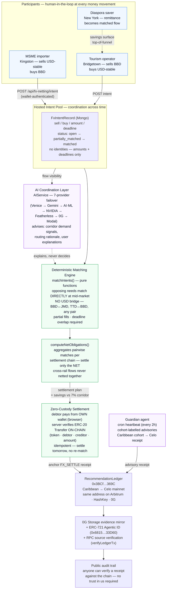

# DiversiFi — Agentic Workflow & Architecture (Caribbean submission)

> The full-system architecture lives in [`docs/architecture.md`](../architecture.md) (with rendered diagram `architecture-diagram.png`). This page is the **track-focused view**: the FX coordination loop the judges will evaluate, showing agents, orchestration, reasoning, human-in-the-loop, and deterministic guarantees.

## The FX coordination loop (CARICOM FX Swap Network)

## Why this shape

**The division of labor is the safety model.** Matching, netting, and savings math are **deterministic pure functions** — reviewable, testable (1,169 tests), and immune to model drift. The AI layer (7-provider failover orchestrator + the autonomous Guardian) **advises and explains**; it surfaces demand signals, drafts recommendations, and explains matches to users in their own language. AI never computes a settlement and never moves funds.

**Human-in-the-loop points:**
1. **Intent creation** — a human posts every liquidity intent from an authenticated wallet.
2. **Match review** — the UI (CaribbeanFxNetCard) shows the match and the computed savings before any settlement; the user confirms.
3. **Settlement execution** — the debtor *personally* sends the transfer from their own wallet; the server only verifies. No custodian exists at any point.
4. **Guardian bounds** — the autonomous loop acts only inside user-signed permission bounds (daily cap, token allowlist, expiry); everything else is advisory with explicit approval.

**Verifiability (the "No Misrepresentation" rule, enforced by architecture):** every anchored receipt is a real on-chain event on mainnets a judge can check without trusting us — `verifyLedgerTx` answers "is this evidence link real?" from the chain's RPC. The savings number attached to every match is computed by `savingsUsd()` against a documented corridor cost (700 bps, regional remittance averages), not asserted.

**Agentic workflow summary (for the rubric's "reasoning loops"):** Guardian heartbeat → fetch cohort context (memory + market data) → draft advisory via failover LLM → anchor reasoning to 0G Storage → record receipt on-chain → (if within signed bounds) propose execution → human approves/rejects → outcome recorded. Every loop iteration leaves a verifiable artifact.

## Data sources, models, third-party tools

| Category | Tools |
|---|---|
| FX / price data | fawazahmed0 open currency dataset (live), Mento stablecoin rates, curated 28-currency risk dataset (World Bank/IMF-style series) |
| Yield/market context | vaults.fyi, DefiLlama, LI.FI Earn |
| LLM providers | Venice, Gemini, AI·ML API, NVIDIA, Featherless, 0G Serving, Modal (failover orchestration, circuit breakers) |
| Chains | Celo (Caribbean/Africa settlement rail), Arbitrum (yield rail), HashKey (APAC rail), 0G (evidence/DA layer) |
| Identity/auth | Privy (email/social/wallet login — walletless exploration supported) |
| Storage/infra | MongoDB (intent pool — amounts/deadlines only), Hetzner (API runtime), Vercel (frontend) |
| Engineering | Next.js, TypeScript, pnpm/turbo, Vitest (1,169 tests), Foundry (contract tests) |

*Full env-var and integration tables: [`docs/integrations.md`](../integrations.md).*
